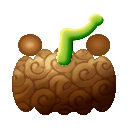
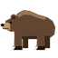
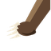
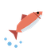
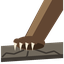
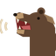

# Kuma Kuma no Mi, Model: Grizzly

{ .mod-icon }

| | |
|---|---|
| **Type** | Zoan |
| **Box** | { .box-icon } Iron |
| **Chance per opening** | iron **2.26%**, wooden **0.113%** ([how it works](index.md#box-odds)) |
| **Abilities** | 8: 6 active, 2 passive |
| **Transformations** | [Kuma Kuma Walk Point](#kuma-kuma-walk-point), [Kuma Kuma Heavy Point](#kuma-kuma-heavy-point) |

Found in the base mod's **iron Devil Fruit box**. Eat it and its abilities appear in the ability menu, grouped under the fruit.

!!! note "About the values"
    The values are those of the ability's tooltip in game, with the base mod's default settings. Damage is shown on the base mod's scale, as in the ability screen.

## Kuma Kuma Walk Point { #kuma-kuma-walk-point }

{ .ability-icon } *Active · Transformation*

Transforms the user into a grizzly hybrid with huge clawed arms, which focuses on strength.

## Kuma Kuma Heavy Point { #kuma-kuma-heavy-point }

{ .ability-icon } *Active · Transformation*

Transforms the user into a grizzly, which focuses on strength and charging.

## Claw Swipe { #claw-swipe }

{ .ability-icon } *Active*

Swipes a huge paw through everything in front of the user, knocking it away.

Requires Kuma Kuma Walk Point or Kuma Kuma Heavy Point to be active.

| Stat | Value |
|---|---|
| Cooldown | 8 s |
| Range | 3.5 blocks (area) |
| Damage | 12 |

## Salmon Swipe { #salmon-swipe }

{ .ability-icon } *Active*

Flips the target up into the air with an upward swipe, like a bear catching a salmon.

Requires Kuma Kuma Walk Point or Kuma Kuma Heavy Point to be active.

| Stat | Value |
|---|---|
| Cooldown | 10 s |
| Range | 3 blocks (line) |
| Damage | 8 |

## Maul { #maul }

{ .ability-icon } *Active*

Charges forward and slams the first enemy in the way into the ground, pinning it for a moment.

Requires Kuma Kuma Heavy Point to be active.

| Stat | Value |
|---|---|
| Cooldown | 12 s |
| Damage | 12 |

## Roar { #roar }

{ .ability-icon } *Active*

Rears up and roars, slowing and weakening everyone nearby and scaring mobs away.

Requires Kuma Kuma Walk Point or Kuma Kuma Heavy Point to be active.

| Stat | Value |
|---|---|
| Cooldown | 20 s |
| Range | 8 blocks (area) |

## Fury { #fury }

{ .ability-icon } *Passive*

While in a form, the user deals more damage the more they are hurt: more below half health, even more below a quarter.

## Thick Fur { #thick-fur }

{ .ability-icon } *Passive*

While in a form, the user's thick fur softens melee blows, resists knockback and keeps the cold out.
