# Kutsu Kutsu no Mi

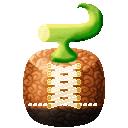{ .mod-icon }

| | |
|---|---|
| **Type** | Paramecia |
| **Theme** | Shoes |
| **Box** | { .box-icon } Wooden |
| **Chance per opening** | wooden **2.32%** ([how it works](index.md#box-odds)) |
| **Abilities** | 7: 7 active, 0 passive |

In 3D: drag to turn, scroll or pinch to zoom.

Found in the base mod's **wooden Devil Fruit box**. Eat it and its abilities appear in the ability menu, grouped under the fruit.

!!! note "About the values"
    The values are those of the ability's tooltip in game, with the base mod's default settings. Damage is shown on the base mod's scale, as in the ability screen.

## Water Soles { #water-soles }

{ .ability-icon } *Active*

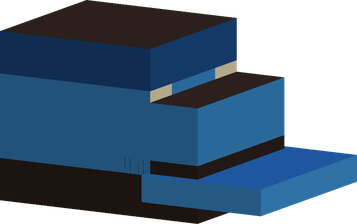{ .form-picture }

The user's soles walk on water and lava as on solid ground. Crouch to sink.

| Stat | Value |
|---|---|
| Cooldown | 2 s |
| Hold | ∞ s |

## Wall Soles { #wall-soles }

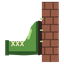{ .ability-icon } *Active*

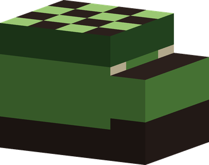{ .form-picture }

The user's soles grip any surface: walk into a wall to climb it, stay put against it, hang from ceilings. Crouch to let go.

| Stat | Value |
|---|---|
| Cooldown | 2 s |
| Hold | ∞ s |

## Silent Soles { #silent-soles }

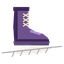{ .ability-icon } *Active*

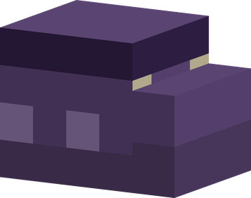{ .form-picture }

The user's soles make no sound: no footsteps, no vibrations, and mobs only notice the user at a quarter of the usual distance.

| Stat | Value |
|---|---|
| Cooldown | 2 s |
| Hold | ∞ s |

## Weighted Soles { #weighted-soles }

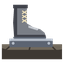{ .ability-icon } *Active*

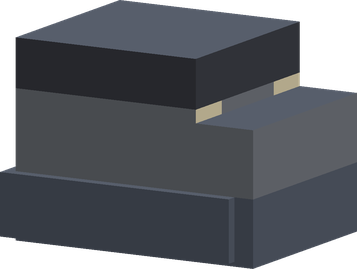{ .form-picture }

The user's soles weigh a ton: nothing can knock the user back, but they walk slower. Stomp hits harder and wider.

| Stat | Value |
|---|---|
| Cooldown | 2 s |
| Hold | ∞ s |

## Spring Soles { #spring-soles }

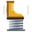{ .ability-icon } *Active*

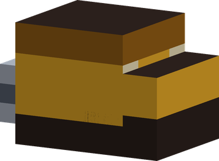{ .form-picture }

The user's soles are springs: jumps about seven blocks high, and no fall damage. Crouch to jump normally.

| Stat | Value |
|---|---|
| Cooldown | 2 s |
| Hold | ∞ s |

## Skate Soles { #skate-soles }

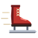{ .ability-icon } *Active*

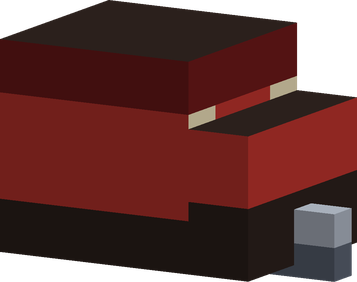{ .form-picture }

The user's soles are blades: the user skates fast on every ground, gliding far before stopping.

| Stat | Value |
|---|---|
| Cooldown | 2 s |
| Hold | ∞ s |

## Stomp { #stomp }

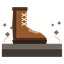{ .ability-icon } *Active*

The user stomps the ground, hurting and throwing up everyone around. Hits harder and wider with Weighted Soles on.

| Stat | Value |
|---|---|
| Cooldown | 6 s |
| Damage | 10–16 |
| Range | 4–6 blocks (area) |
