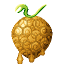
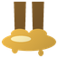
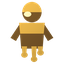
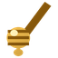
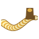

# Mitsu Mitsu no Mi

{ .mod-icon }

| | |
|---|---|
| **Type** | Paramecia |
| **Box** | { .box-icon } Iron |
| **Chance per opening** | iron **2.32%**, wooden **0.116%** ([how it works](index.md#box-odds)) |
| **Abilities** | 6: 6 active, 0 passive |
| **Effects applied** | { .effect-mini }[Amahada](../effects.md#effect-amahada), { .effect-mini }[Kohaku](../effects.md#effect-kohaku), { .effect-mini }[Namakura](../effects.md#effect-namakura), { .effect-mini }[Nebatsuki](../effects.md#effect-nebatsuki) |

Found in the base mod's **iron Devil Fruit box**. Eat it and its abilities appear in the ability menu, grouped under the fruit.

!!! note "About the values"
    The values are those of the ability's tooltip in game, with the base mod's default settings. Damage is shown on the base mod's scale, as in the ability screen.

## Mitsu Numa { #mitsu-numa }

{ .ability-icon } *Active*

Applies { .effect-mini }[Nebatsuki](../effects.md#effect-nebatsuki)

Pours a big pool of honey that slows down anything standing in it, including the user.

| Stat | Value |
|---|---|
| Hold | 16 s |
| Cooldown | 15 s |
| Damage | 1 |
| Range | 5 blocks (area) |

## Mitsu Goromo { #mitsu-goromo }

{ .ability-icon } *Active*

Applies { .effect-mini }[Namakura](../effects.md#effect-namakura), { .effect-mini }[Nebatsuki](../effects.md#effect-nebatsuki)

Covers the target in honey, slowing their movement and attacks for 8 seconds.

| Stat | Value |
|---|---|
| Cooldown | 7 s |
| Range | 12 blocks (line) |

## Mitsu Gusuri { #mitsu-gusuri }

{ .ability-icon } *Active*

The user eats some of their own honey, healing slowly for 8 seconds.

| Stat | Value |
|---|---|
| Cooldown | 30 s |

## Kohaku { #kohaku }

{ .ability-icon } *Active*

Applies { .effect-mini }[Kohaku](../effects.md#effect-kohaku)

Pours honey on the target which hardens, keeping them stuck for 3 seconds.

| Stat | Value |
|---|---|
| Cooldown | 20 s |
| Range | 12 blocks (line) |

## Amahada { #amahada }

{ .ability-icon } *Active*

Applies { .effect-mini }[Amahada](../effects.md#effect-amahada), { .effect-mini }[Nebatsuki](../effects.md#effect-nebatsuki)

Covers the user in honey for 14 seconds, making anyone who hits them stuck.

| Stat | Value |
|---|---|
| Hold | 14 s |
| Cooldown | 16 s |

## Mitsu Suberi { #mitsu-suberi }

{ .ability-icon } *Active*

Applies { .effect-mini }[Nebatsuki](../effects.md#effect-nebatsuki)

The user slides on honey under their feet, leaving a sticky trail behind

| Stat | Value |
|---|---|
| Cooldown | 10 s |
| Hold | 1 s |
| Damage | 3 |
