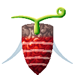
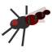
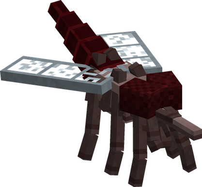
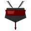
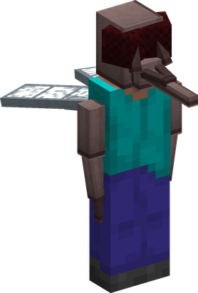
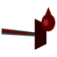
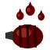
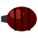
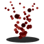

# Mushi Mushi no Mi, Model: Mosquito

{ .mod-icon }

| | |
|---|---|
| **Type** | Zoan |
| **Box** | { .box-icon } Iron |
| **Chance per opening** | iron **2.26%**, wooden **0.113%** ([how it works](index.md#box-odds)) |
| **Abilities** | 8: 5 active, 3 passive (1 hidden, not in the ability menu) |
| **Transformations** | [Mushi Mushi Fly Point](#mushi-mushi-fly-point), [Mushi Mushi Heavy Point](#mushi-mushi-heavy-point) |
| **Effects applied** | { .effect-mini }[Chibukure](../effects.md#effect-chibukure) |

Its forms in 3D: drag to turn, scroll or pinch to zoom.

Found in the base mod's **iron Devil Fruit box**. Eat it and its abilities appear in the ability menu, grouped under the fruit.

!!! note "About the values"
    The values are those of the ability's tooltip in game, with the base mod's default settings. Damage is shown on the base mod's scale, as in the ability screen.

## Mushi Mushi Fly Point { #mushi-mushi-fly-point }

{ .ability-icon } *Active · Transformation*

{ .form-picture }

Transforms the user into a mosquito, the smallest and weakest form there is.

## Mushi Mushi Heavy Point { #mushi-mushi-heavy-point }

{ .ability-icon } *Active · Transformation*

{ .form-picture }

Transforms the user into a mosquito hybrid with big eyes, a proboscis and wings

## Mushi Mushi Flight { #mushi-mushi-flight }

{ .ability-icon } *Passive*

Requires Mushi Mushi Fly Point or Mushi Mushi Heavy Point to be active.

## Mushi { #mushi }

{ .ability-icon } *Passive*

While in the mosquito form, hostile mobs won't target the user.

## Kyuketsu { #kyuketsu }

{ .ability-icon } *Active*

Stabs the proboscis into whatever is in front of the user and heals them with part of the damage

Requires Mushi Mushi Fly Point or Mushi Mushi Heavy Point to be active.

| Stat | Value |
|---|---|
| Cooldown | 3 s |
| Range | 2.5 blocks (line) |
| Damage | 7 |

## Chibukure { #chibukure }

{ .ability-icon } *Active*

Applies { .effect-mini }[Chibukure](../effects.md#effect-chibukure)

Uses all the stored blood at once to heal and get a burst of speed, even while flying.

Requires Mushi Mushi Fly Point or Mushi Mushi Heavy Point to be active.

| Stat | Value |
|---|---|
| Cooldown | 10 s |

## Chibukuro { #chibukuro }

{ .ability-icon } *Passive*

!!! info "Hidden ability"
    It does not appear in the ability menu: it works with [Kyuketsu](#kyuketsu) and [Chibukure](#chibukure).

Stores part of the blood the user drinks but it slowly goes bad

## Kabashira { #kabashira }

{ .ability-icon } *Active*

Creates a column of mosquitoes around the user that bites everything inside it.

Requires Mushi Mushi Fly Point or Mushi Mushi Heavy Point to be active.

| Stat | Value |
|---|---|
| Hold | 6 s |
| Cooldown | 11 s |
| Range | 4 blocks (area) |
| Damage | 2 |
