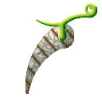
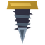
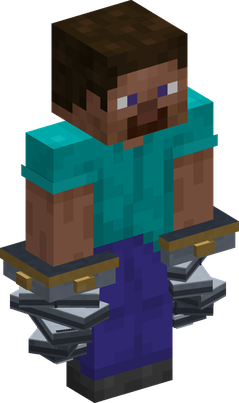
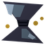
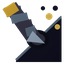

# Neji Neji no Mi

{ .mod-icon }

| | |
|---|---|
| **Type** | Paramecia |
| **Theme** | Twist |
| **Box** | { .box-icon } Wooden |
| **Chance per opening** | wooden **2.32%** ([how it works](index.md#box-odds)) |
| **Abilities** | 5: 5 active, 0 passive |
| **Transformations** | [Neji Neji Point](#neji-neji-point) |

Its form in 3D: drag to turn, scroll or pinch to zoom.

Found in the base mod's **wooden Devil Fruit box**. Eat it and its abilities appear in the ability menu, grouped under the fruit.

!!! note "About the values"
    The values are those of the ability's tooltip in game, with the base mod's default settings. Damage is shown on the base mod's scale, as in the ability screen.

## Neji Neji Point { #neji-neji-point }

{ .ability-icon } *Active · Transformation*

{ .form-picture }

Turns both of the user's forearms into spinning drills, hitting hard but slowly and breaking through stone

## Rasen { #rasen }

{ .ability-icon } *Active*

Drills a line forward where the user is looking hurting everything in it.

Requires Neji Neji Point to be active.

| Stat | Value |
|---|---|
| Cooldown | 5 s |
| Range | 16 blocks (line) |
| Damage | 7 |

## Nejikiri { #nejikiri }

{ .ability-icon } *Active*

Grabs one target in sight and twists them off their feet

Requires Neji Neji Point to be active.

| Stat | Value |
|---|---|
| Cooldown | 6 s |
| Range | 10 blocks (line) |
| Damage | 11 |

## Nejikomi { #nejikomi }

{ .ability-icon } *Active*

Drills forward through the ground digging a tunnel and hurting everything caught in it.

Requires Neji Neji Point to be active.

| Stat | Value |
|---|---|
| Cooldown | 12 s |
| Range | 1.6 blocks (line) |
| Damage | 12 |

## Totsushin { #totsushin }

{ .ability-icon } *Active*

The user points both drills forward and charges, hurting everything they go through.

Requires Neji Neji Point to be active.

| Stat | Value |
|---|---|
| Charge | 1 s |
| Cooldown | 7 s |
| Range | 9 blocks (line) |
| Damage | 9 |
