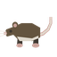
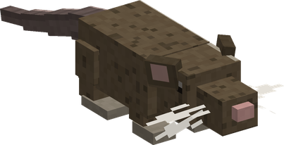
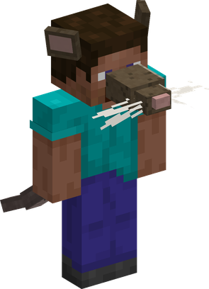
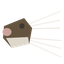

# Nezu Nezu no Mi, Model: Rat

{ .mod-icon }

| | |
|---|---|
| **Type** | Zoan |
| **Box** | { .box-icon } Wooden |
| **Chance per opening** | wooden **2.32%** ([how it works](index.md#box-odds)) |
| **Abilities** | 6: 5 active, 1 passive |
| **Transformations** | [Nezu Nezu Walk Point](#nezu-nezu-walk-point), [Nezu Nezu Heavy Point](#nezu-nezu-heavy-point) |
| **Effects applied** | { .effect-mini }[Ekibyo](../effects.md#effect-ekibyo) |

In 3D: drag to turn, scroll or pinch to zoom.

Found in the base mod's **wooden Devil Fruit box**. Eat it and its abilities appear in the ability menu, grouped under the fruit.

!!! note "About the values"
    The values are those of the ability's tooltip in game, with the base mod's default settings. Damage is shown on the base mod's scale, as in the ability screen.

## Nezu Nezu Walk Point { #nezu-nezu-walk-point }

{ .ability-icon } *Active · Transformation*

{ .form-picture }

Transforms the user into a rat, which is small enough to fit anywhere and too light to get hurt by falls.

## Nezu Nezu Heavy Point { #nezu-nezu-heavy-point }

{ .ability-icon } *Active · Transformation*

{ .form-picture }

Transforms the user into a rat hybrid with whiskers and a tail, a third smaller and harder to hit

## Ekibyo { #ekibyo }

{ .ability-icon } *Active*

Applies { .effect-mini }[Ekibyo](../effects.md#effect-ekibyo)

Bites the first target in the way giving it a plague that spreads to others.

| Stat | Value |
|---|---|
| Cooldown | 15 s |
| Range | 3.5 blocks (line) |

## Hassho { #hassho }

{ .ability-icon } *Active*

Sets off the plague on every nearby carrier dealing all of its remaining damage at once

| Stat | Value |
|---|---|
| Cooldown | 12 s |
| Damage | 0–10 |
| Range | 8 blocks (area) |

## Hige { #hige }

{ .ability-icon } *Passive*

While in either rat form, the user can see in the dark

## Kajiru { #kajiru }

{ .ability-icon } *Active*

Gnaws through the block the rat is looking at, taking a bite every half second.

| Stat | Value |
|---|---|
| Cooldown | 1 s |
