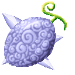
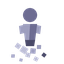
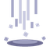
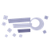
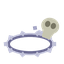

# Shio Shio no Mi

{ .mod-icon }

**Logia** · { .box-icon } Golden box · 7 abilities

Found in the base mod's **golden Devil Fruit box**. Eat it and its abilities appear in the ability menu, grouped under the fruit.

Chance per box opening: golden box **4.13%**, iron box **0.207%**, wooden box **0.010%** ([how it works](index.md#box-odds)).

!!! note "About the values"
    The values are those of the ability's tooltip in game, with the base mod's default settings. Damage is shown on the base mod's scale, as in the ability screen.

## Logia Invulnerability Shio { #logia-invulnerability-shio }

{ .ability-icon } *Passive*

Applies { .effect-mini }[Shiozuke](../effects.md#effect-shiozuke)

Allows the user to avoid attacks by instinctively transforming parts of their body into their specific element

## Kessho no Yari { #kessho-no-yari }

{ .ability-icon } *Active*

Hardens the salt under the user and makes a line of spikes come out of the ground.

| Stat | Value |
|---|---|
| Cooldown | 6 s |
| Damage | 12 |
| Range | 13 blocks (line) |

## Shiozuke { #shiozuke }

{ .ability-icon } *Active*

Applies { .effect-mini }[Shiozuke](../effects.md#effect-shiozuke)

Throws salt at enemies in front of the user, which stops their regeneration and halves any other healing.

| Stat | Value |
|---|---|
| Cooldown | 8 s |
| Damage | 5 |
| Range | 6 blocks (area) |

## Shio-barai { #shio-barai }

{ .ability-icon } *Active*

Throws salt in a ring around the user, burning undead enemies and removing bad effects from allies.

| Stat | Value |
|---|---|
| Cooldown | 12 s |
| Damage | 8 |
| Range | 10 blocks (area) |

## Shio no Ame { #shio-no-ame }

{ .ability-icon } *Active*

Applies { .effect-mini }[Shiozuke](../effects.md#effect-shiozuke)

Makes salt rain down where the user is looking, even far away.

| Stat | Value |
|---|---|
| Cooldown | 9 s |
| Damage | 7 |
| Range | 28 blocks (area) |

## Shio Nagare { #shio-nagare }

{ .ability-icon } *Active*

Applies { .effect-mini }[Shio Form](../effects.md#effect-shio-form), { .effect-mini }[Shiozuke](../effects.md#effect-shiozuke)

The user turns into a current of salt and flies through the air, salting anything it passes through

| Stat | Value |
|---|---|
| Cooldown | 25 s |
| Hold | 10 s |
| Damage | 4 |

## Shio no Wa { #shio-no-wa }

{ .ability-icon } *Active*

Applies { .effect-mini }[Shiozuke](../effects.md#effect-shiozuke)

Pours a ring of salt on the ground that pushes the undead out and salts enemies crossing it.

| Stat | Value |
|---|---|
| Cooldown | 20 s |
| Hold | 30 s |
| Range | 8 blocks (area) |
