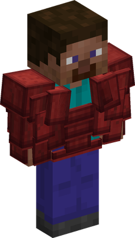
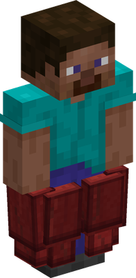
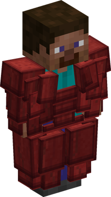

# Suji Suji no Mi

{ .mod-icon }

| | |
|---|---|
| **Type** | Paramecia |
| **Theme** | Muscle |
| **Box** | { .box-icon } Iron |
| **Chance per opening** | iron **2.26%**, wooden **0.113%** ([how it works](index.md#box-odds)) |
| **Abilities** | 5: 5 active, 0 passive |
| **Transformations** | [Suji Suji Upper Point](#suji-suji-upper-point), [Suji Suji Lower Point](#suji-suji-lower-point), [Suji Suji Full Point](#suji-suji-full-point) |

In 3D: drag to turn, scroll or pinch to zoom.

Found in the base mod's **iron Devil Fruit box**. Eat it and its abilities appear in the ability menu, grouped under the fruit.

!!! note "About the values"
    The values are those of the ability's tooltip in game, with the base mod's default settings. Damage is shown on the base mod's scale, as in the ability screen.

## Suji Suji Upper Point { #suji-suji-upper-point }

{ .ability-icon } *Active · Transformation*

{ .form-picture }

Muscle fibers grow over the chest and arms, hitting extremely hard but very slowly

## Suji Suji Lower Point { #suji-suji-lower-point }

{ .ability-icon } *Active · Transformation*

{ .form-picture }

Muscle fibers grow over the legs, making the user run faster and jump higher without hitting harder.

## Suji Suji Full Point { #suji-suji-full-point }

{ .ability-icon } *Active · Transformation*

{ .form-picture }

Muscle fibers grow over the whole body, hitting harder and moving faster but less than the other two forms

## Hasai { #hasai }

{ .ability-icon } *Active*

Punches forward sending a shockwave that goes through enemies and walls.

With the arm fibers it reaches further and goes through stone.

| Stat | Value |
|---|---|
| Charge | 1 s |
| Cooldown | 25 s |
| Projectile damage | 13 |

## Choyaku { #choyaku }

{ .ability-icon } *Active*

The user jumps a long way with their legs, hitting whatever is under them when landing

With the leg fibers the jump goes further and higher, and the landing hits a wider area.

| Stat | Value |
|---|---|
| Charge | 0 s |
| Cooldown | 25 s |
| Damage | 13–28 |
| Range | 3–5 blocks (area) |
