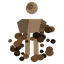
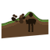
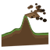
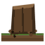
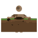
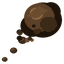
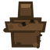
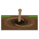
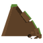

# Tsuchi Tsuchi no Mi

{ .mod-icon }

| | |
|---|---|
| **Type** | Logia |
| **Theme** | Earth |
| **Box** | { .box-icon } Golden |
| **Chance per opening** | golden **3.65%**, iron **0.183%**, wooden **0.009%** ([how it works](index.md#box-odds)) |
| **Abilities** | 9: 7 active, 2 passive |
| **Transformations** | [Tsuchi Tsuchi Golem](#tsuchi-tsuchi-golem) |
| **Effects applied** | { .effect-mini }[Nomikomi](../effects.md#effect-nomikomi) |

Found in the base mod's **golden Devil Fruit box**. Eat it and its abilities appear in the ability menu, grouped under the fruit.

!!! note "About the values"
    The values are those of the ability's tooltip in game, with the base mod's default settings. Damage is shown on the base mod's scale, as in the ability screen.

## Logia Invulnerability Tsuchi { #logia-invulnerability-tsuchi }

{ .ability-icon } *Passive*

Allows the user to avoid attacks by instinctively transforming parts of their body into their specific element

## Dochu { #dochu }

{ .ability-icon } *Passive*

Allows the user to move through specific blocks based on their element

## Jibashiri { #jibashiri }

{ .ability-icon } *Active*

**Normal Mode**: Sends a ridge of earth along the ground, launching anything it reaches up

| Stat | Value |
|---|---|
| Cooldown | 9 s |
| Damage | 12 |
| Range | 16 blocks (line) |

**Golem Mode**: The ridge goes 24 blocks instead of 16, hits harder and is wider.

| Stat | Value |
|---|---|
| Cooldown | 9 s |
| Damage | 16 |
| Range | 24 blocks (line) |

## Kabe { #kabe }

{ .ability-icon } *Active*

**Modes**

- **Normal Mode**: Raises a wall of packed earth 5 wide and 4 tall, which sinks back down after 12 seconds.
- **Golem Mode**: The wall is 9 wide and 6 tall and appears 5 blocks away instead of 2.

| Stat | Value |
|---|---|
| Cooldown | 15 s |
| Hold | 12 s |

## Nomikomi { #nomikomi }

{ .ability-icon } *Active*

Applies { .effect-mini }[Nomikomi](../effects.md#effect-nomikomi)

**Normal Mode**: The ground opens under the first target in the way and traps it for 3 seconds.

| Stat | Value |
|---|---|
| Cooldown | 20 s |
| Range | 8 blocks (line) |

**Golem Mode**: Reaches 14 blocks, traps for 5 seconds and also swallows everything within 4 blocks of the target

| Stat | Value |
|---|---|
| Cooldown | 20 s |
| Range | 14 blocks (line) |

## Tsubute { #tsubute }

{ .ability-icon } *Active*

**Normal Mode**: Rips out a chunk of earth and throws it where the user is looking

| Stat | Value |
|---|---|
| Cooldown | 11 s |

**Golem Mode**: The chunk is a boulder bigger than the golem, exploding where it lands.

| Stat | Value |
|---|---|
| Cooldown | 11 s |
| Projectile damage | 14 |

## Tsuchi Tsuchi Golem { #tsuchi-tsuchi-golem }

{ .ability-icon } *Active · Transformation*

The user covers themselves in earth, becoming much harder to hurt but much slower.

| Stat | Value |
|---|---|
| Cooldown | 5–20 s |
| Hold | 30 s |

**Stats while active**

| Stat | Value |
|---|---|
| Speed | -0.14 |
| Punch Damage | +6 |
| Knockback Resistance | +0.5 |
| Attack Speed | -0.15 |
| Max Health | x1.3 |
| Toughness | +3 |
| Armor | +7 |

## Ryusa { #ryusa }

{ .ability-icon } *Active*

**Normal Mode**: Turns the ground where the user looks into quicksand: enemies caught in it are dragged towards its centre, bogged down and worn away.

| Stat | Value |
|---|---|
| Cooldown | 20 s |
| Hold | 8 s |
| Damage | 2 |
| Range | 5 blocks (area) |

**Golem Mode**: The quicksand is wider, lasts longer, grinds harder and swallows faster.

| Stat | Value |
|---|---|
| Cooldown | 20 s |
| Hold | 10 s |
| Damage | 3 |
| Range | 8 blocks (area) |

## Jisuberi { #jisuberi }

{ .ability-icon } *Active*

**Normal Mode**: The ground in front of the user gives way in a landslide: every enemy in a wide cone is hurt, knocked away and buried for a moment.

| Stat | Value |
|---|---|
| Cooldown | 30 s |
| Damage | 22 |
| Range | 12 blocks (cone) |

**Golem Mode**: The landslide reaches 18 blocks instead of 12, spreads wider, hits harder and buries longer.

| Stat | Value |
|---|---|
| Cooldown | 30 s |
| Damage | 30 |
| Range | 18 blocks (cone) |
