# Uma Uma no Mi, Model: Unicorn

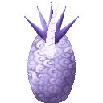{ .mod-icon }

| | |
|---|---|
| **Type** | Mythical Zoan |
| **Box** | { .box-icon } Golden |
| **Chance per opening** | golden **3.65%**, iron **0.183%**, wooden **0.009%** ([how it works](index.md#box-odds)) |
| **Abilities** | 13: 10 active, 3 passive |
| **Transformations** | [Uma Uma Walk Point](#uma-uma-walk-point), [Uma Uma Heavy Point](#uma-uma-heavy-point) |
| **Effects applied** | { .effect-mini }[Purified](../effects.md#effect-purified) |

Its forms in 3D: drag to turn, scroll or pinch to zoom.

Found in the base mod's **golden Devil Fruit box**. Eat it and its abilities appear in the ability menu, grouped under the fruit.

!!! note "About the values"
    The values are those of the ability's tooltip in game, with the base mod's default settings. Damage is shown on the base mod's scale, as in the ability screen.

## Uma Uma Walk Point { #uma-uma-walk-point }

{ .ability-icon } *Active · Transformation*

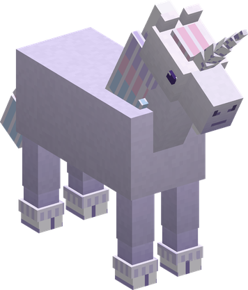{ .form-picture }

Transforms the user into a unicorn, which focuses on speed and can carry allies.

## Uma Uma Heavy Point { #uma-uma-heavy-point }

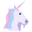{ .ability-icon } *Active · Transformation*

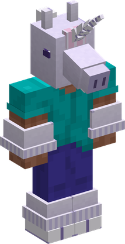{ .form-picture }

Transforms the user into a unicorn hybrid, which focuses on strength and the horn.

## Horn Thrust { #horn-thrust }

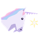{ .ability-icon } *Active*

Drives the horn into the target, through armour, absorption and even a Logia's intangibility. In the Heavy Point it impales and lifts the target.

| Stat | Value |
|---|---|
| Cooldown | 8 s |
| Damage | 24 |

## Unicorn Charge { #unicorn-charge }

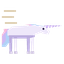{ .ability-icon } *Active*

Gallops forward horn first, running through everyone in the way and throwing them aside.

| Stat | Value |
|---|---|
| Cooldown | 10 s |
| Hold | 1 s |
| Damage | 20 |

## Prism Lance { #prism-lance }

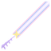{ .ability-icon } *Active*

Fires a beam of light from the horn that runs through every enemy in line, through armour, absorption and even a Logia's intangibility.

| Stat | Value |
|---|---|
| Cooldown | 12 s |
| Damage | 22 |
| Range | 30 blocks (line) |

## Starfall { #starfall }

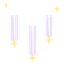{ .ability-icon } *Active*

Calls down five lances of light on the spot the user looks at, each hurting the enemies where it lands.

| Stat | Value |
|---|---|
| Cooldown | 16 s |
| Damage | 6 |
| Range | 30 blocks (area) |

## Purify { #purify }

{ .ability-icon } *Active*

Applies { .effect-mini }[Purified](../effects.md#effect-purified)

Washes the user and nearby allies in the horn's light: harmful effects are removed except hard control, some health comes back, and for a few seconds nothing harmful can land on them.

| Stat | Value |
|---|---|
| Cooldown | 25 s |
| Range | 12 blocks (area) |

## Sanctuary { #sanctuary }

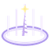{ .ability-icon } *Active*

Applies { .effect-mini }[Purified](../effects.md#effect-purified)

Lays a circle of light where the user stands. Allies inside regenerate and nothing harmful can land on them; enemies inside are burned and weakened.

| Stat | Value |
|---|---|
| Cooldown | 50 s |
| Hold | 12 s |
| Damage | 4 |
| Range | 12 blocks (area) |

## Guiding Light { #guiding-light }

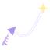{ .ability-icon } *Active*

A thread of light from the horn draws the target to the user: an ally pulled out of danger, or an enemy brought within reach.

| Stat | Value |
|---|---|
| Cooldown | 12 s |
| Range | 25 blocks (line) |

## Moonlight Burst { #moonlight-burst }

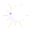{ .ability-icon } *Active*

The unicorn rears up and releases the moon's light: enemies around are blasted away, allies are purified and healed, and the horn's light is filled.

| Stat | Value |
|---|---|
| Cooldown | 60 s |
| Damage | 40 |
| Range | 12 blocks (area) |

## Alicorn { #alicorn }

{ .ability-icon } *Passive*

The horn's light burns away every harmful effect that touches the user, except hard control, and heals the user while transformed. Both spend light, which refills over time and with every horn blow.

## Unicorn Rideable { #unicorn-rideable }

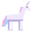{ .ability-icon } *Passive*

Allows other players to ride on the unicorn's back.

## Unicorn Flight { #unicorn-flight }

{ .ability-icon } *Passive*

The unicorn flies, leaving a rainbow in its wake.

Requires Uma Uma Walk Point or Uma Uma Heavy Point to be active.
