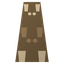

# Usa Usa no Mi, Model: Hare

{ .mod-icon }

| | |
|---|---|
| **Type** | Zoan |
| **Box** | { .box-icon } Wooden |
| **Chance per opening** | wooden **2.32%** ([how it works](index.md#box-odds)) |
| **Abilities** | 5: 5 active, 0 passive |
| **Transformations** | [Usa Usa Walk Point](#usa-usa-walk-point), [Usa Usa Heavy Point](#usa-usa-heavy-point) |

Found in the base mod's **wooden Devil Fruit box**. Eat it and its abilities appear in the ability menu, grouped under the fruit.

!!! note "About the values"
    The values are those of the ability's tooltip in game, with the base mod's default settings. Damage is shown on the base mod's scale, as in the ability screen.

## Usa Usa Walk Point { #usa-usa-walk-point }

{ .ability-icon } *Active · Transformation*

Transforms the user into a hare, which focuses on speed and being small

## Usa Usa Heavy Point { #usa-usa-heavy-point }

{ .ability-icon } *Active · Transformation*

Transforms the user into a hare hybrid with long ears and hind legs, slower than the full hare.

## Ushiro Geri { #ushiro-geri }

{ .ability-icon } *Active*

Kicks the closest target with both hind legs, launching it away and the user the other way

Kicks with a person's legs instead of a hare's, reaching almost twice as far and hitting harder.

| Stat | Value |
|---|---|
| Cooldown | 5 s |
| Damage | 7–11 |
| Range | 2.5–4.5 blocks (line) |

## Datto { #datto }

{ .ability-icon } *Active*

The hare starts running, outrunning anything on the ground until the ability ends

Longer legs make it last 12 seconds instead of 8.

| Stat | Value |
|---|---|
| Cooldown | 6–18 s |
| Hold | 8–12 s |

## Usagitobi { #usagitobi }

{ .ability-icon } *Active*

The hare does a standing jump much higher than the user normally can.

With longer legs the same jump goes a lot higher

| Stat | Value |
|---|---|
| Cooldown | 6 s |
