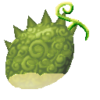
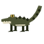
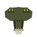
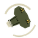
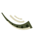
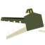
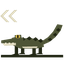

# Wani Wani no Mi, Model: Crocodile

{ .mod-icon }

**Zoan** · { .box-icon } Iron box · 6 abilities

Found in the base mod's **iron Devil Fruit box**. Eat it and its abilities appear in the ability menu, grouped under the fruit.

!!! note "About the values"
    The values are those of the ability's tooltip in game, with the base mod's default settings. Damage is shown on the base mod's scale, as in the ability screen.

## Wani Wani Walk Point { #wani-wani-walk-point }

{ .ability-icon } *Active · Transformation*

Transforms the user into a crocodile, which is slow and armored on land but twice as fast in water.

## Wani Wani Heavy Point { #wani-wani-heavy-point }

{ .ability-icon } *Active · Transformation*

Transforms the user into a crocodile hybrid with plates and long jaws, still good in the water

## Death Roll { #death-roll }

{ .ability-icon } *Active*

Grabs the target in the user's jaws and rolls, hurting it until released.

| Stat | Value |
|---|---|
| Cooldown | 12 s |
| Damage | 8 |

## Tail Sweep { #tail-sweep }

{ .ability-icon } *Active*

Swings the tail around the user hitting everything nearby and pushing them away.

Requires Wani Wani Heavy Point or Wani Wani Walk Point to be active.

| Stat | Value |
|---|---|
| Cooldown | 8 s |
| Range | 4.5 blocks (area) |
| Damage | 4 |

## Lunging Bite { #lunging-bite }

{ .ability-icon } *Active*

Requires Wani Wani Heavy Point or Wani Wani Walk Point to be active.

**Heavy Point**: Lunges forward a few blocks biting the first enemy in the way.

| Stat | Value |
|---|---|
| Cooldown | 8 s |
| Damage | 5 |

**Walk Point**: The whole crocodile lunges further and bites a lot harder.

| Stat | Value |
|---|---|
| Cooldown | 8 s |
| Damage | 8 |

## Belly Crawl { #belly-crawl }

{ .ability-icon } *Active*

The user crawls low and fast, their next bite hits harder

Requires Wani Wani Heavy Point or Wani Wani Walk Point to be active.

| Stat | Value |
|---|---|
| Cooldown | 12 s |
