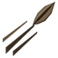

# Zuku Zuku no Mi, Model: Owl

**Zoan** · Iron box · 7 abilities

Found in the base mod's **iron Devil Fruit box**. Eat it and its abilities appear in the ability menu, grouped under the fruit.

!!! note "About the values"
    The values are those of the ability's tooltip in game, with the base mod's default settings. Damage is shown on the base mod's scale, as in the ability screen.

## Zuku Zuku Fly Point { #zuku-zuku-fly-point }

{ .ability-icon } *Active · Transformation*

Transforms the user into an owl, which is bad on foot but light as a feather when falling

## Zuku Zuku Assault Point { #zuku-zuku-assault-point }

{ .ability-icon } *Active · Transformation*

Transforms the user into an owl hybrid with talons, a beak and wings for arms.

## Zuku Zuku Flight { #zuku-zuku-flight }

{ .ability-icon } *Passive*

Requires Zuku Zuku Fly Point or Zuku Zuku Assault Point to be active.

## Anshi { #anshi }

{ .ability-icon } *Passive*

While in either owl form, the user can see perfectly in the dark.

## Washizukami { #washizukami }

{ .ability-icon } *Active*

The owl grabs whatever it flies into with its talons and carries it.

Requires Zuku Zuku Fly Point to be active.

| Stat | Value |
|---|---|
| Cooldown | 10 s |
| Hold | 15 s |
| Range | 1.4 blocks (line) |

## Habataki { #habataki }

{ .ability-icon } *Active*

The user flaps their wings once, launching everything within 8 blocks away and up.

Requires Zuku Zuku Fly Point or Zuku Zuku Assault Point to be active.

| Stat | Value |
|---|---|
| Cooldown | 10 s |
| Damage | 3 |
| Range | 8 blocks (area) |

## Kazakiribane { #kazakiribane }

{ .ability-icon } *Active*

Pulls out a flight feather and throws it, flying straight without dropping

Requires Zuku Zuku Assault Point or Zuku Zuku Fly Point to be active.

| Stat | Value |
|---|---|
| Cooldown | 3 s |
| Projectile damage | 3 |
