# All abilities

Every ability of the 54 fruits in one table: **click a column** to sort it, **type in the box** to keep only the rows that match. Values are those of the ability's tooltip in game; an ability with several modes shows each mode's value, separated by `/`. Hidden abilities are left out.

<input class="table-filter" type="search" placeholder="Filter by ability, fruit or type" aria-label="Filter the abilities">

| Ability | Fruit | Type | Cooldown | Charge | Hold | Damage | Range |
|---|---|---|---|---|---|---|---|
| { .ability-mini }[Logia Invulnerability Ame](fruits/ame-ame-no-mi.md#logia-invulnerability-ame) | [Ame Ame no Mi](fruits/ame-ame-no-mi.md) | Passive |  |  |  |  |  |
| { .ability-mini }[Syrup Spear](fruits/ame-ame-no-mi.md#syrup-spear) | [Ame Ame no Mi](fruits/ame-ame-no-mi.md) | Active | 7 s |  |  | 16 | 12 blocks (line) |
| { .ability-mini }[Spike Burst](fruits/ame-ame-no-mi.md#spike-burst) | [Ame Ame no Mi](fruits/ame-ame-no-mi.md) | Active | 10 s |  |  | 14 | 4 blocks (area) |
| { .ability-mini }[Spiked Charge](fruits/ame-ame-no-mi.md#spiked-charge) | [Ame Ame no Mi](fruits/ame-ame-no-mi.md) | Active | 9 s |  |  | 12 |  |
| { .ability-mini }[Slingshot](fruits/ame-ame-no-mi.md#slingshot) | [Ame Ame no Mi](fruits/ame-ame-no-mi.md) | Active | 8 s | 1 s |  |  |  |
| { .ability-mini }[Syrup Pool](fruits/ame-ame-no-mi.md#syrup-pool) | [Ame Ame no Mi](fruits/ame-ame-no-mi.md) | Active | 15 s |  | 8 s | 12 | 4 blocks (area) |
| { .ability-mini }[Mucho Neto Net](fruits/ami-ami-no-mi.md#mucho-neto-net) | [Ami Ami no Mi](fruits/ami-ami-no-mi.md) | Active | 8 s |  | 3 s | 2 |  |
| { .ability-mini }[Neto Net Hoso Mo](fruits/ami-ami-no-mi.md#neto-net-hoso-mo) | [Ami Ami no Mi](fruits/ami-ami-no-mi.md) | Active | 16 s |  | 5 s |  | 4.5 blocks (area) |
| { .ability-mini }[Mucho Cho Shi Mo](fruits/ami-ami-no-mi.md#mucho-cho-shi-mo) | [Ami Ami no Mi](fruits/ami-ami-no-mi.md) | Active | 10 s |  | 2 s | 3 |  |
| { .ability-mini }[Mucho Tetsujo Mo](fruits/ami-ami-no-mi.md#mucho-tetsujo-mo) | [Ami Ami no Mi](fruits/ami-ami-no-mi.md) | Active | 15 s |  | 3 s | 8 |  |
| { .ability-mini }[Mucho Kaji Mo](fruits/ami-ami-no-mi.md#mucho-kaji-mo) | [Ami Ami no Mi](fruits/ami-ami-no-mi.md) | Active | 10 s |  | 2 s | 4 |  |
| { .ability-mini }[Millionet](fruits/ami-ami-no-mi.md#millionet) | [Ami Ami no Mi](fruits/ami-ami-no-mi.md) | Active | 10 s |  | 2 s | 6 |  |
| { .ability-mini }[No Shock Taimo](fruits/ami-ami-no-mi.md#no-shock-taimo) | [Ami Ami no Mi](fruits/ami-ami-no-mi.md) | Active · Transformation |  |  |  |  |  |
| { .ability-mini }[Broken-Fu Art](fruits/ato-ato-no-mi.md#broken-fu-art) | [Ato Ato no Mi](fruits/ato-ato-no-mi.md) | Active | 45 s |  | 30 s |  |  |
| { .ability-mini }[Dying Art](fruits/ato-ato-no-mi.md#dying-art) | [Ato Ato no Mi](fruits/ato-ato-no-mi.md) | Active | 20 s |  | 6 s | 9 |  |
| { .ability-mini }[Fukugen](fruits/ato-ato-no-mi.md#fukugen) | [Ato Ato no Mi](fruits/ato-ato-no-mi.md) | Active | 2 s |  |  |  |  |
| { .ability-mini }[Heaven's Do Art](fruits/ato-ato-no-mi.md#heavens-do-art) | [Ato Ato no Mi](fruits/ato-ato-no-mi.md) | Active · Transformation |  |  |  |  |  |
| { .ability-mini }[Panorama Art](fruits/ato-ato-no-mi.md#panorama-art) | [Ato Ato no Mi](fruits/ato-ato-no-mi.md) | Active | 25 s |  | 10 s |  | 7 blocks (line) |
| { .ability-mini }[Still Life Art](fruits/ato-ato-no-mi.md#still-life-art) | [Ato Ato no Mi](fruits/ato-ato-no-mi.md) | Active | 20 s |  | 5 s |  | 4 blocks (area) |
| { .ability-mini }[Mosaic Art](fruits/ato-ato-no-mi.md#mosaic-art) | [Ato Ato no Mi](fruits/ato-ato-no-mi.md) | Active | 25 s |  | 8 s |  | 4 blocks (area) |
| { .ability-mini }[Readymade Art](fruits/ato-ato-no-mi.md#readymade-art) | [Ato Ato no Mi](fruits/ato-ato-no-mi.md) | Active | 30 s |  | 10 s |  |  |
| { .ability-mini }[Netsuryo Up](fruits/atsu-atsu-no-mi.md#netsuryo-up) | [Atsu Atsu no Mi](fruits/atsu-atsu-no-mi.md) | Active · Transformation |  |  |  | 2 |  |
| { .ability-mini }[Atsuyaki Tamago](fruits/atsu-atsu-no-mi.md#atsuyaki-tamago) | [Atsu Atsu no Mi](fruits/atsu-atsu-no-mi.md) | Active | 5 s |  |  | 8 |  |
| { .ability-mini }[Atsu Atsu no Gatling](fruits/atsu-atsu-no-mi.md#atsu-atsu-no-gatling) | [Atsu Atsu no Mi](fruits/atsu-atsu-no-mi.md) | Active | 13 s |  | 2 s | 2.5 |  |
| { .ability-mini }[Atsu Gesho](fruits/atsu-atsu-no-mi.md#atsu-gesho) | [Atsu Atsu no Mi](fruits/atsu-atsu-no-mi.md) | Active | 16 s |  | 2–4 s | 2 | 14 blocks (line) |
| { .ability-mini }[Atsuage](fruits/atsu-atsu-no-mi.md#atsuage) | [Atsu Atsu no Mi](fruits/atsu-atsu-no-mi.md) | Active | 15 s |  |  | 6 | 14 blocks (line) |
| { .ability-mini }[Atsutto Odoroku Hana Jet](fruits/atsu-atsu-no-mi.md#hana-jet) | [Atsu Atsu no Mi](fruits/atsu-atsu-no-mi.md) | Active | 9 s |  |  |  |  |
| { .ability-mini }[Atsu Atsu Head](fruits/atsu-atsu-no-mi.md#atsu-atsu-head) | [Atsu Atsu no Mi](fruits/atsu-atsu-no-mi.md) | Active | 8 s |  |  | 12–18 |  |
| { .ability-mini }[Steam Iron](fruits/atsu-atsu-no-mi.md#steam-iron) | [Atsu Atsu no Mi](fruits/atsu-atsu-no-mi.md) | Active | 11 s |  |  | 14 | 3 blocks (area) |
| 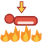{ .ability-mini }[Steam Iron: 10,000 Degree Press](fruits/atsu-atsu-no-mi.md#steam-iron-press) | [Atsu Atsu no Mi](fruits/atsu-atsu-no-mi.md) | Active | 35 s |  |  | 30 | 5.5 blocks (area) |
| { .ability-mini }[Net Tire](fruits/atsu-atsu-no-mi.md#net-tire) | [Atsu Atsu no Mi](fruits/atsu-atsu-no-mi.md) | Active | 13 s |  | 5 s | 8 |  |
| { .ability-mini }[Slippery Slippery](fruits/atsu-atsu-no-mi.md#slippery-slippery) | [Atsu Atsu no Mi](fruits/atsu-atsu-no-mi.md) | Active | 5 s |  | 8 s |  |  |
| { .ability-mini }[Atsu Atsu no Net Surfing](fruits/atsu-atsu-no-mi.md#net-surfing) | [Atsu Atsu no Mi](fruits/atsu-atsu-no-mi.md) | Active | 20 s |  |  | 16 | 14 blocks (line) |
| { .ability-mini }[Vampire Assault Point](fruits/batto-batto-no-mi-model-vampire.md#vampire-assault-point) | [Batto Batto no Mi, Model: Vampire](fruits/batto-batto-no-mi-model-vampire.md) | Active · Transformation |  |  |  |  |  |
| { .ability-mini }[Vampire Fly Point](fruits/batto-batto-no-mi-model-vampire.md#vampire-fly-point) | [Batto Batto no Mi, Model: Vampire](fruits/batto-batto-no-mi-model-vampire.md) | Active · Transformation |  |  |  |  |  |
| { .ability-mini }[Wing Slash](fruits/batto-batto-no-mi-model-vampire.md#wing-slash) | [Batto Batto no Mi, Model: Vampire](fruits/batto-batto-no-mi-model-vampire.md) | Active | 7 s |  |  | 14 | 4.5 blocks (area) |
| { .ability-mini }[Draining Bite](fruits/batto-batto-no-mi-model-vampire.md#draining-bite) | [Batto Batto no Mi, Model: Vampire](fruits/batto-batto-no-mi-model-vampire.md) | Active | 12 s |  |  | 10–15 | 3.5 blocks (line) |
| { .ability-mini }[Give Back](fruits/batto-batto-no-mi-model-vampire.md#give-back) | [Batto Batto no Mi, Model: Vampire](fruits/batto-batto-no-mi-model-vampire.md) | Active | 5 s |  |  |  |  |
| { .ability-mini }[Darkness](fruits/batto-batto-no-mi-model-vampire.md#vampire-darkness) | [Batto Batto no Mi, Model: Vampire](fruits/batto-batto-no-mi-model-vampire.md) | Active | 45 s |  | 30 s |  | 14 blocks (area) |
| { .ability-mini }[Dark Shot](fruits/batto-batto-no-mi-model-vampire.md#dark-shot) | [Batto Batto no Mi, Model: Vampire](fruits/batto-batto-no-mi-model-vampire.md) | Active | 10 s |  |  | 12 |  |
| { .ability-mini }[Red Dash](fruits/batto-batto-no-mi-model-vampire.md#red-dash) | [Batto Batto no Mi, Model: Vampire](fruits/batto-batto-no-mi-model-vampire.md) | Active | 8 s |  |  | 9 | 8–12 blocks (line) |
| { .ability-mini }[Swarm of Bats](fruits/batto-batto-no-mi-model-vampire.md#bat-swarm) | [Batto Batto no Mi, Model: Vampire](fruits/batto-batto-no-mi-model-vampire.md) | Active | 25 s |  | 2–4 s |  |  |
| { .ability-mini }[Echolocation](fruits/batto-batto-no-mi-model-vampire.md#echolocation) | [Batto Batto no Mi, Model: Vampire](fruits/batto-batto-no-mi-model-vampire.md) | Active | 15 s |  |  |  | 24–40 blocks (area) |
| 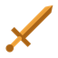{ .ability-mini }[Espada Girl](fruits/buki-buki-no-mi.md#espada-girl) | [Buki Buki no Mi](fruits/buki-buki-no-mi.md) | Active · Punch |  |  |  |  |  |
| { .ability-mini }[Revolver Girl](fruits/buki-buki-no-mi.md#revolver-girl) | [Buki Buki no Mi](fruits/buki-buki-no-mi.md) | Active | 10 s |  | 2 s | 2.5 |  |
| { .ability-mini }[Revolver Leg](fruits/buki-buki-no-mi.md#revolver-leg) | [Buki Buki no Mi](fruits/buki-buki-no-mi.md) | Active | 7 s |  |  | 10 | 3.5 blocks (cone) |
| { .ability-mini }[Gatling Girl](fruits/buki-buki-no-mi.md#gatling-girl) | [Buki Buki no Mi](fruits/buki-buki-no-mi.md) | Active | 25 s |  | 4 s | 1.2 |  |
| { .ability-mini }[Sickle Girl](fruits/buki-buki-no-mi.md#sickle-girl) | [Buki Buki no Mi](fruits/buki-buki-no-mi.md) | Active | 9 s |  |  | 5 |  |
| { .ability-mini }[Fire Girl](fruits/buki-buki-no-mi.md#fire-girl) | [Buki Buki no Mi](fruits/buki-buki-no-mi.md) | Active | 16 s |  | 3 s | 3 | 7 blocks (cone) |
| { .ability-mini }[Missile Girl](fruits/buki-buki-no-mi.md#missile-girl) | [Buki Buki no Mi](fruits/buki-buki-no-mi.md) | Active | 30 s |  | 5 s | 20 |  |
| { .ability-mini }[Flying Disk Girl](fruits/buki-buki-no-mi.md#flying-disk-girl) | [Buki Buki no Mi](fruits/buki-buki-no-mi.md) | Active | 12 s |  | 2 s | 7 |  |
| { .ability-mini }[Hasami](fruits/choki-choki-no-mi.md#hasami) | [Choki Choki no Mi](fruits/choki-choki-no-mi.md) | Active · Punch |  |  |  |  |  |
| 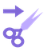{ .ability-mini }[O Kanabashi](fruits/choki-choki-no-mi.md#o-kanabashi) | [Choki Choki no Mi](fruits/choki-choki-no-mi.md) | Active | 8 s |  |  | 8 |  |
| { .ability-mini }[Keep Out](fruits/choki-choki-no-mi.md#keep-out) | [Choki Choki no Mi](fruits/choki-choki-no-mi.md) | Active | 12 s |  |  | 3–8 |  |
| { .ability-mini }[Kirikabe](fruits/choki-choki-no-mi.md#kirikabe) | [Choki Choki no Mi](fruits/choki-choki-no-mi.md) | Active | 15 s |  | 10 s |  |  |
| { .ability-mini }[Kamikiri](fruits/choki-choki-no-mi.md#kamikiri) | [Choki Choki no Mi](fruits/choki-choki-no-mi.md) | Passive |  |  |  |  |  |
| { .ability-mini }[Dai Setsudan](fruits/choki-choki-no-mi.md#dai-setsudan) | [Choki Choki no Mi](fruits/choki-choki-no-mi.md) | Active | 10 s |  |  | 18 |  |
| { .ability-mini }[Kirisaki](fruits/choki-choki-no-mi.md#kirisaki) | [Choki Choki no Mi](fruits/choki-choki-no-mi.md) | Active | 12 s |  | 6 s | 7 |  |
| { .ability-mini }[Kami Hashi](fruits/choki-choki-no-mi.md#kami-hashi) | [Choki Choki no Mi](fruits/choki-choki-no-mi.md) | Active | 15 s |  | 10 s |  |  |
| { .ability-mini }[Ink](fruits/fude-fude-no-mi.md#ink) | [Fude Fude no Mi](fruits/fude-fude-no-mi.md) | Passive |  |  |  |  |  |
| { .ability-mini }[Nuke Suzume](fruits/fude-fude-no-mi.md#nuke-suzume) | [Fude Fude no Mi](fruits/fude-fude-no-mi.md) | Active | 25 s |  | 60 s |  |  |
| { .ability-mini }[Nobori Ryu](fruits/fude-fude-no-mi.md#nobori-ryu) | [Fude Fude no Mi](fruits/fude-fude-no-mi.md) | Active | 25 s |  | 60 s |  |  |
| { .ability-mini }[Kazenbo](fruits/fude-fude-no-mi.md#kazenbo) | [Fude Fude no Mi](fruits/fude-fude-no-mi.md) | Active | 45 s |  | 40 s | 7 |  |
| { .ability-mini }[Ink Double](fruits/fude-fude-no-mi.md#ink-double) | [Fude Fude no Mi](fruits/fude-fude-no-mi.md) | Active | 20 s |  | 30 s |  |  |
| { .ability-mini }[Sumigumo](fruits/fude-fude-no-mi.md#sumigumo) | [Fude Fude no Mi](fruits/fude-fude-no-mi.md) | Active | 25 s |  | 15 s | 2.6–26 | 5 blocks (area) |
| { .ability-mini }[Flat Hiding](fruits/fude-fude-no-mi.md#flat-hiding) | [Fude Fude no Mi](fruits/fude-fude-no-mi.md) | Active · Transformation |  |  |  |  |  |
| { .ability-mini }[Ink Weapon](fruits/fude-fude-no-mi.md#ink-weapon) | [Fude Fude no Mi](fruits/fude-fude-no-mi.md) | Active | 10 s |  | 60 s |  |  |
| { .ability-mini }[Ink Food](fruits/fude-fude-no-mi.md#ink-food) | [Fude Fude no Mi](fruits/fude-fude-no-mi.md) | Active | 30 s |  |  |  |  |
| { .ability-mini }[Ink Snakes](fruits/fude-fude-no-mi.md#ink-snakes) | [Fude Fude no Mi](fruits/fude-fude-no-mi.md) | Active | 16 s |  |  | 5 | 14 blocks (line) |
| { .ability-mini }[Doron](fruits/fuku-fuku-no-mi.md#doron) | [Fuku Fuku no Mi](fruits/fuku-fuku-no-mi.md) | Active | 10 s |  |  |  |  |
| { .ability-mini }[Dress Up](fruits/fuku-fuku-no-mi.md#dress-up) | [Fuku Fuku no Mi](fruits/fuku-fuku-no-mi.md) | Active | 10 s |  |  |  | 5 blocks (line) |
| 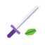{ .ability-mini }[Garb Blade](fruits/fuku-fuku-no-mi.md#garb-blade) | [Fuku Fuku no Mi](fruits/fuku-fuku-no-mi.md) | Active | 10 s |  |  |  |  |
| { .ability-mini }[Gofukuten](fruits/fuku-fuku-no-mi.md#gofukuten) | [Fuku Fuku no Mi](fruits/fuku-fuku-no-mi.md) | Active | 60–90 s |  | 30 s |  |  |
| { .ability-mini }[Fuyu](fruits/fuwa-fuwa-no-mi.md#fuyu) | [Fuwa Fuwa no Mi](fruits/fuwa-fuwa-no-mi.md) | Passive |  |  |  |  |  |
| { .ability-mini }[Item Kaiten](fruits/fuwa-fuwa-no-mi.md#item-kaiten) | [Fuwa Fuwa no Mi](fruits/fuwa-fuwa-no-mi.md) | Active | 5 s |  |  |  |  |
| { .ability-mini }[Item Hassha](fruits/fuwa-fuwa-no-mi.md#item-hassha) | [Fuwa Fuwa no Mi](fruits/fuwa-fuwa-no-mi.md) | Active | 2 s |  |  | 8 |  |
| { .ability-mini }[Shishi Odoshi](fruits/fuwa-fuwa-no-mi.md#shishi-odoshi) | [Fuwa Fuwa no Mi](fruits/fuwa-fuwa-no-mi.md) | Active | 10 s |  |  | 18 | 20 blocks (line) |
| { .ability-mini }[Shishi Odoshi: Chimaki](fruits/fuwa-fuwa-no-mi.md#chimaki) | [Fuwa Fuwa no Mi](fruits/fuwa-fuwa-no-mi.md) | Active | 20 s |  | 5 s | 10–30 | 4 blocks (area) |
| { .ability-mini }[Zanpa](fruits/fuwa-fuwa-no-mi.md#zanpa) | [Fuwa Fuwa no Mi](fruits/fuwa-fuwa-no-mi.md) | Active | 25 s |  |  | 6 |  |
| { .ability-mini }[Shishi Funjin](fruits/fuwa-fuwa-no-mi.md#shishi-funjin) | [Fuwa Fuwa no Mi](fruits/fuwa-fuwa-no-mi.md) | Active | 8 s |  |  | 9 |  |
| { .ability-mini }[Ryuki](fruits/fuwa-fuwa-no-mi.md#ryuki) | [Fuwa Fuwa no Mi](fruits/fuwa-fuwa-no-mi.md) | Active | 12 s |  |  | 18 | 5 blocks (area) |
| 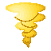{ .ability-mini }[Tatsumaki](fruits/fuwa-fuwa-no-mi.md#tatsumaki) | [Fuwa Fuwa no Mi](fruits/fuwa-fuwa-no-mi.md) | Active | 14 s |  | 2 s | 5 | 3 blocks (area) |
| { .ability-mini }[Fusen](fruits/fuwa-fuwa-no-mi.md#fusen) | [Fuwa Fuwa no Mi](fruits/fuwa-fuwa-no-mi.md) | Active | 2 s |  |  |  |  |
| { .ability-mini }[Desmontar](fruits/gasha-gasha-no-mi.md#desmontar) | [Gasha Gasha no Mi](fruits/gasha-gasha-no-mi.md) | Active | 2 s |  |  |  |  |
| { .ability-mini }[Taller](fruits/gasha-gasha-no-mi.md#taller) | [Gasha Gasha no Mi](fruits/gasha-gasha-no-mi.md) | Active | 1 s |  |  |  |  |
| { .ability-mini }[Muralla](fruits/gasha-gasha-no-mi.md#muralla) | [Gasha Gasha no Mi](fruits/gasha-gasha-no-mi.md) | Active | 12 s |  |  |  |  |
| { .ability-mini }[Cañón Armado](fruits/gasha-gasha-no-mi.md#canon-armado) | [Gasha Gasha no Mi](fruits/gasha-gasha-no-mi.md) | Active | 2 s |  |  |  |  |
| { .ability-mini }[Torreta](fruits/gasha-gasha-no-mi.md#torreta) | [Gasha Gasha no Mi](fruits/gasha-gasha-no-mi.md) | Active | 30 s |  |  |  |  |
| { .ability-mini }[Soldado](fruits/gasha-gasha-no-mi.md#soldado) | [Gasha Gasha no Mi](fruits/gasha-gasha-no-mi.md) | Active | 60 s |  |  |  |  |
| { .ability-mini }[Unión Armado](fruits/gasha-gasha-no-mi.md#union-armado) | [Gasha Gasha no Mi](fruits/gasha-gasha-no-mi.md) | Active · Transformation | 6–30 s |  | 60 s |  |  |
| { .ability-mini }[Ultimate Faust](fruits/gasha-gasha-no-mi.md#ultimate-faust) | [Gasha Gasha no Mi](fruits/gasha-gasha-no-mi.md) | Active | 40 s | 2 s |  | 80 | 6 blocks (area) |
| { .ability-mini }[Blindado](fruits/gasha-gasha-no-mi.md#blindado) | [Gasha Gasha no Mi](fruits/gasha-gasha-no-mi.md) | Active · Transformation |  |  |  |  |  |
| { .ability-mini }[Det Sterkeste Strike](fruits/gasha-gasha-no-mi.md#det-sterkeste-strike) | [Gasha Gasha no Mi](fruits/gasha-gasha-no-mi.md) | Active | 20 s |  |  | 10 | 4 blocks (line) |
| { .ability-mini }[Giro Giro Vision](fruits/giro-giro-no-mi.md#giro-vision) | [Giro Giro no Mi](fruits/giro-giro-no-mi.md) | Active | 2 s |  |  |  | 40 blocks (area) |
| { .ability-mini }[Peeping Mind](fruits/giro-giro-no-mi.md#peeping-mind) | [Giro Giro no Mi](fruits/giro-giro-no-mi.md) | Active | 10 s |  |  |  |  |
| { .ability-mini }[Senrigan](fruits/giro-giro-no-mi.md#senrigan) | [Giro Giro no Mi](fruits/giro-giro-no-mi.md) | Active | 60 s |  |  |  | 4,000 blocks (area) |
| { .ability-mini }[Hierro Lagrima: Mekujira](fruits/giro-giro-no-mi.md#mekujira) | [Giro Giro no Mi](fruits/giro-giro-no-mi.md) | Active | 10 s |  |  | 7–14 |  |
| { .ability-mini }[Insight](fruits/giro-giro-no-mi.md#giro-insight) | [Giro Giro no Mi](fruits/giro-giro-no-mi.md) | Passive |  |  |  |  |  |
| { .ability-mini }[Gold Hoard](fruits/goru-goru-no-mi.md#gold-hoard) | [Goru Goru no Mi](fruits/goru-goru-no-mi.md) | Passive |  |  |  |  |  |
| { .ability-mini }[Golden Senses](fruits/goru-goru-no-mi.md#golden-senses) | [Goru Goru no Mi](fruits/goru-goru-no-mi.md) | Passive |  |  |  |  |  |
| 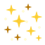{ .ability-mini }[Gold Dust](fruits/goru-goru-no-mi.md#gold-dust) | [Goru Goru no Mi](fruits/goru-goru-no-mi.md) | Active | 20 s |  |  |  | 8 blocks (area) |
| { .ability-mini }[Golden Statue](fruits/goru-goru-no-mi.md#golden-statue) | [Goru Goru no Mi](fruits/goru-goru-no-mi.md) | Active | 30 s |  | 4–10 s |  | 16 blocks (line) |
| { .ability-mini }[Gon Bomba](fruits/goru-goru-no-mi.md#gon-bomba) | [Goru Goru no Mi](fruits/goru-goru-no-mi.md) | Active | 10 s |  |  | 22 | 3 blocks (area) |
| { .ability-mini }[Gon Lancia](fruits/goru-goru-no-mi.md#gon-lancia) | [Goru Goru no Mi](fruits/goru-goru-no-mi.md) | Active | 10 s |  |  | 3 |  |
| { .ability-mini }[Gon L'ira di Dio](fruits/goru-goru-no-mi.md#gon-lira-di-dio) | [Goru Goru no Mi](fruits/goru-goru-no-mi.md) | Active | 14 s |  |  | 26 | 16 blocks (line) |
| { .ability-mini }[Gon Incantesimo](fruits/goru-goru-no-mi.md#gon-incantesimo) | [Goru Goru no Mi](fruits/goru-goru-no-mi.md) | Active | 16 s |  | 6 s | 2–12 | 14 blocks (line) |
| { .ability-mini }[Gon Frenesia](fruits/goru-goru-no-mi.md#gon-frenesia) | [Goru Goru no Mi](fruits/goru-goru-no-mi.md) | Active | 8 s |  |  | 18 | 4 blocks (cone) |
| { .ability-mini }[Gon Tempesta](fruits/goru-goru-no-mi.md#gon-tempesta) | [Goru Goru no Mi](fruits/goru-goru-no-mi.md) | Active | 12 s |  |  | 16 | 8 blocks (cone) |
| { .ability-mini }[Golden Armour](fruits/goru-goru-no-mi.md#golden-armour) | [Goru Goru no Mi](fruits/goru-goru-no-mi.md) | Active · Transformation |  |  |  |  |  |
| { .ability-mini }[Golden Tesoro](fruits/goru-goru-no-mi.md#golden-tesoro) | [Goru Goru no Mi](fruits/goru-goru-no-mi.md) | Active · Transformation |  |  |  |  |  |
| { .ability-mini }[Gon Inferno](fruits/goru-goru-no-mi.md#gon-inferno) | [Goru Goru no Mi](fruits/goru-goru-no-mi.md) | Active | 20 s |  |  | 26 |  |
| { .ability-mini }[Gon Fuoco di Dio](fruits/goru-goru-no-mi.md#gon-fuoco-di-dio) | [Goru Goru no Mi](fruits/goru-goru-no-mi.md) | Active | 20 s |  |  | 20 | 32 blocks (line) |
| { .ability-mini }[Puropera](fruits/guru-guru-no-mi.md#puropera) | [Guru Guru no Mi](fruits/guru-guru-no-mi.md) | Active |  |  |  |  |  |
| { .ability-mini }[Toppu: Matasaburo](fruits/guru-guru-no-mi.md#toppu-matasaburo) | [Guru Guru no Mi](fruits/guru-guru-no-mi.md) | Active | 10 s |  |  | 6 | 10 blocks (cone) |
| { .ability-mini }[Guru Guru Toshaho](fruits/guru-guru-no-mi.md#guru-guru-toshaho) | [Guru Guru no Mi](fruits/guru-guru-no-mi.md) | Active | 13 s |  |  | 8 |  |
| { .ability-mini }[Suketo](fruits/guru-guru-no-mi.md#suketo) | [Guru Guru no Mi](fruits/guru-guru-no-mi.md) | Active | 10 s |  | 5 s | 7 |  |
| { .ability-mini }[Senpu](fruits/guru-guru-no-mi.md#senpu) | [Guru Guru no Mi](fruits/guru-guru-no-mi.md) | Active | 12 s |  | 3 s | 8 | 2.6 blocks (area) |
| { .ability-mini }[Hiko](fruits/guru-guru-no-mi.md#hiko) | [Guru Guru no Mi](fruits/guru-guru-no-mi.md) | Passive |  |  |  |  |  |
| { .ability-mini }[Kaiten Ningen](fruits/guru-guru-no-mi.md#kaiten-ningen) | [Guru Guru no Mi](fruits/guru-guru-no-mi.md) | Passive |  |  |  |  |  |
| { .ability-mini }[Furnace](fruits/gutsu-gutsu-no-mi.md#furnace) | [Gutsu Gutsu no Mi](fruits/gutsu-gutsu-no-mi.md) | Passive |  |  |  |  |  |
| { .ability-mini }[Smelt](fruits/gutsu-gutsu-no-mi.md#smelt) | [Gutsu Gutsu no Mi](fruits/gutsu-gutsu-no-mi.md) | Active | 1 s |  |  |  |  |
| { .ability-mini }[Forge](fruits/gutsu-gutsu-no-mi.md#forge) | [Gutsu Gutsu no Mi](fruits/gutsu-gutsu-no-mi.md) | Active | 10 s |  |  |  |  |
| { .ability-mini }[Arm the Crew](fruits/gutsu-gutsu-no-mi.md#arm-the-crew) | [Gutsu Gutsu no Mi](fruits/gutsu-gutsu-no-mi.md) | Active | 30 s |  |  |  | 10 blocks (area) |
| { .ability-mini }[Molten Shot](fruits/gutsu-gutsu-no-mi.md#molten-shot) | [Gutsu Gutsu no Mi](fruits/gutsu-gutsu-no-mi.md) | Active | 4 s |  |  | 9 |  |
| { .ability-mini }[Molten Stream](fruits/gutsu-gutsu-no-mi.md#molten-stream) | [Gutsu Gutsu no Mi](fruits/gutsu-gutsu-no-mi.md) | Active | 15 s |  | 5 s | 2 | 10 blocks (line) |
| { .ability-mini }[Metal Casing](fruits/gutsu-gutsu-no-mi.md#metal-casing) | [Gutsu Gutsu no Mi](fruits/gutsu-gutsu-no-mi.md) | Active | 25 s |  | 3–8 s |  | 12 blocks (line) |
| { .ability-mini }[Metal Coat](fruits/gutsu-gutsu-no-mi.md#metal-coat) | [Gutsu Gutsu no Mi](fruits/gutsu-gutsu-no-mi.md) | Active · Transformation |  |  |  |  |  |
| { .ability-mini }[Overfed](fruits/gutsu-gutsu-no-mi.md#overfed) | [Gutsu Gutsu no Mi](fruits/gutsu-gutsu-no-mi.md) | Active · Transformation |  |  |  | 2 | 5.6 blocks (area) |
| { .ability-mini }[Orochi Heavy Point](fruits/hebi-hebi-no-mi-model-yamata-no-orochi.md#orochi-heavy-point) | [Hebi Hebi no Mi, Model: Yamata no Orochi](fruits/hebi-hebi-no-mi-model-yamata-no-orochi.md) | Active · Transformation |  |  |  |  |  |
| { .ability-mini }[Orochi Guard Point](fruits/hebi-hebi-no-mi-model-yamata-no-orochi.md#orochi-guard-point) | [Hebi Hebi no Mi, Model: Yamata no Orochi](fruits/hebi-hebi-no-mi-model-yamata-no-orochi.md) | Active · Transformation |  |  |  |  |  |
| { .ability-mini }[Eight Lives](fruits/hebi-hebi-no-mi-model-yamata-no-orochi.md#eight-lives) | [Hebi Hebi no Mi, Model: Yamata no Orochi](fruits/hebi-hebi-no-mi-model-yamata-no-orochi.md) | Passive |  |  |  |  |  |
| 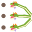{ .ability-mini }[Multi Bite](fruits/hebi-hebi-no-mi-model-yamata-no-orochi.md#multi-bite) | [Hebi Hebi no Mi, Model: Yamata no Orochi](fruits/hebi-hebi-no-mi-model-yamata-no-orochi.md) | Active | 8 s |  |  | 12–14 | 3.5–6 blocks (line) |
| { .ability-mini }[Long Neck](fruits/hebi-hebi-no-mi-model-yamata-no-orochi.md#long-neck) | [Hebi Hebi no Mi, Model: Yamata no Orochi](fruits/hebi-hebi-no-mi-model-yamata-no-orochi.md) | Active | 10 s |  |  | 20 | 9.6–16 blocks (line) |
| { .ability-mini }[Devour](fruits/hebi-hebi-no-mi-model-yamata-no-orochi.md#devour) | [Hebi Hebi no Mi, Model: Yamata no Orochi](fruits/hebi-hebi-no-mi-model-yamata-no-orochi.md) | Active | 12 s |  |  | 18 | 3–5 blocks (line) |
| { .ability-mini }[Eightfold Strike](fruits/hebi-hebi-no-mi-model-yamata-no-orochi.md#eightfold-strike) | [Hebi Hebi no Mi, Model: Yamata no Orochi](fruits/hebi-hebi-no-mi-model-yamata-no-orochi.md) | Active | 20 s |  |  | 5–40 | 4–6 blocks (line) |
| { .ability-mini }[Coiled Guard](fruits/hebi-hebi-no-mi-model-yamata-no-orochi.md#coiled-guard) | [Hebi Hebi no Mi, Model: Yamata no Orochi](fruits/hebi-hebi-no-mi-model-yamata-no-orochi.md) | Active | 15 s |  | 5 s |  |  |
| { .ability-mini }[Jaw Grab](fruits/hebi-hebi-no-mi-model-yamata-no-orochi.md#jaw-grab) | [Hebi Hebi no Mi, Model: Yamata no Orochi](fruits/hebi-hebi-no-mi-model-yamata-no-orochi.md) | Active | 16 s |  | 3 s | 4–24 | 5.4–9 blocks (line) |
| { .ability-mini }[Thrash](fruits/hebi-hebi-no-mi-model-yamata-no-orochi.md#thrash) | [Hebi Hebi no Mi, Model: Yamata no Orochi](fruits/hebi-hebi-no-mi-model-yamata-no-orochi.md) | Active | 16 s |  |  | 24 | 5–9 blocks (area) |
| 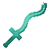{ .ability-mini }[Vipera Glaive](fruits/hira-hira-no-mi.md#vipera-glaive) | [Hira Hira no Mi](fruits/hira-hira-no-mi.md) | Active | 8 s |  |  | 7 | 14 blocks (line) |
| { .ability-mini }[Corrida Glaive](fruits/hira-hira-no-mi.md#corrida-glaive) | [Hira Hira no Mi](fruits/hira-hira-no-mi.md) | Active · Punch |  |  |  |  |  |
| { .ability-mini }[Army Bandera](fruits/hira-hira-no-mi.md#army-bandera) | [Hira Hira no Mi](fruits/hira-hira-no-mi.md) | Active | 15 s |  |  | 4 | 9 blocks (area) |
| { .ability-mini }[Death Enjambre](fruits/hira-hira-no-mi.md#death-enjambre) | [Hira Hira no Mi](fruits/hira-hira-no-mi.md) | Active | 30 s |  | 5 s | 7 | 5 blocks (area) |
| { .ability-mini }[Steel Cape](fruits/hira-hira-no-mi.md#steel-cape) | [Hira Hira no Mi](fruits/hira-hira-no-mi.md) | Active | 3–9 s |  | 6 s |  |  |
| { .ability-mini }[Lock](fruits/hira-hira-no-mi.md#lock) | [Hira Hira no Mi](fruits/hira-hira-no-mi.md) | Active | 20 s |  | 30 s |  |  |
| { .ability-mini }[Flag Body](fruits/hira-hira-no-mi.md#flag-body) | [Hira Hira no Mi](fruits/hira-hira-no-mi.md) | Passive |  |  |  |  |  |
| { .ability-mini }[Onyudo Heavy Point](fruits/hito-hito-no-mi-model-onyudo.md#onyudo-heavy-point) | [Hito Hito no Mi, Model: Onyudo](fruits/hito-hito-no-mi-model-onyudo.md) | Active · Transformation |  |  |  |  |  |
| { .ability-mini }[Onyudo Guard Point](fruits/hito-hito-no-mi-model-onyudo.md#onyudo-guard-point) | [Hito Hito no Mi, Model: Onyudo](fruits/hito-hito-no-mi-model-onyudo.md) | Active · Transformation |  |  |  |  |  |
| { .ability-mini }[Great Sweep](fruits/hito-hito-no-mi-model-onyudo.md#great-sweep) | [Hito Hito no Mi, Model: Onyudo](fruits/hito-hito-no-mi-model-onyudo.md) | Active | 10 s |  |  | 11–26 | 4–7.5 blocks (area) |
| { .ability-mini }[Long Thrust](fruits/hito-hito-no-mi-model-onyudo.md#long-thrust) | [Hito Hito no Mi, Model: Onyudo](fruits/hito-hito-no-mi-model-onyudo.md) | Active | 11 s |  |  | 14–30 | 5.5–10 blocks (line) |
| { .ability-mini }[Monk's Guard](fruits/hito-hito-no-mi-model-onyudo.md#monks-guard) | [Hito Hito no Mi, Model: Onyudo](fruits/hito-hito-no-mi-model-onyudo.md) | Active | 15 s |  | 5 s |  |  |
| { .ability-mini }[Giant's Stomp](fruits/hito-hito-no-mi-model-onyudo.md#giants-stomp) | [Hito Hito no Mi, Model: Onyudo](fruits/hito-hito-no-mi-model-onyudo.md) | Active | 14 s |  |  | 12–18 | 3.5–7 blocks (area) |
| { .ability-mini }[Dread Gaze](fruits/hito-hito-no-mi-model-onyudo.md#dread-gaze) | [Hito Hito no Mi, Model: Onyudo](fruits/hito-hito-no-mi-model-onyudo.md) | Active | 18 s |  |  |  | 14 blocks (area) |
| { .ability-mini }[Earth Splitter](fruits/hito-hito-no-mi-model-onyudo.md#earth-splitter) | [Hito Hito no Mi, Model: Onyudo](fruits/hito-hito-no-mi-model-onyudo.md) | Active | 40 s |  |  | 26–40 | 16 blocks (line) |
| { .ability-mini }[Omocha](fruits/hobi-hobi-no-mi.md#omocha) | [Hobi Hobi no Mi](fruits/hobi-hobi-no-mi.md) | Active · Punch |  |  |  |  |  |
| { .ability-mini }[Keiyaku](fruits/hobi-hobi-no-mi.md#keiyaku) | [Hobi Hobi no Mi](fruits/hobi-hobi-no-mi.md) | Active | 1 s |  |  |  | 10 blocks (line) |
| { .ability-mini }[Little Black Bears](fruits/hobi-hobi-no-mi.md#little-black-bears) | [Hobi Hobi no Mi](fruits/hobi-hobi-no-mi.md) | Active | 45 s |  |  |  | 6 blocks (area) |
| { .ability-mini }[Atamawari Ningyo](fruits/hobi-hobi-no-mi.md#atamawari-ningyo) | [Hobi Hobi no Mi](fruits/hobi-hobi-no-mi.md) | Active | 120 s |  | 60 s |  | 16 blocks (area) |
| { .ability-mini }[Noroi](fruits/hobi-hobi-no-mi.md#noroi) | [Hobi Hobi no Mi](fruits/hobi-hobi-no-mi.md) | Passive |  |  |  |  |  |
| { .ability-mini }[Zettai Meirei](fruits/hobi-hobi-no-mi.md#zettai-meirei) | [Hobi Hobi no Mi](fruits/hobi-hobi-no-mi.md) | Active | 30 s |  | 10 s |  | 24 blocks (area) |
| { .ability-mini }[Kaijo](fruits/hobi-hobi-no-mi.md#kaijo) | [Hobi Hobi no Mi](fruits/hobi-hobi-no-mi.md) | Active | 5 s |  |  |  | 10 blocks (line) |
| { .ability-mini }[Tanuki Heavy Point](fruits/inu-inu-no-mi-model-tanuki.md#tanuki-heavy-point) | [Inu Inu no Mi, Model: Tanuki](fruits/inu-inu-no-mi-model-tanuki.md) | Active · Transformation |  |  |  |  |  |
| { .ability-mini }[Tanuki Walk Point](fruits/inu-inu-no-mi-model-tanuki.md#tanuki-walk-point) | [Inu Inu no Mi, Model: Tanuki](fruits/inu-inu-no-mi-model-tanuki.md) | Active · Transformation |  |  |  |  |  |
| { .ability-mini }[Tanuki Bite](fruits/inu-inu-no-mi-model-tanuki.md#tanuki-bite) | [Inu Inu no Mi, Model: Tanuki](fruits/inu-inu-no-mi-model-tanuki.md) | Active | 5 s |  |  | 6–7 | 1.8 blocks (line) |
| { .ability-mini }[Tail Swipe](fruits/inu-inu-no-mi-model-tanuki.md#tail-swipe) | [Inu Inu no Mi, Model: Tanuki](fruits/inu-inu-no-mi-model-tanuki.md) | Active | 8 s |  |  | 6–8 | 2–2.6 blocks (area) |
| { .ability-mini }[Belly Drum](fruits/inu-inu-no-mi-model-tanuki.md#belly-drum) | [Inu Inu no Mi, Model: Tanuki](fruits/inu-inu-no-mi-model-tanuki.md) | Active | 12 s |  |  | 2.5–10 | 4 blocks (area) |
| { .ability-mini }[Belly Bash](fruits/inu-inu-no-mi-model-tanuki.md#belly-bash) | [Inu Inu no Mi, Model: Tanuki](fruits/inu-inu-no-mi-model-tanuki.md) | Active | 10 s |  |  | 12 |  |
| { .ability-mini }[Scurry](fruits/inu-inu-no-mi-model-tanuki.md#scurry) | [Inu Inu no Mi, Model: Tanuki](fruits/inu-inu-no-mi-model-tanuki.md) | Active | 7 s |  |  | 4 |  |
| { .ability-mini }[Play Dead](fruits/inu-inu-no-mi-model-tanuki.md#play-dead) | [Inu Inu no Mi, Model: Tanuki](fruits/inu-inu-no-mi-model-tanuki.md) | Active | 15 s |  | 10 s |  |  |
| { .ability-mini }[Burrow](fruits/inu-inu-no-mi-model-tanuki.md#burrow) | [Inu Inu no Mi, Model: Tanuki](fruits/inu-inu-no-mi-model-tanuki.md) | Active | 16 s |  | 3 s |  |  |
| 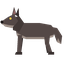{ .ability-mini }[Wolf Walk Point](fruits/inu-inu-no-mi-model-wolf.md#wolf-walk-point) | [Inu Inu no Mi, Model: Wolf](fruits/inu-inu-no-mi-model-wolf.md) | Active · Transformation |  |  |  |  |  |
| { .ability-mini }[Wolf Heavy Point](fruits/inu-inu-no-mi-model-wolf.md#wolf-heavy-point) | [Inu Inu no Mi, Model: Wolf](fruits/inu-inu-no-mi-model-wolf.md) | Active · Transformation |  |  |  |  |  |
| { .ability-mini }[Kamitsuki](fruits/inu-inu-no-mi-model-wolf.md#kamitsuki) | [Inu Inu no Mi, Model: Wolf](fruits/inu-inu-no-mi-model-wolf.md) | Active | 6 s |  |  | 9 |  |
| { .ability-mini }[Shippu](fruits/inu-inu-no-mi-model-wolf.md#shippu) | [Inu Inu no Mi, Model: Wolf](fruits/inu-inu-no-mi-model-wolf.md) | Active | 8 s |  |  | 9 |  |
| { .ability-mini }[Toboe](fruits/inu-inu-no-mi-model-wolf.md#toboe) | [Inu Inu no Mi, Model: Wolf](fruits/inu-inu-no-mi-model-wolf.md) | Active | 20 s |  |  |  | 12 blocks (area) |
| { .ability-mini }[Kyukaku](fruits/inu-inu-no-mi-model-wolf.md#kyukaku) | [Inu Inu no Mi, Model: Wolf](fruits/inu-inu-no-mi-model-wolf.md) | Active | 20 s |  |  |  | 32 blocks (area) |
| { .ability-mini }[Yako](fruits/inu-inu-no-mi-model-wolf.md#yako) | [Inu Inu no Mi, Model: Wolf](fruits/inu-inu-no-mi-model-wolf.md) | Passive |  |  |  |  |  |
| { .ability-mini }[Jusshigan](fruits/inu-inu-no-mi-model-wolf.md#jusshigan) | [Inu Inu no Mi, Model: Wolf](fruits/inu-inu-no-mi-model-wolf.md) | Active | 8 s |  |  | 9 |  |
| { .ability-mini }[Gekko Jusshigan](fruits/inu-inu-no-mi-model-wolf.md#gekko-jusshigan) | [Inu Inu no Mi, Model: Wolf](fruits/inu-inu-no-mi-model-wolf.md) | Active | 15 s |  |  | 18 |  |
| { .ability-mini }[Rankyaku: Koro](fruits/inu-inu-no-mi-model-wolf.md#rankyaku-koro) | [Inu Inu no Mi, Model: Wolf](fruits/inu-inu-no-mi-model-wolf.md) | Active | 7 s |  |  | 12 |  |
| { .ability-mini }[Tekkai Kenpo: Roga no Kamae](fruits/inu-inu-no-mi-model-wolf.md#tekkai-kenpo-roga-no-kamae) | [Inu Inu no Mi, Model: Wolf](fruits/inu-inu-no-mi-model-wolf.md) | Active |  |  | 15 s |  |  |
| { .ability-mini }[Stone Mass](fruits/ishi-ishi-no-mi.md#ishi-stone) | [Ishi Ishi no Mi](fruits/ishi-ishi-no-mi.md) | Passive |  |  |  |  |  |
| { .ability-mini }[Stone Assimilation](fruits/ishi-ishi-no-mi.md#ishi-travel) | [Ishi Ishi no Mi](fruits/ishi-ishi-no-mi.md) | Passive |  |  |  |  |  |
| { .ability-mini }[Pulpostone](fruits/ishi-ishi-no-mi.md#pulpostone) | [Ishi Ishi no Mi](fruits/ishi-ishi-no-mi.md) | Active | 10 s |  |  | 12 |  |
| 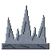{ .ability-mini }[Charlestone](fruits/ishi-ishi-no-mi.md#charlestone) | [Ishi Ishi no Mi](fruits/ishi-ishi-no-mi.md) | Active | 25 s |  |  | 14 |  |
| 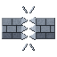{ .ability-mini }[Ishiusu](fruits/ishi-ishi-no-mi.md#ishiusu) | [Ishi Ishi no Mi](fruits/ishi-ishi-no-mi.md) | Active | 15 s |  |  | 26 |  |
| { .ability-mini }[Bitestone](fruits/ishi-ishi-no-mi.md#bitestone) | [Ishi Ishi no Mi](fruits/ishi-ishi-no-mi.md) | Active | 12 s |  |  | 15 |  |
| { .ability-mini }[Ishi Kobushi](fruits/ishi-ishi-no-mi.md#ishi-kobushi) | [Ishi Ishi no Mi](fruits/ishi-ishi-no-mi.md) | Active | 3 s |  |  | 6 |  |
| { .ability-mini }[Stone Giant](fruits/ishi-ishi-no-mi.md#ishi-giant) | [Ishi Ishi no Mi](fruits/ishi-ishi-no-mi.md) | Active · Transformation |  |  |  |  |  |
| { .ability-mini }[Decaying Touch](fruits/juku-juku-no-mi.md#decaying-touch) | [Juku Juku no Mi](fruits/juku-juku-no-mi.md) | Active | 6 s |  |  |  | 5 blocks (line) |
| { .ability-mini }[Sinkhole](fruits/juku-juku-no-mi.md#sinkhole) | [Juku Juku no Mi](fruits/juku-juku-no-mi.md) | Active | 15 s |  |  |  | 8 blocks (line) |
| { .ability-mini }[Kare-San-Sui](fruits/juku-juku-no-mi.md#kare-san-sui) | [Juku Juku no Mi](fruits/juku-juku-no-mi.md) | Active | 20 s |  |  |  | 16 blocks (line) |
| { .ability-mini }[Aging Touch](fruits/juku-juku-no-mi.md#aging-touch) | [Juku Juku no Mi](fruits/juku-juku-no-mi.md) | Active | 15 s |  |  |  | 4.5 blocks (line) |
| 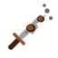{ .ability-mini }[Rot Gear](fruits/juku-juku-no-mi.md#rot-gear) | [Juku Juku no Mi](fruits/juku-juku-no-mi.md) | Active | 15 s |  |  |  | 4.5 blocks (line) |
| 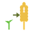{ .ability-mini }[Ripen](fruits/juku-juku-no-mi.md#ripen) | [Juku Juku no Mi](fruits/juku-juku-no-mi.md) | Active | 30 s |  |  |  | 6 blocks (area) |
| { .ability-mini }[Kama Tsume](fruits/kama-kama-no-mi.md#kama-tsume) | [Kama Kama no Mi](fruits/kama-kama-no-mi.md) | Active · Transformation |  |  |  |  |  |
| { .ability-mini }[Kama Kama no Kamaitachi](fruits/kama-kama-no-mi.md#kama-kama-no-kamaitachi) | [Kama Kama no Mi](fruits/kama-kama-no-mi.md) | Active | 3 s |  |  | 6 |  |
| { .ability-mini }[Kama Kama no Tsumujikaze](fruits/kama-kama-no-mi.md#kama-kama-no-tsumujikaze) | [Kama Kama no Mi](fruits/kama-kama-no-mi.md) | Active | 10–15 s |  |  | 9–15 |  |
| { .ability-mini }[Kama Kama no Kamaitachi Midareuchi](fruits/kama-kama-no-mi.md#kama-kama-no-kamaitachi-midareuchi) | [Kama Kama no Mi](fruits/kama-kama-no-mi.md) | Active | 30 s |  |  | 3–4 | 3 blocks (area) |
| { .ability-mini }[Kama Kama no Renzan](fruits/kama-kama-no-mi.md#kama-kama-no-renzan) | [Kama Kama no Mi](fruits/kama-kama-no-mi.md) | Active | 10 s |  |  | 16 | 3 blocks (line) |
| { .ability-mini }[Kama Kama no Tsuji Giri](fruits/kama-kama-no-mi.md#kama-kama-no-tsuji-giri) | [Kama Kama no Mi](fruits/kama-kama-no-mi.md) | Active | 10 s |  |  | 10 |  |
| { .ability-mini }[Kama Kama no Kiri Harai](fruits/kama-kama-no-mi.md#kama-kama-no-kiri-harai) | [Kama Kama no Mi](fruits/kama-kama-no-mi.md) | Active | 12 s |  | 2 s |  |  |
| { .ability-mini }[Kama Kama no Enbu](fruits/kama-kama-no-mi.md#kama-kama-no-enbu) | [Kama Kama no Mi](fruits/kama-kama-no-mi.md) | Active | 15 s |  |  | 8 |  |
| { .ability-mini }[Kibi Dango](fruits/kibi-kibi-no-mi.md#kibi-dango) | [Kibi Kibi no Mi](fruits/kibi-kibi-no-mi.md) | Active | 2 s |  |  |  |  |
| { .ability-mini }[Kibi Dan-boshi](fruits/kibi-kibi-no-mi.md#kibi-dan-boshi) | [Kibi Kibi no Mi](fruits/kibi-kibi-no-mi.md) | Active | 3 s |  |  |  |  |
| { .ability-mini }[Wheels](fruits/koro-koro-no-mi.md#wheels) | [Koro Koro no Mi](fruits/koro-koro-no-mi.md) | Active · Transformation |  |  |  |  |  |
| { .ability-mini }[Ram](fruits/koro-koro-no-mi.md#ram) | [Koro Koro no Mi](fruits/koro-koro-no-mi.md) | Active | 7 s |  |  | 8–16 |  |
| { .ability-mini }[Skid](fruits/koro-koro-no-mi.md#skid) | [Koro Koro no Mi](fruits/koro-koro-no-mi.md) | Active | 8 s |  |  | 9 | 3.2 blocks (area) |
| { .ability-mini }[Rail Jump](fruits/koro-koro-no-mi.md#rail-jump) | [Koro Koro no Mi](fruits/koro-koro-no-mi.md) | Active | 11 s |  |  | 12 | 14 blocks (line) |
| { .ability-mini }[Bakudan Ame](fruits/koro-koro-no-mi.md#bakudan-ame) | [Koro Koro no Mi](fruits/koro-koro-no-mi.md) | Active | 6 s |  |  | 10–20 |  |
| { .ability-mini }[Spin](fruits/koro-koro-no-mi.md#spin) | [Koro Koro no Mi](fruits/koro-koro-no-mi.md) | Active | 30 s |  | 15 s |  |  |
| { .ability-mini }[Gauntlet Punch](fruits/kote-kote-no-mi.md#gauntlet-punch) | [Kote Kote no Mi](fruits/kote-kote-no-mi.md) | Active | 6 s |  |  | 14 | 16 blocks (line) |
| { .ability-mini }[Gauntlet Grab](fruits/kote-kote-no-mi.md#gauntlet-grab) | [Kote Kote no Mi](fruits/kote-kote-no-mi.md) | Active | 8 s |  | 20 s | 12 | 12 blocks (line) |
| { .ability-mini }[Lightning Barrier](fruits/kote-kote-no-mi.md#lightning-barrier) | [Kote Kote no Mi](fruits/kote-kote-no-mi.md) | Active | 14 s |  | 8 s |  |  |
| { .ability-mini }[Tensei Hoshi](fruits/kote-kote-no-mi.md#tensei-hoshi) | [Kote Kote no Mi](fruits/kote-kote-no-mi.md) | Active | 16 s |  | 8 s |  | 20 blocks (line) |
| { .ability-mini }[Grande](fruits/kote-kote-no-mi.md#grande) | [Kote Kote no Mi](fruits/kote-kote-no-mi.md) | Active | 30 s |  | 8 s | 4 | 5 blocks (area) |
| { .ability-mini }[Gauntlet Vise](fruits/kote-kote-no-mi.md#gauntlet-vise) | [Kote Kote no Mi](fruits/kote-kote-no-mi.md) | Active | 16 s |  | 2 s | 18 | 12 blocks (line) |
| { .ability-mini }[Gauntlet Lift](fruits/kote-kote-no-mi.md#gauntlet-lift) | [Kote Kote no Mi](fruits/kote-kote-no-mi.md) | Active | 8 s |  |  |  |  |
| { .ability-mini }[Solmente](fruits/kote-kote-no-mi.md#solmente) | [Kote Kote no Mi](fruits/kote-kote-no-mi.md) | Active | 40 s |  | 60 s |  | 10 blocks (line) |
| { .ability-mini }[A Jien Te](fruits/kote-kote-no-mi.md#a-jien-te) | [Kote Kote no Mi](fruits/kote-kote-no-mi.md) | Active | 20 s |  | 10 s |  | 24 blocks (line) |
| { .ability-mini }[Rosamygale Heavy Point](fruits/kumo-kumo-no-mi-model-rosamygale-grauvogeli.md#rosamygale-heavy-point) | [Kumo Kumo no Mi, Model: Rosamygale Grauvogeli](fruits/kumo-kumo-no-mi-model-rosamygale-grauvogeli.md) | Active · Transformation |  |  |  |  |  |
| { .ability-mini }[Rosamygale Walk Point](fruits/kumo-kumo-no-mi-model-rosamygale-grauvogeli.md#rosamygale-walk-point) | [Kumo Kumo no Mi, Model: Rosamygale Grauvogeli](fruits/kumo-kumo-no-mi-model-rosamygale-grauvogeli.md) | Active · Transformation |  |  |  |  |  |
| { .ability-mini }[Wall Walker](fruits/kumo-kumo-no-mi-model-rosamygale-grauvogeli.md#wall-walker) | [Kumo Kumo no Mi, Model: Rosamygale Grauvogeli](fruits/kumo-kumo-no-mi-model-rosamygale-grauvogeli.md) | Passive |  |  |  |  |  |
| { .ability-mini }[Hard Gum](fruits/kumo-kumo-no-mi-model-rosamygale-grauvogeli.md#hard-gum) | [Kumo Kumo no Mi, Model: Rosamygale Grauvogeli](fruits/kumo-kumo-no-mi-model-rosamygale-grauvogeli.md) | Active | 12 s |  |  |  | 12 blocks (line) |
| { .ability-mini }[Marianette](fruits/kumo-kumo-no-mi-model-rosamygale-grauvogeli.md#marianette) | [Kumo Kumo no Mi, Model: Rosamygale Grauvogeli](fruits/kumo-kumo-no-mi-model-rosamygale-grauvogeli.md) | Active | 14 s |  | 4 s |  | 14 blocks (line) |
| { .ability-mini }[Oshizumaria](fruits/kumo-kumo-no-mi-model-rosamygale-grauvogeli.md#oshizumaria) | [Kumo Kumo no Mi, Model: Rosamygale Grauvogeli](fruits/kumo-kumo-no-mi-model-rosamygale-grauvogeli.md) | Active | 15 s |  |  |  |  |
| 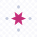{ .ability-mini }[Ikidomaria](fruits/kumo-kumo-no-mi-model-rosamygale-grauvogeli.md#ikidomaria) | [Kumo Kumo no Mi, Model: Rosamygale Grauvogeli](fruits/kumo-kumo-no-mi-model-rosamygale-grauvogeli.md) | Active | 15 s |  |  |  |  |
| 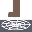{ .ability-mini }[Web Trap](fruits/kumo-kumo-no-mi-model-rosamygale-grauvogeli.md#web-trap) | [Kumo Kumo no Mi, Model: Rosamygale Grauvogeli](fruits/kumo-kumo-no-mi-model-rosamygale-grauvogeli.md) | Active | 8 s |  |  |  |  |
| { .ability-mini }[Cocoon](fruits/kumo-kumo-no-mi-model-rosamygale-grauvogeli.md#cocoon) | [Kumo Kumo no Mi, Model: Rosamygale Grauvogeli](fruits/kumo-kumo-no-mi-model-rosamygale-grauvogeli.md) | Active | 16 s |  |  |  | 6 blocks (area) |
| { .ability-mini }[Venom Bite](fruits/kumo-kumo-no-mi-model-rosamygale-grauvogeli.md#venom-bite) | [Kumo Kumo no Mi, Model: Rosamygale Grauvogeli](fruits/kumo-kumo-no-mi-model-rosamygale-grauvogeli.md) | Active | 10 s |  |  | 18 | 2.5 blocks (line) |
| 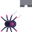{ .ability-mini }[Thread Pull](fruits/kumo-kumo-no-mi-model-rosamygale-grauvogeli.md#thread-pull) | [Kumo Kumo no Mi, Model: Rosamygale Grauvogeli](fruits/kumo-kumo-no-mi-model-rosamygale-grauvogeli.md) | Active | 7 s |  |  |  | 20 blocks (line) |
| { .ability-mini }[Cubreak](fruits/kyubu-kyubu-no-mi.md#cubreak) | [Kyubu Kyubu no Mi](fruits/kyubu-kyubu-no-mi.md) | Active | 4 s |  |  |  |  |
| { .ability-mini }[Cubooster](fruits/kyubu-kyubu-no-mi.md#cubooster) | [Kyubu Kyubu no Mi](fruits/kyubu-kyubu-no-mi.md) | Active | 8 s |  |  | 3.5 |  |
| { .ability-mini }[Cube Wall](fruits/kyubu-kyubu-no-mi.md#cube-wall) | [Kyubu Kyubu no Mi](fruits/kyubu-kyubu-no-mi.md) | Active | 6 s |  |  |  |  |
| { .ability-mini }[Air Cube](fruits/kyubu-kyubu-no-mi.md#air-cube) | [Kyubu Kyubu no Mi](fruits/kyubu-kyubu-no-mi.md) | Active | 12 s |  | 10 s | 12 |  |
| { .ability-mini }[Living Cube](fruits/kyubu-kyubu-no-mi.md#living-cube) | [Kyubu Kyubu no Mi](fruits/kyubu-kyubu-no-mi.md) | Active | 20 s |  | 4–10 s |  | 5 blocks (line) |
| 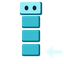{ .ability-mini }[Totem Cube](fruits/kyubu-kyubu-no-mi.md#totem-cube) | [Kyubu Kyubu no Mi](fruits/kyubu-kyubu-no-mi.md) | Active | 18 s |  |  | 20 | 12 blocks (line) |
| { .ability-mini }[Cube Ride](fruits/kyubu-kyubu-no-mi.md#cube-ride) | [Kyubu Kyubu no Mi](fruits/kyubu-kyubu-no-mi.md) | Active | 15 s |  | 5 s |  |  |
| { .ability-mini }[Maki Maki no Jutsu](fruits/maki-maki-no-mi.md#maki-maki-no-jutsu) | [Maki Maki no Mi](fruits/maki-maki-no-mi.md) | Active | 10 s |  | 6 s |  |  |
| 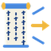{ .ability-mini }[Hokan](fruits/maki-maki-no-mi.md#hokan) | [Maki Maki no Mi](fruits/maki-maki-no-mi.md) | Active | 8 s |  |  |  |  |
| { .ability-mini }[Scroll Wrap](fruits/maki-maki-no-mi.md#scroll-wrap) | [Maki Maki no Mi](fruits/maki-maki-no-mi.md) | Active | 15 s |  |  | 2.5 | 12 blocks (line) |
| { .ability-mini }[Katon](fruits/maki-maki-no-mi.md#katon) | [Maki Maki no Mi](fruits/maki-maki-no-mi.md) | Active | 10 s |  |  | 4–12 | 9 blocks (line) |
| { .ability-mini }[Deluge](fruits/maki-maki-no-mi.md#deluge) | [Maki Maki no Mi](fruits/maki-maki-no-mi.md) | Active | 12 s |  |  | 5 | 10 blocks (line) |
| 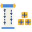{ .ability-mini }[Storage Scroll](fruits/maki-maki-no-mi.md#storage-scroll) | [Maki Maki no Mi](fruits/maki-maki-no-mi.md) | Active | 1 s |  |  |  |  |
| { .ability-mini }[Bunshin no Jutsu](fruits/maki-maki-no-mi.md#bunshin-no-jutsu) | [Maki Maki no Mi](fruits/maki-maki-no-mi.md) | Active | 30 s |  | 15 s |  |  |
| { .ability-mini }[Face Touch](fruits/mane-mane-no-mi.md#face-touch) | [Mane Mane no Mi](fruits/mane-mane-no-mi.md) | Active | 2 s |  |  |  | 4 blocks (line) |
| [Mane Mane Memory](fruits/mane-mane-no-mi.md#mane-mane-memory) | [Mane Mane no Mi](fruits/mane-mane-no-mi.md) | Active | 5 s |  | ∞ s |  |  |
| { .ability-mini }[Jubai Sandan](fruits/moa-moa-no-mi.md#jubai-sandan) | [Moa Moa no Mi](fruits/moa-moa-no-mi.md) | Active | 8 s |  |  | 4 |  |
| { .ability-mini }[Gojubai Ho](fruits/moa-moa-no-mi.md#gojubai-ho) | [Moa Moa no Mi](fruits/moa-moa-no-mi.md) | Active | 14 s |  |  | 8 |  |
| 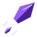{ .ability-mini }[Hyakubai Gan](fruits/moa-moa-no-mi.md#hyakubai-gan) | [Moa Moa no Mi](fruits/moa-moa-no-mi.md) | Active | 20 s |  | 10 s | 26 |  |
| { .ability-mini }[Hyakubai Giri](fruits/moa-moa-no-mi.md#hyakubai-giri) | [Moa Moa no Mi](fruits/moa-moa-no-mi.md) | Active | 16 s |  |  | 22 |  |
| { .ability-mini }[Jubai Soku](fruits/moa-moa-no-mi.md#moa-soku) | [Moa Moa no Mi](fruits/moa-moa-no-mi.md) | Active | 20 s |  |  |  |  |
| { .ability-mini }[Hyakubai Soku: Renda](fruits/moa-moa-no-mi.md#hyakubai-soku-renda) | [Moa Moa no Mi](fruits/moa-moa-no-mi.md) | Active | 18 s |  |  | 2.5 |  |
| { .ability-mini }[Gojubai Soku: Gekitsui](fruits/moa-moa-no-mi.md#gojubai-soku-gekitsui) | [Moa Moa no Mi](fruits/moa-moa-no-mi.md) | Active | 20 s |  |  | 26 |  |
| { .ability-mini }[Modo Modo](fruits/modo-modo-no-mi.md#modo-modo) | [Modo Modo no Mi](fruits/modo-modo-no-mi.md) | Active | 3 s |  |  |  | 3.5 blocks (line) |
| { .ability-mini }[Modo Modo Shot](fruits/modo-modo-no-mi.md#modo-modo-shot) | [Modo Modo no Mi](fruits/modo-modo-no-mi.md) | Active | 7 s |  |  |  |  |
| { .ability-mini }[Back to Lava](fruits/modo-modo-no-mi.md#back-to-lava) | [Modo Modo no Mi](fruits/modo-modo-no-mi.md) | Active | 20 s |  |  |  | 10 blocks (line) |
| { .ability-mini }[Entomb](fruits/modo-modo-no-mi.md#entomb) | [Modo Modo no Mi](fruits/modo-modo-no-mi.md) | Active | 20 s |  | 3–6 s |  | 12 blocks (line) |
| { .ability-mini }[Own Youth](fruits/modo-modo-no-mi.md#own-youth) | [Modo Modo no Mi](fruits/modo-modo-no-mi.md) | Active · Transformation |  |  |  |  |  |
| { .ability-mini }[Renew](fruits/modo-modo-no-mi.md#renew) | [Modo Modo no Mi](fruits/modo-modo-no-mi.md) | Active | 300 s |  |  |  |  |
| { .ability-mini }[Logia Invulnerability Mori](fruits/mori-mori-no-mi.md#logia-invulnerability-mori) | [Mori Mori no Mi](fruits/mori-mori-no-mi.md) | Passive |  |  |  |  |  |
| { .ability-mini }[Kogosei](fruits/mori-mori-no-mi.md#kogosei) | [Mori Mori no Mi](fruits/mori-mori-no-mi.md) | Passive |  |  |  |  |  |
| { .ability-mini }[Ryokuka](fruits/mori-mori-no-mi.md#ryokuka) | [Mori Mori no Mi](fruits/mori-mori-no-mi.md) | Passive |  |  |  |  |  |
| { .ability-mini }[Jukon](fruits/mori-mori-no-mi.md#jukon) | [Mori Mori no Mi](fruits/mori-mori-no-mi.md) | Active | 20 s |  | 5 s | 14 | 5 blocks (area) |
| { .ability-mini }[Edayari](fruits/mori-mori-no-mi.md#edayari) | [Mori Mori no Mi](fruits/mori-mori-no-mi.md) | Active | 8 s |  | 3 s | 20 | 12 blocks (line) |
| { .ability-mini }[Kinniku Mori Mori](fruits/mori-mori-no-mi.md#kinniku-mori-mori) | [Mori Mori no Mi](fruits/mori-mori-no-mi.md) | Active · Transformation | 6–30 s |  | 60 s |  |  |
| { .ability-mini }[Wakagi](fruits/mori-mori-no-mi.md#wakagi) | [Mori Mori no Mi](fruits/mori-mori-no-mi.md) | Passive | 300 s |  |  |  |  |
| { .ability-mini }[Bokarin](fruits/mori-mori-no-mi.md#bokarin) | [Mori Mori no Mi](fruits/mori-mori-no-mi.md) | Active | 5 s |  |  |  |  |
| { .ability-mini }[Hanaguruma](fruits/mori-mori-no-mi.md#hanaguruma) | [Mori Mori no Mi](fruits/mori-mori-no-mi.md) | Active |  |  |  |  |  |
| { .ability-mini }[Hisho](fruits/mori-mori-no-mi.md#hisho) | [Mori Mori no Mi](fruits/mori-mori-no-mi.md) | Passive |  |  |  |  |  |
| { .ability-mini }[Greenery](fruits/mosa-mosa-no-mi.md#greenery) | [Mosa Mosa no Mi](fruits/mosa-mosa-no-mi.md) | Passive |  |  |  |  |  |
| { .ability-mini }[Mosa Mosa Dance](fruits/mosa-mosa-no-mi.md#mosa-mosa-dance) | [Mosa Mosa no Mi](fruits/mosa-mosa-no-mi.md) | Active | 15 s |  |  |  | 9 blocks (area) |
| { .ability-mini }[Thorn Whip](fruits/mosa-mosa-no-mi.md#thorn-whip) | [Mosa Mosa no Mi](fruits/mosa-mosa-no-mi.md) | Active | 6 s |  |  | 10 | 12 blocks (line) |
| { .ability-mini }[Vine Grip](fruits/mosa-mosa-no-mi.md#vine-grip) | [Mosa Mosa no Mi](fruits/mosa-mosa-no-mi.md) | Active | 14 s |  | 5 s | 8 | 18 blocks (line) |
| { .ability-mini }[Green Wall](fruits/mosa-mosa-no-mi.md#green-wall) | [Mosa Mosa no Mi](fruits/mosa-mosa-no-mi.md) | Active | 20 s |  |  |  |  |
| 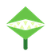{ .ability-mini }[Devouring Plant](fruits/mosa-mosa-no-mi.md#devouring-plant) | [Mosa Mosa no Mi](fruits/mosa-mosa-no-mi.md) | Active | 18 s |  | 3 s | 6–15 | 16 blocks (line) |
| { .ability-mini }[Root Bridge](fruits/mosa-mosa-no-mi.md#root-bridge) | [Mosa Mosa no Mi](fruits/mosa-mosa-no-mi.md) | Active | 12 s |  |  |  | 20 blocks (line) |
| { .ability-mini }[Mosa Mosa Kuzushi](fruits/mosa-mosa-no-mi.md#mosa-mosa-kuzushi) | [Mosa Mosa no Mi](fruits/mosa-mosa-no-mi.md) | Active | 30 s |  |  | 16 | 12 blocks (area) |
| { .ability-mini }[Kabutomushi Heavy Point](fruits/mushi-mushi-no-mi-model-kabutomushi.md#kabutomushi-heavy-point) | [Mushi Mushi no Mi, Model: Kabutomushi](fruits/mushi-mushi-no-mi-model-kabutomushi.md) | Active · Transformation |  |  |  |  |  |
| 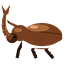{ .ability-mini }[Kabutomushi Walk Point](fruits/mushi-mushi-no-mi-model-kabutomushi.md#kabutomushi-walk-point) | [Mushi Mushi no Mi, Model: Kabutomushi](fruits/mushi-mushi-no-mi-model-kabutomushi.md) | Active · Transformation |  |  |  |  |  |
| { .ability-mini }[Kabutomushi Rideable](fruits/mushi-mushi-no-mi-model-kabutomushi.md#kabutomushi-rideable) | [Mushi Mushi no Mi, Model: Kabutomushi](fruits/mushi-mushi-no-mi-model-kabutomushi.md) | Passive |  |  |  |  |  |
| { .ability-mini }[Beetle Upper](fruits/mushi-mushi-no-mi-model-kabutomushi.md#beetle-upper) | [Mushi Mushi no Mi, Model: Kabutomushi](fruits/mushi-mushi-no-mi-model-kabutomushi.md) | Active | 11 s |  |  | 10 |  |
| 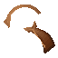{ .ability-mini }[Horn Toss](fruits/mushi-mushi-no-mi-model-kabutomushi.md#horn-toss) | [Mushi Mushi no Mi, Model: Kabutomushi](fruits/mushi-mushi-no-mi-model-kabutomushi.md) | Active | 7 s |  |  | 6 |  |
| { .ability-mini }[Horn Dive](fruits/mushi-mushi-no-mi-model-kabutomushi.md#horn-dive) | [Mushi Mushi no Mi, Model: Kabutomushi](fruits/mushi-mushi-no-mi-model-kabutomushi.md) | Active | 14 s |  |  | 14–26 | 4 blocks (area) |
| 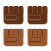{ .ability-mini }[Four Arm Rush](fruits/mushi-mushi-no-mi-model-kabutomushi.md#four-arm-rush) | [Mushi Mushi no Mi, Model: Kabutomushi](fruits/mushi-mushi-no-mi-model-kabutomushi.md) | Active | 12 s |  |  | 4–24 | 3 blocks (line) |
| { .ability-mini }[Shell Guard](fruits/mushi-mushi-no-mi-model-kabutomushi.md#shell-guard) | [Mushi Mushi no Mi, Model: Kabutomushi](fruits/mushi-mushi-no-mi-model-kabutomushi.md) | Active | 20 s |  | 5 s |  |  |
| { .ability-mini }[Beetle Ram](fruits/mushi-mushi-no-mi-model-kabutomushi.md#beetle-ram) | [Mushi Mushi no Mi, Model: Kabutomushi](fruits/mushi-mushi-no-mi-model-kabutomushi.md) | Active | 16 s |  |  | 22 |  |
| { .ability-mini }[Suzumebachi Heavy Point](fruits/mushi-mushi-no-mi-model-suzumebachi.md#suzumebachi-heavy-point) | [Mushi Mushi no Mi, Model: Suzumebachi](fruits/mushi-mushi-no-mi-model-suzumebachi.md) | Active · Transformation |  |  |  |  |  |
| 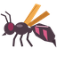{ .ability-mini }[Suzumebachi Walk Point](fruits/mushi-mushi-no-mi-model-suzumebachi.md#suzumebachi-walk-point) | [Mushi Mushi no Mi, Model: Suzumebachi](fruits/mushi-mushi-no-mi-model-suzumebachi.md) | Active · Transformation |  |  |  |  |  |
| { .ability-mini }[Stinger](fruits/mushi-mushi-no-mi-model-suzumebachi.md#stinger) | [Mushi Mushi no Mi, Model: Suzumebachi](fruits/mushi-mushi-no-mi-model-suzumebachi.md) | Active | 6 s |  |  | 7 |  |
| 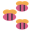{ .ability-mini }[Pink Hornets](fruits/mushi-mushi-no-mi-model-suzumebachi.md#pink-hornets) | [Mushi Mushi no Mi, Model: Suzumebachi](fruits/mushi-mushi-no-mi-model-suzumebachi.md) | Active | 30 s |  | 15 s | 2 |  |
| { .ability-mini }[Needle Dash](fruits/mushi-mushi-no-mi-model-suzumebachi.md#needle-dash) | [Mushi Mushi no Mi, Model: Suzumebachi](fruits/mushi-mushi-no-mi-model-suzumebachi.md) | Active | 10 s |  |  | 14 |  |
| { .ability-mini }[Venom Spray](fruits/mushi-mushi-no-mi-model-suzumebachi.md#venom-spray) | [Mushi Mushi no Mi, Model: Suzumebachi](fruits/mushi-mushi-no-mi-model-suzumebachi.md) | Active | 15 s |  |  | 5 | 7 blocks (line) |
| { .ability-mini }[Numbing Sting](fruits/mushi-mushi-no-mi-model-suzumebachi.md#numbing-sting) | [Mushi Mushi no Mi, Model: Suzumebachi](fruits/mushi-mushi-no-mi-model-suzumebachi.md) | Active | 18 s |  |  | 9 |  |
| { .ability-mini }[Mandible Bite](fruits/mushi-mushi-no-mi-model-suzumebachi.md#mandible-bite) | [Mushi Mushi no Mi, Model: Suzumebachi](fruits/mushi-mushi-no-mi-model-suzumebachi.md) | Active | 14 s |  |  | 22 |  |
| { .ability-mini }[Saber Tiger Heavy Point](fruits/neko-neko-no-mi-model-saber-tiger.md#saber-tiger-heavy-point) | [Neko Neko no Mi, Model: Saber Tiger](fruits/neko-neko-no-mi-model-saber-tiger.md) | Active · Transformation |  |  |  |  |  |
| { .ability-mini }[Saber Tiger Walk Point](fruits/neko-neko-no-mi-model-saber-tiger.md#saber-tiger-walk-point) | [Neko Neko no Mi, Model: Saber Tiger](fruits/neko-neko-no-mi-model-saber-tiger.md) | Active · Transformation |  |  |  |  |  |
| { .ability-mini }[Saber Bite](fruits/neko-neko-no-mi-model-saber-tiger.md#saber-bite) | [Neko Neko no Mi, Model: Saber Tiger](fruits/neko-neko-no-mi-model-saber-tiger.md) | Active | 10 s |  |  | 16–24 | 2.5–3 blocks (line) |
| { .ability-mini }[Pounce](fruits/neko-neko-no-mi-model-saber-tiger.md#pounce) | [Neko Neko no Mi, Model: Saber Tiger](fruits/neko-neko-no-mi-model-saber-tiger.md) | Active | 11 s |  |  | 14–21 |  |
| { .ability-mini }[Throat Hold](fruits/neko-neko-no-mi-model-saber-tiger.md#throat-hold) | [Neko Neko no Mi, Model: Saber Tiger](fruits/neko-neko-no-mi-model-saber-tiger.md) | Active | 15 s |  | 3 s | 4 |  |
| { .ability-mini }[Claw Rake](fruits/neko-neko-no-mi-model-saber-tiger.md#claw-rake) | [Neko Neko no Mi, Model: Saber Tiger](fruits/neko-neko-no-mi-model-saber-tiger.md) | Active | 8 s |  |  | 10 | 2.5 blocks (line) |
| { .ability-mini }[Roar](fruits/neko-neko-no-mi-model-saber-tiger.md#roar) | [Neko Neko no Mi, Model: Saber Tiger](fruits/neko-neko-no-mi-model-saber-tiger.md) | Active | 18 s |  |  |  | 7 blocks (area) |
| { .ability-mini }[Evasive Leap](fruits/neko-neko-no-mi-model-saber-tiger.md#evasive-leap) | [Neko Neko no Mi, Model: Saber Tiger](fruits/neko-neko-no-mi-model-saber-tiger.md) | Active | 7 s |  | 1 s |  |  |
| { .ability-mini }[Gagan](fruits/neko-neko-no-mi-model-saber-tiger.md#gagan) | [Neko Neko no Mi, Model: Saber Tiger](fruits/neko-neko-no-mi-model-saber-tiger.md) | Active | 10 s |  |  | 14 | 16 blocks (line) |
| { .ability-mini }[Tekkai: Kibasen](fruits/neko-neko-no-mi-model-saber-tiger.md#tekkai-kibasen) | [Neko Neko no Mi, Model: Saber Tiger](fruits/neko-neko-no-mi-model-saber-tiger.md) | Active | 13 s |  |  | 20 |  |
| { .ability-mini }[Shigan: Madara](fruits/neko-neko-no-mi-model-saber-tiger.md#shigan-madara) | [Neko Neko no Mi, Model: Saber Tiger](fruits/neko-neko-no-mi-model-saber-tiger.md) | Active | 11 s |  |  | 2.5–20 | 2.5 blocks (line) |
| 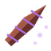{ .ability-mini }[Spin Drill](fruits/noko-noko-no-mi.md#spin-drill) | [Noko Noko no Mi](fruits/noko-noko-no-mi.md) | Active | 7 s |  |  | 12 |  |
| { .ability-mini }[Shade Dance](fruits/noko-noko-no-mi.md#shade-dance) | [Noko Noko no Mi](fruits/noko-noko-no-mi.md) | Active | 8 s |  |  | 1.5 |  |
| { .ability-mini }[Cross Shade](fruits/noko-noko-no-mi.md#cross-shade) | [Noko Noko no Mi](fruits/noko-noko-no-mi.md) | Active | 12 s |  |  | 1.5 |  |
| { .ability-mini }[Lot Stiffen](fruits/noko-noko-no-mi.md#lot-stiffen) | [Noko Noko no Mi](fruits/noko-noko-no-mi.md) | Active | 25 s |  |  |  |  |
| { .ability-mini }[Run Hypha](fruits/noko-noko-no-mi.md#run-hypha) | [Noko Noko no Mi](fruits/noko-noko-no-mi.md) | Active | 16 s |  | 6 s |  | 16 blocks (line) |
| { .ability-mini }[Snow Spore](fruits/noko-noko-no-mi.md#snow-spore) | [Noko Noko no Mi](fruits/noko-noko-no-mi.md) | Active | 25 s |  |  |  | 6 blocks (area) |
| { .ability-mini }[Fatal Bomb](fruits/noko-noko-no-mi.md#fatal-bomb) | [Noko Noko no Mi](fruits/noko-noko-no-mi.md) | Active | 180 s |  |  | 10 | 14 blocks (area) |
| { .ability-mini }[Nuitsuke](fruits/nui-nui-no-mi.md#nuitsuke) | [Nui Nui no Mi](fruits/nui-nui-no-mi.md) | Active | 10 s |  | 6 s |  |  |
| { .ability-mini }[Nuiawase](fruits/nui-nui-no-mi.md#nuiawase) | [Nui Nui no Mi](fruits/nui-nui-no-mi.md) | Active | 12 s |  | 6 s |  |  |
| { .ability-mini }[Haute Couture: Patchwork](fruits/nui-nui-no-mi.md#haute-couture-patchwork) | [Nui Nui no Mi](fruits/nui-nui-no-mi.md) | Active | 18 s |  |  | 4–20 | 8 blocks (area) |
| { .ability-mini }[Tsukuroi](fruits/nui-nui-no-mi.md#tsukuroi) | [Nui Nui no Mi](fruits/nui-nui-no-mi.md) | Active | 20 s |  |  |  |  |
| { .ability-mini }[Hodoki](fruits/nui-nui-no-mi.md#hodoki) | [Nui Nui no Mi](fruits/nui-nui-no-mi.md) | Active | 1 s |  |  |  |  |
| { .ability-mini }[Ude Nui](fruits/nui-nui-no-mi.md#ude-nui) | [Nui Nui no Mi](fruits/nui-nui-no-mi.md) | Active | 15 s |  | 4 s | 5 |  |
| { .ability-mini }[Nui Tobi](fruits/nui-nui-no-mi.md#nui-tobi) | [Nui Nui no Mi](fruits/nui-nui-no-mi.md) | Active | 8 s |  |  |  | 24 blocks (line) |
| { .ability-mini }[Pass Through](fruits/nuke-nuke-no-mi.md#pass-through) | [Nuke Nuke no Mi](fruits/nuke-nuke-no-mi.md) | Active | 5–10 s |  | 5 s |  |  |
| { .ability-mini }[Through Illusion](fruits/nuke-nuke-no-mi.md#through-illusion) | [Nuke Nuke no Mi](fruits/nuke-nuke-no-mi.md) | Active | 8 s |  |  | 6 | 12 blocks (line) |
| { .ability-mini }[Bottomless Hell](fruits/nuke-nuke-no-mi.md#bottomless-hell) | [Nuke Nuke no Mi](fruits/nuke-nuke-no-mi.md) | Active | 20 s |  |  | 8 | 12 blocks (line) |
| { .ability-mini }[Take Along](fruits/nuke-nuke-no-mi.md#take-along) | [Nuke Nuke no Mi](fruits/nuke-nuke-no-mi.md) | Active | 12 s |  | 10 s |  | 4 blocks (line) |
| { .ability-mini }[Untouched](fruits/nuke-nuke-no-mi.md#untouched) | [Nuke Nuke no Mi](fruits/nuke-nuke-no-mi.md) | Active | 15 s |  | 3 s |  |  |
| { .ability-mini }[Logia Invulnerability Numa](fruits/numa-numa-no-mi.md#logia-invulnerability-numa) | [Numa Numa no Mi](fruits/numa-numa-no-mi.md) | Passive |  |  |  |  |  |
| { .ability-mini }[Numa Numa no Gatling Gun](fruits/numa-numa-no-mi.md#numa-numa-no-gatling-gun) | [Numa Numa no Mi](fruits/numa-numa-no-mi.md) | Active |  |  |  |  |  |
| 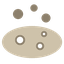{ .ability-mini }[Numachi](fruits/numa-numa-no-mi.md#numachi) | [Numa Numa no Mi](fruits/numa-numa-no-mi.md) | Active | 20 s |  | 15 s |  | 6 blocks (area) |
| { .ability-mini }[Numa Kyu](fruits/numa-numa-no-mi.md#numa-kyu) | [Numa Numa no Mi](fruits/numa-numa-no-mi.md) | Active | 15 s |  | 3 s | 9 |  |
| { .ability-mini }[Hikizuri Komi](fruits/numa-numa-no-mi.md#hikizuri-komi) | [Numa Numa no Mi](fruits/numa-numa-no-mi.md) | Active | 18 s |  | 5 s | 14 |  |
| 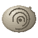{ .ability-mini }[Numa Sensui](fruits/numa-numa-no-mi.md#numa-sensui) | [Numa Numa no Mi](fruits/numa-numa-no-mi.md) | Active | 5–9 s |  | 8 s |  |  |
| { .ability-mini }[Numa Kura](fruits/numa-numa-no-mi.md#numa-kura) | [Numa Numa no Mi](fruits/numa-numa-no-mi.md) | Active | 1 s |  |  |  |  |
| 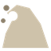{ .ability-mini }[Doro Nami](fruits/numa-numa-no-mi.md#doro-nami) | [Numa Numa no Mi](fruits/numa-numa-no-mi.md) | Active | 12 s |  |  | 20 | 10 blocks (line) |
| { .ability-mini }[Numa no Te](fruits/numa-numa-no-mi.md#numa-no-te) | [Numa Numa no Mi](fruits/numa-numa-no-mi.md) | Active | 15 s |  | 3 s | 18 |  |
| { .ability-mini }[Haki Dashi](fruits/numa-numa-no-mi.md#haki-dashi) | [Numa Numa no Mi](fruits/numa-numa-no-mi.md) | Active | 14 s |  |  | 6 |  |
| { .ability-mini }[Sokonashi Numa](fruits/numa-numa-no-mi.md#sokonashi-numa) | [Numa Numa no Mi](fruits/numa-numa-no-mi.md) | Active | 45 s |  | 4 s | 40 | 7 blocks (area) |
| { .ability-mini }[Met Punc](fruits/pamu-pamu-no-mi.md#met-punc) | [Pamu Pamu no Mi](fruits/pamu-pamu-no-mi.md) | Active | 10 s |  |  | 14 | 3.5 blocks (area) |
| { .ability-mini }[Bracchium](fruits/pamu-pamu-no-mi.md#bracchium) | [Pamu Pamu no Mi](fruits/pamu-pamu-no-mi.md) | Active | 8 s |  |  | 15 | 3 blocks (cone) |
| { .ability-mini }[Jirai Punc](fruits/pamu-pamu-no-mi.md#jirai-punc) | [Pamu Pamu no Mi](fruits/pamu-pamu-no-mi.md) | Active | 20 s |  | 30 s | 10 |  |
| { .ability-mini }[Punc Bala](fruits/pamu-pamu-no-mi.md#punc-bala) | [Pamu Pamu no Mi](fruits/pamu-pamu-no-mi.md) | Active | 12 s |  |  | 7 |  |
| { .ability-mini }[Catapult Punc](fruits/pamu-pamu-no-mi.md#catapult-punc) | [Pamu Pamu no Mi](fruits/pamu-pamu-no-mi.md) | Active |  |  |  | 6 |  |
| { .ability-mini }[Punc Rock Fest](fruits/pamu-pamu-no-mi.md#punc-rock-fest) | [Pamu Pamu no Mi](fruits/pamu-pamu-no-mi.md) | Active | 15 s |  |  | 16 | 5 blocks (area) |
| 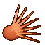{ .ability-mini }[Punc Hair](fruits/pamu-pamu-no-mi.md#punc-hair) | [Pamu Pamu no Mi](fruits/pamu-pamu-no-mi.md) | Active | 12 s |  |  | 2.5 |  |
| 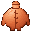{ .ability-mini }[Fashion Punc](fruits/pamu-pamu-no-mi.md#fashion-punc) | [Pamu Pamu no Mi](fruits/pamu-pamu-no-mi.md) | Active · Transformation |  |  |  | 12 |  |
| { .ability-mini }[Punc Rock Super Arena](fruits/pamu-pamu-no-mi.md#punc-rock-super-arena) | [Pamu Pamu no Mi](fruits/pamu-pamu-no-mi.md) | Active | 60 s |  |  | 28 | 10 blocks (area) |
| { .ability-mini }[Logia Invulnerability Pasa](fruits/pasa-pasa-no-mi.md#logia-invulnerability-pasa) | [Pasa Pasa no Mi](fruits/pasa-pasa-no-mi.md) | Passive |  |  |  |  |  |
| { .ability-mini }[Paper Swarm](fruits/pasa-pasa-no-mi.md#paper-swarm) | [Pasa Pasa no Mi](fruits/pasa-pasa-no-mi.md) | Active |  |  |  |  |  |
| { .ability-mini }[Paper Blades](fruits/pasa-pasa-no-mi.md#paper-blades) | [Pasa Pasa no Mi](fruits/pasa-pasa-no-mi.md) | Active |  |  |  |  |  |
| { .ability-mini }[Paper Storm](fruits/pasa-pasa-no-mi.md#paper-storm) | [Pasa Pasa no Mi](fruits/pasa-pasa-no-mi.md) | Active | 16 s |  | 5 s | 3 | 3.5 blocks (area) |
| { .ability-mini }[Paper Mummy](fruits/pasa-pasa-no-mi.md#paper-mummy) | [Pasa Pasa no Mi](fruits/pasa-pasa-no-mi.md) | Active | 20 s |  | 2–4 s | 2–4 | 14 blocks (line) |
| { .ability-mini }[Paper Wall](fruits/pasa-pasa-no-mi.md#paper-wall) | [Pasa Pasa no Mi](fruits/pasa-pasa-no-mi.md) | Active | 20 s |  | 10 s |  |  |
| { .ability-mini }[Sefer Ha-Bahir](fruits/pasa-pasa-no-mi.md#sefer-ha-bahir) | [Pasa Pasa no Mi](fruits/pasa-pasa-no-mi.md) | Active | 12 s |  |  | 8–14 | 20 blocks (line) |
| { .ability-mini }[Sefer Ha-Zohar](fruits/pasa-pasa-no-mi.md#sefer-ha-zohar) | [Pasa Pasa no Mi](fruits/pasa-pasa-no-mi.md) | Active | 16 s |  |  | 9 | 20 blocks (line) |
| { .ability-mini }[Sefer Atziluth](fruits/pasa-pasa-no-mi.md#sefer-atziluth) | [Pasa Pasa no Mi](fruits/pasa-pasa-no-mi.md) | Active | 16 s |  |  | 3 | 20 blocks (line) |
| { .ability-mini }[Sefer Assiah](fruits/pasa-pasa-no-mi.md#sefer-assiah) | [Pasa Pasa no Mi](fruits/pasa-pasa-no-mi.md) | Active | 20 s |  |  | 2 | 20 blocks (line) |
| { .ability-mini }[Sefer Briah](fruits/pasa-pasa-no-mi.md#sefer-briah) | [Pasa Pasa no Mi](fruits/pasa-pasa-no-mi.md) | Active | 45 s |  |  |  |  |
| { .ability-mini }[Sefer Yetzirah](fruits/pasa-pasa-no-mi.md#sefer-yetzirah) | [Pasa Pasa no Mi](fruits/pasa-pasa-no-mi.md) | Active | 25 s |  | 3 s |  |  |
| { .ability-mini }[Warding Page](fruits/pasa-pasa-no-mi.md#warding-page) | [Pasa Pasa no Mi](fruits/pasa-pasa-no-mi.md) | Active | 45 s |  | 20 s |  |  |
| { .ability-mini }[Collar](fruits/peto-peto-no-mi.md#collar) | [Peto Peto no Mi](fruits/peto-peto-no-mi.md) | Active | 5 s |  |  |  |  |
| { .ability-mini }[Order](fruits/peto-peto-no-mi.md#order) | [Peto Peto no Mi](fruits/peto-peto-no-mi.md) | Active | 6 s |  | 3–4 s |  | 20 blocks (line) |
| { .ability-mini }[Full Strength](fruits/peto-peto-no-mi.md#full-strength) | [Peto Peto no Mi](fruits/peto-peto-no-mi.md) | Active | 35 s |  | 20 s |  | 20 blocks (line) |
| { .ability-mini }[Red Collar](fruits/peto-peto-no-mi.md#red-collar) | [Peto Peto no Mi](fruits/peto-peto-no-mi.md) | Active · Transformation |  |  |  |  |  |
| { .ability-mini }[Levitation](fruits/peto-peto-no-mi.md#peto-levitation) | [Peto Peto no Mi](fruits/peto-peto-no-mi.md) | Active | 18 s |  | 2–3 s |  | 20 blocks (line) |
| { .ability-mini }[Recall](fruits/peto-peto-no-mi.md#recall) | [Peto Peto no Mi](fruits/peto-peto-no-mi.md) | Active | 20 s |  |  |  |  |
| { .ability-mini }[Release](fruits/peto-peto-no-mi.md#release) | [Peto Peto no Mi](fruits/peto-peto-no-mi.md) | Active | 2 s |  |  |  | 24 blocks (line) |
| { .ability-mini }[Pachycephalosaurus Heavy Point](fruits/ryu-ryu-no-mi-model-pachycephalosaurus.md#pachycephalosaurus-heavy-point) | [Ryu Ryu no Mi, Model: Pachycephalosaurus](fruits/ryu-ryu-no-mi-model-pachycephalosaurus.md) | Active · Transformation |  |  |  |  |  |
| { .ability-mini }[Pachycephalosaurus Walk Point](fruits/ryu-ryu-no-mi-model-pachycephalosaurus.md#pachycephalosaurus-walk-point) | [Ryu Ryu no Mi, Model: Pachycephalosaurus](fruits/ryu-ryu-no-mi-model-pachycephalosaurus.md) | Active · Transformation |  |  |  |  |  |
| { .ability-mini }[Thick Skull](fruits/ryu-ryu-no-mi-model-pachycephalosaurus.md#thick-skull) | [Ryu Ryu no Mi, Model: Pachycephalosaurus](fruits/ryu-ryu-no-mi-model-pachycephalosaurus.md) | Passive |  |  |  |  |  |
| { .ability-mini }[Skull Smash](fruits/ryu-ryu-no-mi-model-pachycephalosaurus.md#skull-smash) | [Ryu Ryu no Mi, Model: Pachycephalosaurus](fruits/ryu-ryu-no-mi-model-pachycephalosaurus.md) | Passive |  |  |  | 3 |  |
| { .ability-mini }[Ul-Zugan](fruits/ryu-ryu-no-mi-model-pachycephalosaurus.md#ul-zugan) | [Ryu Ryu no Mi, Model: Pachycephalosaurus](fruits/ryu-ryu-no-mi-model-pachycephalosaurus.md) | Active | 12 s |  |  | 18–22 |  |
| { .ability-mini }[Ul-Meteor](fruits/ryu-ryu-no-mi-model-pachycephalosaurus.md#ul-meteor) | [Ryu Ryu no Mi, Model: Pachycephalosaurus](fruits/ryu-ryu-no-mi-model-pachycephalosaurus.md) | Active | 15 s |  |  | 26 |  |
| 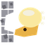{ .ability-mini }[Wall Breaker](fruits/ryu-ryu-no-mi-model-pachycephalosaurus.md#wall-breaker) | [Ryu Ryu no Mi, Model: Pachycephalosaurus](fruits/ryu-ryu-no-mi-model-pachycephalosaurus.md) | Active | 16 s |  |  | 16 |  |
| { .ability-mini }[Pin Down](fruits/ryu-ryu-no-mi-model-pachycephalosaurus.md#pin-down) | [Ryu Ryu no Mi, Model: Pachycephalosaurus](fruits/ryu-ryu-no-mi-model-pachycephalosaurus.md) | Active | 15 s |  | 3 s | 3 |  |
| { .ability-mini }[Tail Sweep](fruits/ryu-ryu-no-mi-model-pachycephalosaurus.md#tail-sweep) | [Ryu Ryu no Mi, Model: Pachycephalosaurus](fruits/ryu-ryu-no-mi-model-pachycephalosaurus.md) | Active | 10 s |  |  | 10–13 | 3–4.5 blocks (area) |
| { .ability-mini }[Skull Barrage](fruits/ryu-ryu-no-mi-model-pachycephalosaurus.md#skull-barrage) | [Ryu Ryu no Mi, Model: Pachycephalosaurus](fruits/ryu-ryu-no-mi-model-pachycephalosaurus.md) | Active | 13 s |  |  | 3.5–21 | 2.5–3.5 blocks (line) |
| { .ability-mini }[Spinosaurus Heavy Point](fruits/ryu-ryu-no-mi-model-spinosaurus.md#spinosaurus-heavy-point) | [Ryu Ryu no Mi, Model: Spinosaurus](fruits/ryu-ryu-no-mi-model-spinosaurus.md) | Active · Transformation |  |  |  |  |  |
| { .ability-mini }[Spinosaurus Walk Point](fruits/ryu-ryu-no-mi-model-spinosaurus.md#spinosaurus-walk-point) | [Ryu Ryu no Mi, Model: Spinosaurus](fruits/ryu-ryu-no-mi-model-spinosaurus.md) | Active · Transformation |  |  |  |  |  |
| { .ability-mini }[Frenzy](fruits/ryu-ryu-no-mi-model-spinosaurus.md#frenzy) | [Ryu Ryu no Mi, Model: Spinosaurus](fruits/ryu-ryu-no-mi-model-spinosaurus.md) | Passive |  |  |  |  |  |
| { .ability-mini }[Rending Claw](fruits/ryu-ryu-no-mi-model-spinosaurus.md#rending-claw) | [Ryu Ryu no Mi, Model: Spinosaurus](fruits/ryu-ryu-no-mi-model-spinosaurus.md) | Active | 10 s |  |  | 18 | 2.5 blocks (line) |
| { .ability-mini }[Shred](fruits/ryu-ryu-no-mi-model-spinosaurus.md#shred) | [Ryu Ryu no Mi, Model: Spinosaurus](fruits/ryu-ryu-no-mi-model-spinosaurus.md) | Active | 12 s |  |  | 3–18 | 2.5 blocks (line) |
| { .ability-mini }[Cling](fruits/ryu-ryu-no-mi-model-spinosaurus.md#cling) | [Ryu Ryu no Mi, Model: Spinosaurus](fruits/ryu-ryu-no-mi-model-spinosaurus.md) | Active | 16 s |  | 4 s | 3 |  |
| { .ability-mini }[Jaw Crush](fruits/ryu-ryu-no-mi-model-spinosaurus.md#jaw-crush) | [Ryu Ryu no Mi, Model: Spinosaurus](fruits/ryu-ryu-no-mi-model-spinosaurus.md) | Active | 12 s |  |  | 24 | 4 blocks (line) |
| { .ability-mini }[Paddle Tail](fruits/ryu-ryu-no-mi-model-spinosaurus.md#paddle-tail) | [Ryu Ryu no Mi, Model: Spinosaurus](fruits/ryu-ryu-no-mi-model-spinosaurus.md) | Active | 15 s |  |  | 16 | 6 blocks (area) |
| { .ability-mini }[Crushing Leap](fruits/ryu-ryu-no-mi-model-spinosaurus.md#crushing-leap) | [Ryu Ryu no Mi, Model: Spinosaurus](fruits/ryu-ryu-no-mi-model-spinosaurus.md) | Active | 16 s |  |  | 18 | 5 blocks (area) |
| { .ability-mini }[Triceratops Heavy Point](fruits/ryu-ryu-no-mi-model-triceratops.md#triceratops-heavy-point) | [Ryu Ryu no Mi, Model: Triceratops](fruits/ryu-ryu-no-mi-model-triceratops.md) | Active · Transformation |  |  |  |  |  |
| { .ability-mini }[Triceratops Guard Point](fruits/ryu-ryu-no-mi-model-triceratops.md#triceratops-guard-point) | [Ryu Ryu no Mi, Model: Triceratops](fruits/ryu-ryu-no-mi-model-triceratops.md) | Active · Transformation |  |  |  |  |  |
| { .ability-mini }[Thick Hide](fruits/ryu-ryu-no-mi-model-triceratops.md#thick-hide) | [Ryu Ryu no Mi, Model: Triceratops](fruits/ryu-ryu-no-mi-model-triceratops.md) | Passive |  |  |  |  |  |
| { .ability-mini }[Frill Flight](fruits/ryu-ryu-no-mi-model-triceratops.md#frill-flight) | [Ryu Ryu no Mi, Model: Triceratops](fruits/ryu-ryu-no-mi-model-triceratops.md) | Active | 15 s |  | 20 s |  |  |
| { .ability-mini }[Tamaceratops](fruits/ryu-ryu-no-mi-model-triceratops.md#tamaceratops) | [Ryu Ryu no Mi, Model: Triceratops](fruits/ryu-ryu-no-mi-model-triceratops.md) | Active | 12 s |  |  | 20 |  |
| { .ability-mini }[Magnumceratops](fruits/ryu-ryu-no-mi-model-triceratops.md#magnumceratops) | [Ryu Ryu no Mi, Model: Triceratops](fruits/ryu-ryu-no-mi-model-triceratops.md) | Active | 14 s |  |  | 16–30 | 4 blocks (area) |
| 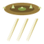{ .ability-mini }[Heliceratops](fruits/ryu-ryu-no-mi-model-triceratops.md#heliceratops) | [Ryu Ryu no Mi, Model: Triceratops](fruits/ryu-ryu-no-mi-model-triceratops.md) | Active | 14 s |  |  | 3–9 | 4 blocks (line) |
| { .ability-mini }[Horn Charge](fruits/ryu-ryu-no-mi-model-triceratops.md#horn-charge) | [Ryu Ryu no Mi, Model: Triceratops](fruits/ryu-ryu-no-mi-model-triceratops.md) | Active | 18 s |  |  | 26 |  |
| { .ability-mini }[Horn Lift](fruits/ryu-ryu-no-mi-model-triceratops.md#horn-lift) | [Ryu Ryu no Mi, Model: Triceratops](fruits/ryu-ryu-no-mi-model-triceratops.md) | Active | 10 s |  |  | 14 | 5 blocks (line) |
| { .ability-mini }[Ground Stomp](fruits/ryu-ryu-no-mi-model-triceratops.md#ground-stomp) | [Ryu Ryu no Mi, Model: Triceratops](fruits/ryu-ryu-no-mi-model-triceratops.md) | Active | 14 s |  |  | 10 | 7 blocks (area) |
| { .ability-mini }[Jump Ahead](fruits/toki-toki-no-mi.md#jump-ahead) | [Toki Toki no Mi](fruits/toki-toki-no-mi.md) | Active | 15–45 s |  | 5–30 s |  |  |
| { .ability-mini }[Shelter](fruits/toki-toki-no-mi.md#shelter) | [Toki Toki no Mi](fruits/toki-toki-no-mi.md) | Active | 25–50 s |  |  |  | 4.5 blocks (line) |
| { .ability-mini }[Send Ahead](fruits/toki-toki-no-mi.md#send-ahead) | [Toki Toki no Mi](fruits/toki-toki-no-mi.md) | Active | 36–50 s |  |  |  | 4.5 blocks (line) |
| { .ability-mini }[Postpone](fruits/toki-toki-no-mi.md#postpone) | [Toki Toki no Mi](fruits/toki-toki-no-mi.md) | Active | 12 s |  |  |  | 8 blocks (area) |
| { .ability-mini }[Float](fruits/ton-ton-no-mi.md#float) | [Ton Ton no Mi](fruits/ton-ton-no-mi.md) | Active | 2–7 s |  | 10 s |  |  |
| { .ability-mini }[Vise](fruits/ton-ton-no-mi.md#vise) | [Ton Ton no Mi](fruits/ton-ton-no-mi.md) | Active | 8 s |  |  | 6–16 | 3 blocks (area) |
| { .ability-mini }[Heavy Body](fruits/ton-ton-no-mi.md#heavy-body) | [Ton Ton no Mi](fruits/ton-ton-no-mi.md) | Active | 2 s |  | ∞ s |  |  |
| { .ability-mini }[Senton Knuckle](fruits/ton-ton-no-mi.md#senton-knuckle) | [Ton Ton no Mi](fruits/ton-ton-no-mi.md) | Active | 10 s |  |  | 22 | 3.5 blocks (line) |
| { .ability-mini }[Hyakuton Stomp](fruits/ton-ton-no-mi.md#hyakuton-stomp) | [Ton Ton no Mi](fruits/ton-ton-no-mi.md) | Active | 12 s |  |  | 14 | 5 blocks (area) |
| 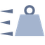{ .ability-mini }[Manton Tackle](fruits/ton-ton-no-mi.md#manton-tackle) | [Ton Ton no Mi](fruits/ton-ton-no-mi.md) | Active | 15 s |  |  | 20 |  |
| 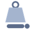{ .ability-mini }[Senton Press](fruits/ton-ton-no-mi.md#senton-press) | [Ton Ton no Mi](fruits/ton-ton-no-mi.md) | Active | 20 s |  | 3 s | 26 |  |
| { .ability-mini }[Eagle Assault Point](fruits/tori-tori-no-mi-model-eagle.md#eagle-assault-point) | [Tori Tori no Mi, Model: Eagle](fruits/tori-tori-no-mi-model-eagle.md) | Active · Transformation |  |  |  |  |  |
| { .ability-mini }[Eagle Fly Point](fruits/tori-tori-no-mi-model-eagle.md#eagle-fly-point) | [Tori Tori no Mi, Model: Eagle](fruits/tori-tori-no-mi-model-eagle.md) | Active · Transformation |  |  |  |  |  |
| { .ability-mini }[Talon Strike](fruits/tori-tori-no-mi-model-eagle.md#talon-strike) | [Tori Tori no Mi, Model: Eagle](fruits/tori-tori-no-mi-model-eagle.md) | Active | 10 s |  |  | 18 |  |
| { .ability-mini }[Carry Off](fruits/tori-tori-no-mi-model-eagle.md#carry-off) | [Tori Tori no Mi, Model: Eagle](fruits/tori-tori-no-mi-model-eagle.md) | Active | 12 s |  | 8 s |  |  |
| { .ability-mini }[Wing Gust](fruits/tori-tori-no-mi-model-eagle.md#wing-gust) | [Tori Tori no Mi, Model: Eagle](fruits/tori-tori-no-mi-model-eagle.md) | Active | 12 s |  |  | 5 | 8 blocks (area) |
| { .ability-mini }[Screech](fruits/tori-tori-no-mi-model-eagle.md#screech) | [Tori Tori no Mi, Model: Eagle](fruits/tori-tori-no-mi-model-eagle.md) | Active | 20 s |  |  |  | 10 blocks (area) |
| { .ability-mini }[Falcon Assault Point](fruits/tori-tori-no-mi-model-falcon.md#falcon-assault-point) | [Tori Tori no Mi, Model: Falcon](fruits/tori-tori-no-mi-model-falcon.md) | Active · Transformation |  |  |  |  |  |
| { .ability-mini }[Falcon Fly Point](fruits/tori-tori-no-mi-model-falcon.md#falcon-fly-point) | [Tori Tori no Mi, Model: Falcon](fruits/tori-tori-no-mi-model-falcon.md) | Active · Transformation |  |  |  |  |  |
| { .ability-mini }[Falcon Rideable](fruits/tori-tori-no-mi-model-falcon.md#falcon-rideable) | [Tori Tori no Mi, Model: Falcon](fruits/tori-tori-no-mi-model-falcon.md) | Passive |  |  |  |  |  |
| { .ability-mini }[Tobizume](fruits/tori-tori-no-mi-model-falcon.md#tobizume) | [Tori Tori no Mi, Model: Falcon](fruits/tori-tori-no-mi-model-falcon.md) | Active | 8 s |  |  | 12 |  |
| { .ability-mini }[Tsukami Otoshi](fruits/tori-tori-no-mi-model-falcon.md#tsukami-otoshi) | [Tori Tori no Mi, Model: Falcon](fruits/tori-tori-no-mi-model-falcon.md) | Active | 12 s |  | 6 s |  |  |
| 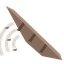{ .ability-mini }[Hane Arashi](fruits/tori-tori-no-mi-model-falcon.md#hane-arashi) | [Tori Tori no Mi, Model: Falcon](fruits/tori-tori-no-mi-model-falcon.md) | Active | 10 s |  |  | 3 | 7 blocks (area) |
| { .ability-mini }[Kyukoka](fruits/tori-tori-no-mi-model-falcon.md#kyukoka) | [Tori Tori no Mi, Model: Falcon](fruits/tori-tori-no-mi-model-falcon.md) | Active | 15 s |  |  | 10–20 | 4 blocks (area) |
| 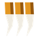{ .ability-mini }[Kagizume](fruits/tori-tori-no-mi-model-falcon.md#kagizume) | [Tori Tori no Mi, Model: Falcon](fruits/tori-tori-no-mi-model-falcon.md) | Active | 11 s |  |  | 16 | 3 blocks (line) |
| { .ability-mini }[Hayabusa no Me](fruits/tori-tori-no-mi-model-falcon.md#hayabusa-no-me) | [Tori Tori no Mi, Model: Falcon](fruits/tori-tori-no-mi-model-falcon.md) | Active | 30 s |  | 10 s |  | 40 blocks (area) |
| { .ability-mini }[Hane Tsubute](fruits/tori-tori-no-mi-model-falcon.md#hane-tsubute) | [Tori Tori no Mi, Model: Falcon](fruits/tori-tori-no-mi-model-falcon.md) | Active | 8 s |  |  | 4 |  |
| { .ability-mini }[Logia Invulnerability Toro](fruits/toro-toro-no-mi.md#logia-invulnerability-toro) | [Toro Toro no Mi](fruits/toro-toro-no-mi.md) | Passive |  |  |  |  |  |
| { .ability-mini }[Flow](fruits/toro-toro-no-mi.md#flow) | [Toro Toro no Mi](fruits/toro-toro-no-mi.md) | Active · Transformation |  |  |  |  |  |
| { .ability-mini }[Liquid Blast](fruits/toro-toro-no-mi.md#liquid-blast) | [Toro Toro no Mi](fruits/toro-toro-no-mi.md) | Active | 5 s |  |  | 8 |  |
| { .ability-mini }[Great Wave](fruits/toro-toro-no-mi.md#great-wave) | [Toro Toro no Mi](fruits/toro-toro-no-mi.md) | Active | 15 s |  |  | 12 | 12 blocks (line) |
| { .ability-mini }[Liquid Sphere](fruits/toro-toro-no-mi.md#liquid-sphere) | [Toro Toro no Mi](fruits/toro-toro-no-mi.md) | Active | 18 s |  | 4 s | 10 |  |
| { .ability-mini }[Geyser](fruits/toro-toro-no-mi.md#geyser) | [Toro Toro no Mi](fruits/toro-toro-no-mi.md) | Active | 12 s |  |  | 10 | 2.5 blocks (area) |
| 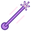{ .ability-mini }[Pressure Jet](fruits/toro-toro-no-mi.md#pressure-jet) | [Toro Toro no Mi](fruits/toro-toro-no-mi.md) | Active | 14 s |  | 2 s | 4 | 14 blocks (line) |
| { .ability-mini }[Slick](fruits/toro-toro-no-mi.md#slick) | [Toro Toro no Mi](fruits/toro-toro-no-mi.md) | Active | 20 s |  | 10 s |  |  |
| { .ability-mini }[Song](fruits/uta-uta-no-mi.md#uta-song) | [Uta Uta no Mi](fruits/uta-uta-no-mi.md) | Active | 30–120 s | 3 s |  |  | 16 blocks (area) |
| { .ability-mini }[Musical Note Soldiers](fruits/uta-uta-no-mi.md#note-soldiers) | [Uta Uta no Mi](fruits/uta-uta-no-mi.md) | Active | 30 s |  |  | 7 |  |
| { .ability-mini }[Staff](fruits/uta-uta-no-mi.md#uta-staff) | [Uta Uta no Mi](fruits/uta-uta-no-mi.md) | Active | 16 s |  | 4 s | 6 | 14 blocks (line) |
| { .ability-mini }[Trick or Treat](fruits/uta-uta-no-mi.md#trick-or-treat) | [Uta Uta no Mi](fruits/uta-uta-no-mi.md) | Active | 12 s |  |  | 12 |  |
| { .ability-mini }[Knight Form](fruits/uta-uta-no-mi.md#knight-form) | [Uta Uta no Mi](fruits/uta-uta-no-mi.md) | Active · Transformation |  |  |  |  |  |
| { .ability-mini }[Tot Musica](fruits/uta-uta-no-mi.md#tot-musica) | [Uta Uta no Mi](fruits/uta-uta-no-mi.md) | Active |  |  |  |  |  |
| { .ability-mini }[Voice](fruits/uta-uta-no-mi.md#uta-voice) | [Uta Uta no Mi](fruits/uta-uta-no-mi.md) | Passive |  |  |  |  |  |

