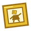
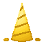
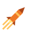

# Status effects

The **6 status effects** Missing Missing no Mi adds, and what applies them.

| Effect | Kind | Applied by |
|---|---|---|
| { .effect-icon } **Art**{ #effect-art } | Harmful | [Broken-Fu Art](fruits/ato-ato-no-mi.md#broken-fu-art), [Dying Art](fruits/ato-ato-no-mi.md#dying-art), [Panorama Art](fruits/ato-ato-no-mi.md#panorama-art) |
| { .effect-icon } **Buried**{ #effect-buried } | Harmful | [Shishi Odoshi: Chimaki](fruits/fuwa-fuwa-no-mi.md#chimaki) |
| { .effect-icon } **Giro Sight**{ #effect-giro-sight } | Beneficial | [Peeping Mind](fruits/giro-giro-no-mi.md#peeping-mind) |
| **In the Swamp**{ #effect-in-the-swamp } | Neutral | [Hikizuri Komi](fruits/numa-numa-no-mi.md#hikizuri-komi), [Numa Sensui](fruits/numa-numa-no-mi.md#numa-sensui), [Sokonashi Numa](fruits/numa-numa-no-mi.md#sokonashi-numa) |
| { .effect-icon } **Launched**{ #effect-launched } | Beneficial | [Guru Guru Toshaho](fruits/guru-guru-no-mi.md#guru-guru-toshaho) |
| { .effect-icon } **Toy**{ #effect-toy } | Harmful | [Omocha](fruits/hobi-hobi-no-mi.md#omocha) |
