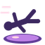

# Status effects

The **37 status effects** Missing Missing no Mi adds, and what applies them.

| Effect | Kind | Applied by |
|---|---|---|
| { .effect-icon } **Absorbed**{ #effect-absorbed } | Neutral | — |
| { .effect-icon } **Aged**{ #effect-aged } | Harmful | [Aging Touch](fruits/juku-juku-no-mi.md#aging-touch), [Draining Bite](fruits/batto-batto-no-mi-model-vampire.md#draining-bite) |
| { .effect-icon } **Art**{ #effect-art } | Harmful | [Broken-Fu Art](fruits/ato-ato-no-mi.md#broken-fu-art), [Dying Art](fruits/ato-ato-no-mi.md#dying-art), [Panorama Art](fruits/ato-ato-no-mi.md#panorama-art) |
| { .effect-icon } **Buried**{ #effect-buried } | Harmful | [Shishi Odoshi: Chimaki](fruits/fuwa-fuwa-no-mi.md#chimaki), [Devouring Plant](fruits/mosa-mosa-no-mi.md#devouring-plant), [Paper Mummy](fruits/pasa-pasa-no-mi.md#paper-mummy) |
| { .effect-icon } **Cased in Metal**{ #effect-cased-in-metal } | Harmful | [Metal Casing](fruits/gutsu-gutsu-no-mi.md#metal-casing) |
| { .effect-icon } **Collared**{ #effect-collared } | Harmful | [Collar](fruits/peto-peto-no-mi.md#collar) |
| { .effect-icon } **Cubed**{ #effect-cubed } | Harmful | [Living Cube](fruits/kyubu-kyubu-no-mi.md#living-cube) |
| { .effect-icon } **Devoted**{ #effect-devoted } | Neutral | [Kibi Dan-boshi](fruits/kibi-kibi-no-mi.md#kibi-dan-boshi) |
| { .effect-icon } **Exhausted**{ #effect-exhausted } | Harmful | [Knight Form](fruits/uta-uta-no-mi.md#knight-form), [Tot Musica](fruits/uta-uta-no-mi.md#tot-musica), [Song](fruits/uta-uta-no-mi.md#uta-song), [Voice](fruits/uta-uta-no-mi.md#uta-voice) |
| { .effect-icon } **Floured**{ #effect-floured } | Harmful | [Logia Invulnerability Ame](fruits/ame-ame-no-mi.md#logia-invulnerability-ame) |
| { .effect-icon } **Frozen Stiff**{ #effect-frozen-stiff } | Harmful | — |
| { .effect-icon } **Giro Sight**{ #effect-giro-sight } | Beneficial | [Peeping Mind](fruits/giro-giro-no-mi.md#peeping-mind) |
| { .effect-icon } **Gold Dust**{ #effect-gold-dust } | Neutral | [Gold Dust](fruits/goru-goru-no-mi.md#gold-dust) |
| { .effect-icon } **Golden Statue**{ #effect-golden-statue } | Harmful | [Golden Statue](fruits/goru-goru-no-mi.md#golden-statue) |
| { .effect-icon } **In His Darkness**{ #effect-in-his-darkness } | Beneficial | [Darkness](fruits/batto-batto-no-mi-model-vampire.md#vampire-darkness) |
| **In the Swamp**{ #effect-in-the-swamp } | Neutral | [Hikizuri Komi](fruits/numa-numa-no-mi.md#hikizuri-komi), [Numa Sensui](fruits/numa-numa-no-mi.md#numa-sensui), [Sokonashi Numa](fruits/numa-numa-no-mi.md#sokonashi-numa) |
| { .effect-icon } **Jumped Ahead**{ #effect-jumped-ahead } | Neutral | — |
| { .effect-icon } **Just Woken**{ #effect-just-woken } | Beneficial | [Song](fruits/uta-uta-no-mi.md#uta-song) |
| { .effect-icon } **Launched**{ #effect-launched } | Beneficial | [Guru Guru Toshaho](fruits/guru-guru-no-mi.md#guru-guru-toshaho) |
| { .effect-icon } **Lowered**{ #effect-lowered } | Harmful | [Order](fruits/peto-peto-no-mi.md#order) |
| { .effect-icon } **Pinned**{ #effect-pinned } | Harmful | — |
| { .effect-icon } **Puppet**{ #effect-puppet } | Neutral | [Knight Form](fruits/uta-uta-no-mi.md#knight-form), [Tot Musica](fruits/uta-uta-no-mi.md#tot-musica), [Song](fruits/uta-uta-no-mi.md#uta-song), [Voice](fruits/uta-uta-no-mi.md#uta-voice) |
| { .effect-icon } **Rolling Low**{ #effect-rolling-low } | Beneficial | [Wheels](fruits/koro-koro-no-mi.md#wheels) |
| { .effect-icon } **Scattered**{ #effect-scattered } | Beneficial | [Sefer Yetzirah](fruits/pasa-pasa-no-mi.md#sefer-yetzirah) |
| { .effect-icon } **Sent Ahead**{ #effect-sent-ahead } | Neutral | — |
| { .effect-icon } **Slipping**{ #effect-slipping } | Harmful | — |
| { .effect-icon } **Spared by the Syrup**{ #effect-spared-by-the-syrup } | Beneficial | [Syrup Pool](fruits/ame-ame-no-mi.md#syrup-pool) |
| { .effect-icon } **Spores**{ #effect-spores } | Harmful | [Cross Shade](fruits/noko-noko-no-mi.md#cross-shade), [Run Hypha](fruits/noko-noko-no-mi.md#run-hypha), [Shade Dance](fruits/noko-noko-no-mi.md#shade-dance), [Spin Drill](fruits/noko-noko-no-mi.md#spin-drill) |
| { .effect-icon } **Stolen Youth**{ #effect-stolen-youth } | Beneficial | [Draining Bite](fruits/batto-batto-no-mi-model-vampire.md#draining-bite) |
| { .effect-icon } **Swarm of Bats**{ #effect-swarm-of-bats } | Beneficial | [Swarm of Bats](fruits/batto-batto-no-mi-model-vampire.md#bat-swarm) |
| { .effect-icon } **Taken Along**{ #effect-taken-along } | Neutral | [Take Along](fruits/nuke-nuke-no-mi.md#take-along) |
| { .effect-icon } **Toy**{ #effect-toy } | Harmful | [Omocha](fruits/hobi-hobi-no-mi.md#omocha) |
| { .effect-icon } **Untouched**{ #effect-untouched } | Beneficial | [Untouched](fruits/nuke-nuke-no-mi.md#untouched) |
| { .effect-icon } **Warded**{ #effect-warded } | Beneficial | [Warding Page](fruits/pasa-pasa-no-mi.md#warding-page) |
| { .effect-icon } **Wide Awake**{ #effect-wide-awake } | Beneficial | [Song](fruits/uta-uta-no-mi.md#uta-song) |
| { .effect-icon } **Wound in Paper**{ #effect-wound } | Harmful | [Scroll Wrap](fruits/maki-maki-no-mi.md#scroll-wrap) |
| { .effect-icon } **Younger**{ #effect-younger } | Harmful | [Modo Modo](fruits/modo-modo-no-mi.md#modo-modo), [Modo Modo Shot](fruits/modo-modo-no-mi.md#modo-modo-shot) |
