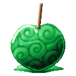
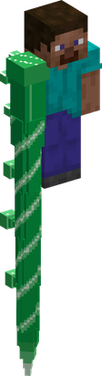
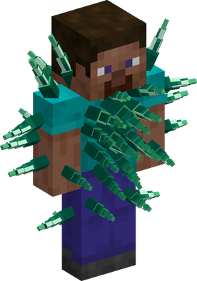

# Ame Ame no Mi

{ .mod-icon }

| | |
|---|---|
| **Type** | Logia |
| **Theme** | Candy syrup |
| **Box** | { .box-icon } Iron |
| **Chance per opening** | iron **1.71%**, wooden **0.085%** ([how it works](index.md#box-odds)) |
| **Abilities** | 6: 5 active, 1 passive |
| **Effects applied** | { .effect-mini }[Floured](../effects.md#effect-floured), { .effect-mini }[Spared by the Syrup](../effects.md#effect-spared-by-the-syrup) |

In 3D: drag to turn, scroll or pinch to zoom.

Found in the base mod's **iron Devil Fruit box**. Eat it and its abilities appear in the ability menu, grouped under the fruit.

!!! note "About the values"
    The values are those of the ability's tooltip in game, with the base mod's default settings. Damage is shown on the base mod's scale, as in the ability screen.

## Logia Invulnerability Ame { #logia-invulnerability-ame }

{ .ability-icon } *Passive*

Applies { .effect-mini }[Floured](../effects.md#effect-floured)

Allows the user to avoid attacks by instinctively transforming parts of their body into their specific element

Whoever hits the user's syrup body in close combat without Haki is stuck in place for a moment

A hit with wheat or bread in hand, or one of them thrown at the user, covers the user in flour. For a while the syrup body lets no hit through and holds nobody

## Syrup Spear { #syrup-spear }

{ .ability-icon } *Active*

{ .form-picture }

The user's arm stretches far ahead into a spear of hardened syrup that pierces every enemy in a line and leaves them stuck for a moment

| Stat | Value |
|---|---|
| Damage type | Slash |
| Haki | Hardening |
| Cooldown | 7 s |
| Damage | 16 |
| Range | 12 blocks (line) |

## Spike Burst { #spike-burst }

{ .ability-icon } *Active*

{ .form-picture }

Spikes of hardened syrup shoot out of the user's whole body, hitting every enemy around and throwing them back

| Stat | Value |
|---|---|
| Damage type | Slash |
| Haki | Hardening |
| Cooldown | 10 s |
| Damage | 14 |
| Range | 4 blocks (area) |

## Spiked Charge { #spiked-charge }

{ .ability-icon } *Active*

Covered in spikes of hardened syrup, the user dashes forward, hitting every enemy on the way and throwing them aside

| Stat | Value |
|---|---|
| Damage type | Slash |
| Haki | Hardening |
| Cooldown | 9 s |
| Damage | 12 |

## Slingshot { #slingshot }

{ .ability-icon } *Active*

The user's syrup body stretches back and snaps forward, launching the user far where the user is looking

| Stat | Value |
|---|---|
| Cooldown | 8 s |
| Charge | 1 s |

## Syrup Pool { #syrup-pool }

{ .ability-icon } *Active*

Applies { .effect-mini }[Spared by the Syrup](../effects.md#effect-spared-by-the-syrup)

The user spreads a pool of syrup on the ground where the user is looking, whoever steps in it is stuck

Using it again hardens the pool into spikes that hit every enemy standing in it

| Stat | Value |
|---|---|
| Damage type | Indirect |
| Haki | Special |
| Cooldown | 15 s |
| Hold | 8 s |
| Damage | 12 |
| Range | 4 blocks (area) |
