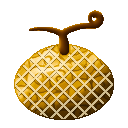

# Ami Ami no Mi

{ .mod-icon }

| | |
|---|---|
| **Type** | Paramecia |
| **Theme** | Net |
| **Box** | { .box-icon } Wooden |
| **Chance per opening** | wooden **2.92%** ([how it works](index.md#box-odds)) |
| **Abilities** | 7: 7 active, 0 passive |
| **Transformations** | [No Shock Taimo](#no-shock-taimo) |

Found in the base mod's **wooden Devil Fruit box**. Eat it and its abilities appear in the ability menu, grouped under the fruit.

!!! note "About the values"
    The values are those of the ability's tooltip in game, with the base mod's default settings. Damage is shown on the base mod's scale, as in the ability screen.

## Mucho Neto Net { #mucho-neto-net }

{ .ability-icon } *Active*

Throws a sticky net that wraps the target and holds it in place for 3 seconds.

| Stat | Value |
|---|---|
| Damage type | Projectile, Indirect |
| Cooldown | 8 s |
| Damage | 2 |
| Hold | 3 s |

## Neto Net Hoso Mo { #neto-net-hoso-mo }

{ .ability-icon } *Active*

Throws a sticky net that closes as a dome over the aimed spot: enemies caught under it are slowed and cannot leave for 5 seconds.

| Stat | Value |
|---|---|
| Damage type | Indirect |
| Cooldown | 16 s |
| Range | 4.5 blocks (area) |
| Hold | 5 s |

## Mucho Cho Shi Mo { #mucho-cho-shi-mo }

{ .ability-icon } *Active*

Swallows an iron ingot and throws a barbed wire net: it holds the target for 2 seconds and cuts it every second.

| Stat | Value |
|---|---|
| Damage type | Projectile, Indirect |
| Element | Metal |
| Cooldown | 10 s |
| Damage | 3 |
| Hold | 2 s |

## Mucho Tetsujo Mo { #mucho-tetsujo-mo }

{ .ability-icon } *Active*

Swallows an iron ingot and raises four iron frames round the enemy in sight: they shut into a cage that holds it and crushes it as it shrinks.

| Stat | Value |
|---|---|
| Damage type | Blunt, Indirect |
| Element | Metal |
| Cooldown | 15 s |
| Damage | 8 |
| Hold | 3 s |

## Mucho Kaji Mo { #mucho-kaji-mo }

{ .ability-icon } *Active*

Swallows a fire charge and throws a burning net: it holds the target for 2 seconds and sets it alight.

| Stat | Value |
|---|---|
| Damage type | Projectile, Indirect |
| Element | Fire |
| Cooldown | 10 s |
| Damage | 4 |
| Hold | 2 s |

## Millionet { #millionet }

{ .ability-icon } *Active*

Drinks a water bottle and throws a net of boiling water: it scalds the target and holds it for 2 seconds.

| Stat | Value |
|---|---|
| Damage type | Projectile, Indirect |
| Element | Water |
| Cooldown | 10 s |
| Damage | 6 |
| Hold | 2 s |

## No Shock Taimo { #no-shock-taimo }

{ .ability-icon } *Active · Transformation*

The user's body turns into a net that spreads out blows: melee hits and projectiles deal 70% less damage. Blades, fire and explosions go through.

| Stat | Value |
|---|---|
| Hold | 30 s |
