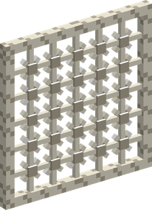
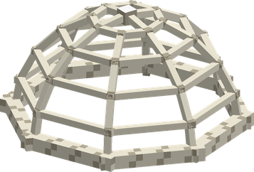
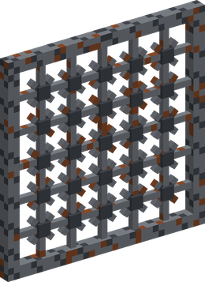
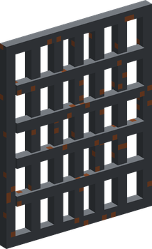
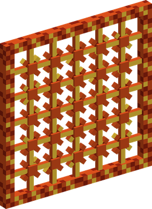
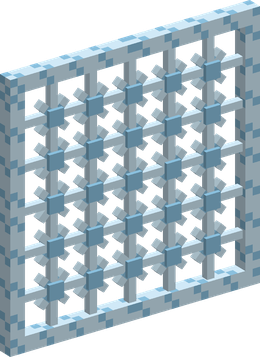
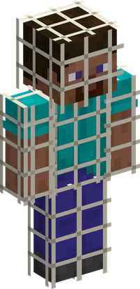

# Ami Ami no Mi

{ .mod-icon }

| | |
|---|---|
| **Type** | Paramecia |
| **Theme** | Net |
| **Box** | { .box-icon } Wooden |
| **Chance per opening** | wooden **2.92%** ([how it works](index.md#box-odds)) |
| **Abilities** | 7: 7 active, 0 passive |
| **Transformations** | [No Shock Taimo](#no-shock-taimo) |

In 3D: drag to turn, scroll or pinch to zoom.

Found in the base mod's **wooden Devil Fruit box**. Eat it and its abilities appear in the ability menu, grouped under the fruit.

!!! note "About the values"
    The values are those of the ability's tooltip in game, with the base mod's default settings. Damage is shown on the base mod's scale, as in the ability screen.

## Mucho Neto Net { #mucho-neto-net }

{ .ability-icon } *Active*

{ .form-picture }

Throws a sticky net that wraps the target, making it unable to move for 3 seconds

| Stat | Value |
|---|---|
| Damage type | Projectile, Indirect |
| Cooldown | 8 s |
| Damage | 2 |
| Hold | 3 s |

## Neto Net Hoso Mo { #neto-net-hoso-mo }

{ .ability-icon } *Active*

{ .form-picture }

Throws a sticky net that becomes a dome on the targeted location, all enemies inside are slowed and can't leave it for 5 seconds

| Stat | Value |
|---|---|
| Damage type | Indirect |
| Cooldown | 16 s |
| Range | 4.5 blocks (area) |
| Hold | 5 s |

## Mucho Cho Shi Mo { #mucho-cho-shi-mo }

{ .ability-icon } *Active*

{ .form-picture }

The user eats an iron ingot and throws a barbed wire net, that holds the target for 2 seconds and damages it every second.

| Stat | Value |
|---|---|
| Damage type | Projectile, Indirect |
| Element | Metal |
| Cooldown | 10 s |
| Damage | 3 |
| Hold | 2 s |

## Mucho Tetsujo Mo { #mucho-tetsujo-mo }

{ .ability-icon } *Active*

{ .form-picture }

The user eats an iron ingot and creates an iron cage around the enemy they are looking at, the cage holds the enemy and deals damage while it shrinks.

| Stat | Value |
|---|---|
| Damage type | Blunt, Indirect |
| Element | Metal |
| Cooldown | 15 s |
| Damage | 8 |
| Hold | 3 s |

## Mucho Kaji Mo { #mucho-kaji-mo }

{ .ability-icon } *Active*

{ .form-picture }

The user eats a fire charge and throws a burning net, that holds the target for 2 seconds and sets it on fire

| Stat | Value |
|---|---|
| Damage type | Projectile, Indirect |
| Element | Fire |
| Cooldown | 10 s |
| Damage | 4 |
| Hold | 2 s |

## Millionet { #millionet }

{ .ability-icon } *Active*

{ .form-picture }

The user drinks a water bottle and throws a net made of boiling water, which burns the target and holds it for 2 seconds.

| Stat | Value |
|---|---|
| Damage type | Projectile, Indirect |
| Element | Water |
| Cooldown | 10 s |
| Damage | 6 |
| Hold | 2 s |

## No Shock Taimo { #no-shock-taimo }

{ .ability-icon } *Active · Transformation*

{ .form-picture }

The user's body becomes a net that absorbs the hits, melee attacks and projectiles deals 70% less damage. Does not work against blades, fire and explosions

| Stat | Value |
|---|---|
| Hold | 30 s |
