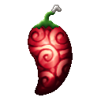
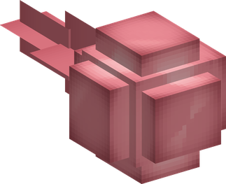
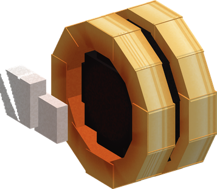

# Atsu Atsu no Mi

{ .mod-icon }

| | |
|---|---|
| **Type** | Paramecia |
| **Theme** | Heat |
| **Box** | { .box-icon } Iron |
| **Chance per opening** | iron **1.71%**, wooden **0.085%** ([how it works](index.md#box-odds)) |
| **Abilities** | 12: 12 active, 0 passive |
| **Transformations** | [Netsuryo Up](#netsuryo-up) |

In 3D: drag to turn, scroll or pinch to zoom.

Found in the base mod's **iron Devil Fruit box**. Eat it and its abilities appear in the ability menu, grouped under the fruit.

!!! note "About the values"
    The values are those of the ability's tooltip in game, with the base mod's default settings. Damage is shown on the base mod's scale, as in the ability screen.

## Netsuryo Up { #netsuryo-up }

{ .ability-icon } *Active · Transformation*

The user raises their body heat to 3,000, 5,500 or 10,000 degrees. The hotter they are, the more their other abilities hurt and the further ice and snow melt around them, but the shorter it lasts. The level is chosen with the alternate mode

Enemies standing close catch fire. At 10,000 degrees allies burn too, and the stone under the user's feet turns to lava for a while

| Stat | Value |
|---|---|
| Element | Fire |
| Haki | Special |
| Damage | 2 |
| Netsuryo Up | 3,000 Degrees |
| Other Abilities' Damage | +25 % |
| Melting | 3 |
| Duration | 60 s |
| Netsuryo Up | 5,500 Degrees |
| Other Abilities' Damage | +50 % |
| Melting | 5 |
| Duration | 30 s |
| Netsuryo Up | 10,000 Degrees |
| Other Abilities' Damage | +100 % |
| Melting | 8 |
| Duration | 12 s |

## Atsuyaki Tamago { #atsuyaki-tamago }

{ .ability-icon } *Active*

{ .form-picture }

The user throws a ball of heat that burns what it hits and melts ice and snow where it lands

| Stat | Value |
|---|---|
| Damage type | Projectile |
| Element | Fire |
| Haki | Special |
| Cooldown | 5 s |
| Damage | 8 |

## Atsu Atsu no Gatling { #atsu-atsu-no-gatling }

{ .ability-icon } *Active*

The user throws a barrage of balls of heat where they are looking

Use the ability again to stop it

| Stat | Value |
|---|---|
| Damage type | Projectile |
| Element | Fire |
| Haki | Special |
| Cooldown | 13 s |
| Hold | 2 s |
| Damage | 2.5 |

## Atsu Gesho { #atsu-gesho }

{ .ability-icon } *Active*

A whirlwind of scalding steam seizes the enemy the user is looking at, they can't move and are burned for as long as it turns. It lasts less on players and bosses

Use the ability again to let go

| Stat | Value |
|---|---|
| Damage type | Indirect |
| Element | Fire |
| Haki | Special |
| Cooldown | 16 s |
| Hold | 2–4 s |
| Damage | 2 |
| Range | 14 blocks (line) |

## Atsuage { #atsuage }

{ .ability-icon } *Active*

A whirlwind of steam carries the enemy the user is looking at high in the air, then lets them fall. Used with no enemy in sight, it takes the one held by Atsu Gesho

| Stat | Value |
|---|---|
| Damage type | Indirect |
| Element | Fire |
| Haki | Special |
| Cooldown | 15 s |
| Damage | 6 |
| Range | 14 blocks (line) |

## Atsutto Odoroku Hana Jet { #hana-jet }

{ .ability-icon } *Active*

A jet of steam throws the user through the air where they are looking. The fall that follows doesn't hurt, and Atsu Atsu Head hits harder during the flight

| Stat | Value |
|---|---|
| Cooldown | 9 s |

## Atsu Atsu Head { #atsu-atsu-head }

{ .ability-icon } *Active*

The user charges head first, the first enemy they meet is burned and thrown back. It hits harder during the flight of the Hana Jet

| Stat | Value |
|---|---|
| Damage type | Blunt, Physical |
| Element | Fire |
| Haki | Hardening |
| Cooldown | 8 s |
| Damage | 12–18 |

## Steam Iron { #steam-iron }

{ .ability-icon } *Active*

The user leaps and comes down flat on the ground, enemies around the landing are burned and thrown back and ice and snow melt

| Stat | Value |
|---|---|
| Damage type | Blunt, Physical |
| Element | Fire |
| Haki | Hardening |
| Cooldown | 11 s |
| Damage | 14 |
| Range | 3 blocks (area) |

## Steam Iron: 10,000 Degree Press { #steam-iron-press }

{ .ability-icon } *Active*

Only at 10,000 degrees, the user leaps high above and comes down flat on a wide area, burning and throwing back every enemy in it

| Stat | Value |
|---|---|
| Damage type | Blunt, Physical |
| Element | Fire |
| Haki | Hardening |
| Cooldown | 35 s |
| Damage | 30 |
| Range | 5.5 blocks (area) |

## Net Tire { #net-tire }

{ .ability-icon } *Active*

{ .form-picture }

The user rolls forward as a burning wheel, much faster, enemies in the way are burned and thrown aside and ice and snow melt

Use the ability again to stop

| Stat | Value |
|---|---|
| Damage type | Blunt, Physical |
| Element | Fire |
| Haki | Hardening |
| Cooldown | 13 s |
| Hold | 5 s |
| Damage | 8 |

## Slippery Slippery { #slippery-slippery }

{ .ability-icon } *Active*

Standing on ice or snow, the user melts its surface and slides on it, much faster, for as long as they stay on ice or snow

Use the ability again to stop

| Stat | Value |
|---|---|
| Cooldown | 5 s |
| Hold | 8 s |

## Atsu Atsu no Net Surfing { #net-surfing }

{ .ability-icon } *Active*

Standing in or beside lava, the user raises it into a wave and rides it forward, enemies it reaches are burned and swept along

| Stat | Value |
|---|---|
| Damage type | Blunt, Indirect |
| Element | Fire |
| Haki | Special |
| Cooldown | 20 s |
| Damage | 16 |
| Range | 14 blocks (line) |
