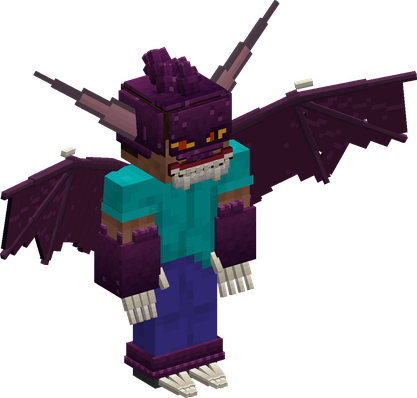
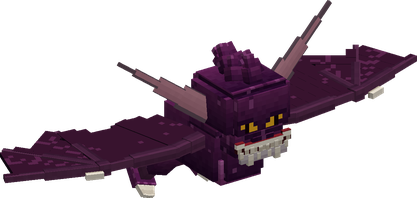
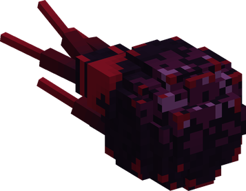

# Batto Batto no Mi, Model: Vampire

{ .mod-icon }

| | |
|---|---|
| **Type** | Mythical Zoan |
| **Box** | { .box-icon } Golden |
| **Chance per opening** | golden **3.06%**, iron **0.153%**, wooden **0.008%** ([how it works](index.md#box-odds)) |
| **Abilities** | 11: 10 active, 1 passive (1 hidden, not in the ability menu) |
| **Transformations** | [Vampire Assault Point](#vampire-assault-point), [Vampire Fly Point](#vampire-fly-point) |
| **Effects applied** | { .effect-mini }[Aged](../effects.md#effect-aged), { .effect-mini }[In His Darkness](../effects.md#effect-in-his-darkness), { .effect-mini }[Stolen Youth](../effects.md#effect-stolen-youth), { .effect-mini }[Swarm of Bats](../effects.md#effect-swarm-of-bats) |

In 3D: drag to turn, scroll or pinch to zoom.

Found in the base mod's **golden Devil Fruit box**. Eat it and its abilities appear in the ability menu, grouped under the fruit.

!!! note "About the values"
    The values are those of the ability's tooltip in game, with the base mod's default settings. Damage is shown on the base mod's scale, as in the ability screen.

## Vampire Assault Point { #vampire-assault-point }

{ .ability-icon } *Active · Transformation*

{ .form-picture }

Transforms the user into a winged vampire with fangs and claws, which can fly and still use weapons.

## Vampire Fly Point { #vampire-fly-point }

{ .ability-icon } *Active · Transformation*

{ .form-picture }

Transforms the user into a giant bat, fast in the air

## Vampire Flight { #vampire-flight }

*Passive*

!!! info "Hidden ability"
    It does not appear in the ability menu.

Requires Vampire or Giant Bat to be active.

## Wing Slash { #wing-slash }

{ .ability-icon } *Active*

The user slashes all the enemies in front of them with their claws and the edge of their wings

At night or in the dark, the cut makes them bleed

| Stat | Value |
|---|---|
| Damage type | Physical |
| Haki | Hardening |
| Cooldown | 7 s |
| Range | 4.5 blocks (area) |
| Damage | 14 |

## Draining Bite { #draining-bite }

{ .ability-icon } *Active*

Applies { .effect-mini }[Aged](../effects.md#effect-aged), { .effect-mini }[Stolen Youth](../effects.md#effect-stolen-youth)

The user bites the enemy in front of them and drains their youth, the enemy grows old, slower and weaker while the user is healed and becomes stronger and faster. Each bite makes the user stronger

At night or in the dark, the bite deals more damage and heals more

| Stat | Value |
|---|---|
| Damage type | Fist, Physical |
| Haki | Hardening |
| Cooldown | 12 s |
| Damage | 10–15 |
| Range | 3.5 blocks (line) |

## Give Back { #give-back }

{ .ability-icon } *Active*

The user gives back the youth they drained, everyone they have bitten is young again and the user loses the strength they gained

| Stat | Value |
|---|---|
| Cooldown | 5 s |

## Darkness { #vampire-darkness }

{ .ability-icon } *Active*

Applies { .effect-mini }[In His Darkness](../effects.md#effect-in-his-darkness)

The user spreads an unnatural darkness around them in which enemies can barely see. It disappears after the user takes enough damage

Inside their own darkness, the user's abilities are used as at night

Use the ability again to lift the darkness

| Stat | Value |
|---|---|
| Cooldown | 45 s |
| Hold | 30 s |
| Range | 14 blocks (area) |

## Dark Shot { #dark-shot }

{ .ability-icon } *Active*

{ .form-picture }

The user spits a shot of dark matter where they are looking, which blinds the enemy it hits

At night or in the dark, the shot splits in three

| Stat | Value |
|---|---|
| Damage type | Blunt, Projectile |
| Haki | Special |
| Cooldown | 10 s |
| Damage | 12 |

## Red Dash { #red-dash }

{ .ability-icon } *Active*

The user disappears in a red burst and reappears further where they are looking, slashing all the enemies on their way

At night or in the dark, the dash goes further

| Stat | Value |
|---|---|
| Damage type | Slash |
| Haki | Hardening |
| Cooldown | 8 s |
| Damage | 9 |
| Range | 8–12 blocks (line) |

## Swarm of Bats { #bat-swarm }

{ .ability-icon } *Active*

Applies { .effect-mini }[Swarm of Bats](../effects.md#effect-swarm-of-bats)

The user bursts into a swarm of bats, every attack goes through them for a short time, even those imbued with Haki

At night or in the dark, it lasts twice as long

| Stat | Value |
|---|---|
| Cooldown | 25 s |
| Hold | 2–4 s |

## Echolocation { #echolocation }

{ .ability-icon } *Active*

The user lets out a cry that reveals all nearby enemies through walls for a few seconds

At night or in the dark, the cry reaches further

| Stat | Value |
|---|---|
| Cooldown | 15 s |
| Range | 24–40 blocks (area) |
| Enemies Shown | 8 s |
