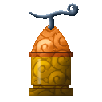
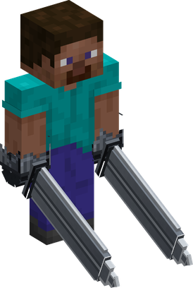
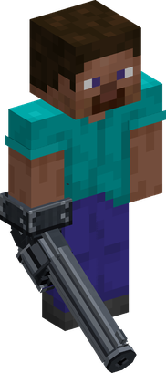
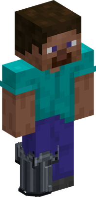
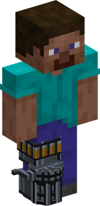
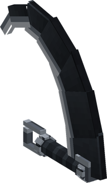
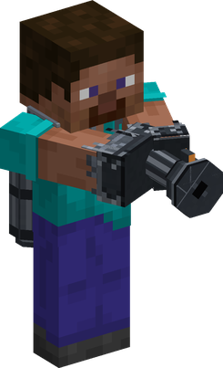
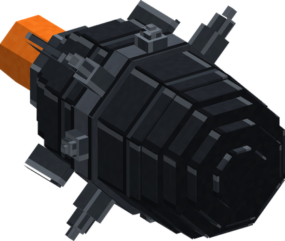
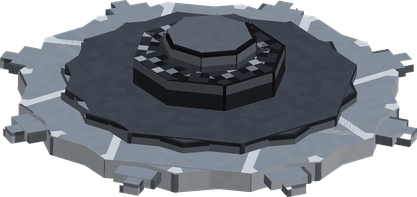

# Buki Buki no Mi

{ .mod-icon }

| | |
|---|---|
| **Type** | Paramecia |
| **Theme** | Weapons |
| **Box** | { .box-icon } Iron |
| **Chance per opening** | iron **2.45%**, wooden **0.122%** ([how it works](index.md#box-odds)) |
| **Abilities** | 8: 8 active, 0 passive |

In 3D: drag to turn, scroll or pinch to zoom.

Found in the base mod's **iron Devil Fruit box**. Eat it and its abilities appear in the ability menu, grouped under the fruit.

!!! note "About the values"
    The values are those of the ability's tooltip in game, with the base mod's default settings. Damage is shown on the base mod's scale, as in the ability screen.

## Espada Girl { #espada-girl }

{ .ability-icon } *Active · Punch*

{ .form-picture }

Transforms the user's arms into sword blades, the punches will cut the enemies and the hands are counted as a sword

| Stat | Value |
|---|---|
| Damage type | Slash, Fist, Physical |
| Haki | Hardening |

## Revolver Girl { #revolver-girl }

{ .ability-icon } *Active*

{ .form-picture }

Transforms the user's arm into a revolver that shoots multiple bullets where the user is looking at.

| Stat | Value |
|---|---|
| Damage type | Projectile, Bullet |
| Cooldown | 10 s |
| Hold | 2 s |
| Damage | 2.5 |

## Revolver Leg { #revolver-leg }

{ .ability-icon } *Active*

{ .form-picture }

The user kicks with their leg transformed into a gun, that shoots when the kick lands and pushes back the enemies in front

| Stat | Value |
|---|---|
| Damage type | Bullet |
| Cooldown | 7 s |
| Damage | 10 |
| Range | 3.5 blocks (cone) |

## Gatling Girl { #gatling-girl }

{ .ability-icon } *Active*

{ .form-picture }

Transforms the user's leg into a Gatling gun that shoots a lot of bullets where the user is looking at. The user is slowed while shooting.

| Stat | Value |
|---|---|
| Damage type | Projectile, Bullet |
| Cooldown | 25 s |
| Hold | 4 s |
| Damage | 1.2 |

**Stats while active**

| Stat | Value |
|---|---|
| Speed | x0.5 |

## Sickle Girl { #sickle-girl }

{ .ability-icon } *Active*

{ .form-picture }

Throws a sickle with a chain from the user's arm, it cuts the first enemy it hits and then the chain pulls it back

| Stat | Value |
|---|---|
| Damage type | Slash, Projectile |
| Cooldown | 9 s |
| Damage | 5 |

## Fire Girl { #fire-girl }

{ .ability-icon } *Active*

{ .form-picture }

Transforms the user's upper body into a flamethrower, that shoots a cone of fire in front of them setting the enemies on fire.

| Stat | Value |
|---|---|
| Element | Fire |
| Cooldown | 16 s |
| Hold | 3 s |
| Damage | 3 |
| Range | 7 blocks (cone) |

## Missile Girl { #missile-girl }

{ .ability-icon } *Active*

{ .form-picture }

Transforms the user into a missile that flies where they are looking and explodes on the first thing it hits. Use the ability again to explode instantly. The user takes no damage

| Stat | Value |
|---|---|
| Element | Explosion |
| Cooldown | 30 s |
| Hold | 5 s |
| Damage | 14 |

## Flying Disk Girl { #flying-disk-girl }

{ .ability-icon } *Active*

{ .form-picture }

Transforms the user into a spinning cutting disk that dashes forward, damaging and pushing away all enemies in its path.

| Stat | Value |
|---|---|
| Damage type | Slash, Physical |
| Cooldown | 12 s |
| Hold | 2 s |
| Damage | 7 |
