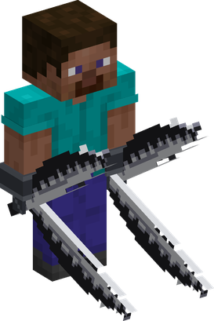

# Choki Choki no Mi

{ .mod-icon }

| | |
|---|---|
| **Type** | Paramecia |
| **Theme** | Scissors |
| **Box** | { .box-icon } Wooden |
| **Chance per opening** | wooden **2.21%** ([how it works](index.md#box-odds)) |
| **Abilities** | 8: 7 active, 1 passive |

In 3D: drag to turn, scroll or pinch to zoom.

Found in the base mod's **wooden Devil Fruit box**. Eat it and its abilities appear in the ability menu, grouped under the fruit.

!!! note "About the values"
    The values are those of the ability's tooltip in game, with the base mod's default settings. Damage is shown on the base mod's scale, as in the ability screen.

## Hasami { #hasami }

{ .ability-icon } *Active · Punch*

{ .form-picture }

Transforms the user's hands into giant scissors, the punches will cut the enemies and blocks can be cut like paper. The hands are counted as a sword

| Stat | Value |
|---|---|
| Damage type | Slash, Fist, Physical |
| Haki | Hardening |

## O Kanabashi { #o-kanabashi }

{ .ability-icon } *Active*

While the scissors are active, the user dashes forward cutting all enemies and blocks near them.

| Stat | Value |
|---|---|
| Damage type | Slash, Physical |
| Haki | Hardening |
| Cooldown | 8 s |
| Damage | 8 |

## Keep Out { #keep-out }

{ .ability-icon } *Active*

While the scissors are active, the user cuts up to 4 pieces of the ground and throws them one by one where they are looking. Harder blocks deals more damage

| Stat | Value |
|---|---|
| Damage type | Blunt, Projectile |
| Haki | Imbuing |
| Cooldown | 12 s |
| Damage | 3–8 |

## Kirikabe { #kirikabe }

{ .ability-icon } *Active*

Cuts the ground under the user and raises it as a wall of 9 blocks wide and 6 blocks tall, which goes back down after 10 seconds

| Stat | Value |
|---|---|
| Cooldown | 15 s |
| Hold | 10 s |

## Kamikiri { #kamikiri }

{ .ability-icon } *Passive*

While the scissors are active, right clicking a block with an empty hand cuts it instantly.

## Dai Setsudan { #dai-setsudan }

{ .ability-icon } *Active*

While the scissors are active, the user closes both blades on the enemy in front of them, dealing heavy damage

| Stat | Value |
|---|---|
| Damage type | Slash, Physical |
| Haki | Hardening |
| Cooldown | 10 s |
| Damage | 18 |

## Kirisaki { #kirisaki }

{ .ability-icon } *Active*

While the scissors are active, the user cuts open the protections of the enemy in front of them, it loses a big part of its armor for a few seconds

| Stat | Value |
|---|---|
| Damage type | Slash, Physical |
| Haki | Hardening |
| Cooldown | 12 s |
| Damage | 7 |
| Hold | 6 s |
| Target's Armor | x0.4 |

## Kami Hashi { #kami-hashi }

{ .ability-icon } *Active*

While the scissors are active, the user cuts a strip of the ground and unrolls it like paper towards where they are looking, making a bridge or a ramp that goes back down after 10 seconds

| Stat | Value |
|---|---|
| Cooldown | 15 s |
| Hold | 10 s |
