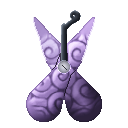

# Choki Choki no Mi

{ .mod-icon }

| | |
|---|---|
| **Type** | Paramecia |
| **Theme** | Scissors |
| **Box** | { .box-icon } Wooden |
| **Chance per opening** | wooden **2.92%** ([how it works](index.md#box-odds)) |
| **Abilities** | 5: 4 active, 1 passive |

Found in the base mod's **wooden Devil Fruit box**. Eat it and its abilities appear in the ability menu, grouped under the fruit.

!!! note "About the values"
    The values are those of the ability's tooltip in game, with the base mod's default settings. Damage is shown on the base mod's scale, as in the ability screen.

## Hasami { #hasami }

{ .ability-icon } *Active · Punch*

Turns the user's hands into giant scissors, until toggled off: bare-handed hits cut, blocks are cut like paper, and the hands count as a sword.

| Stat | Value |
|---|---|
| Damage type | Slash, Fist, Physical |
| Haki | Hardening |

## O Kanabashi { #o-kanabashi }

{ .ability-icon } *Active*

With the scissors out, the user charges forward, cutting every body and block beside them.

| Stat | Value |
|---|---|
| Damage type | Slash, Physical |
| Haki | Hardening |
| Cooldown | 8 s |
| Damage | 8 |

## Keep Out { #keep-out }

{ .ability-icon } *Active*

With the scissors out, the user cuts up to 4 slabs of the ground around them and hurls them one after another, each where they aim as it is thrown. Harder blocks hit harder.

| Stat | Value |
|---|---|
| Damage type | Blunt, Projectile |
| Haki | Imbuing |
| Cooldown | 12 s |
| Damage | 3–8 |

## Kirikabe { #kirikabe }

{ .ability-icon } *Active*

Cuts the strip of ground under the user and stands it up: a wall 9 wide and 6 tall, surface on top, which lies back down after 10 seconds.

| Stat | Value |
|---|---|
| Cooldown | 15 s |
| Hold | 10 s |

## Kamikiri { #kamikiri }

{ .ability-icon } *Passive*

With the scissors out and an empty hand, right-clicking a block snips it out at once.
