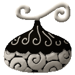
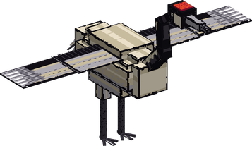
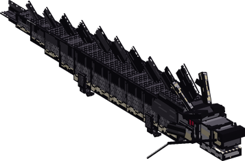
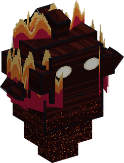
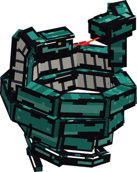

# Fude Fude no Mi

{ .mod-icon }

| | |
|---|---|
| **Type** | Paramecia |
| **Theme** | Brush |
| **Box** | { .box-icon } Iron |
| **Chance per opening** | iron **1.71%**, wooden **0.085%** ([how it works](index.md#box-odds)) |
| **Abilities** | 10: 9 active, 1 passive |
| **Transformations** | [Flat Hiding](#flat-hiding) |

In 3D: drag to turn, scroll or pinch to zoom.

Found in the base mod's **iron Devil Fruit box**. Eat it and its abilities appear in the ability menu, grouped under the fruit.

!!! note "About the values"
    The values are those of the ability's tooltip in game, with the base mod's default settings. Damage is shown on the base mod's scale, as in the ability screen.

## Ink { #ink }

{ .ability-icon } *Passive*

The user's body makes ink, and what they draw with it becomes real. Every drawing is first traced flat on the ground, then comes to life after a short moment.

A living drawing holds a part of the user's ink until it dissolves. Drawings dissolve in water

## Nuke Suzume { #nuke-suzume }

{ .ability-icon } *Active*

{ .form-picture }

The user draws a great crane of ink on the ground in front of them. After a short moment it comes to life with the user on its back and flies where they look, for 60 seconds at most.

Using the ability again dissolves the crane. It also dissolves in water

| Stat | Value |
|---|---|
| Cooldown | 25 s |
| Hold | 60 s |

## Nobori Ryu { #nobori-ryu }

{ .ability-icon } *Active*

{ .form-picture }

The user draws a long dragon of ink on the ground in front of them. After a short moment it comes to life with the user on its back, for 60 seconds at most. It can't fly, but it climbs any wall it is ridden against.

Using the ability again dissolves the dragon. It also dissolves in water

| Stat | Value |
|---|---|
| Cooldown | 25 s |
| Hold | 60 s |

## Kazenbo { #kazenbo }

{ .ability-icon } *Active*

{ .form-picture }

The user draws a huge ghost of ink wreathed in flames on the ground in front of them. After a short moment it comes to life, for 40 seconds at most, it floats to the user's enemies through walls, damages every second the ones it touches and sets them on fire.

Using the ability again dissolves the ghost. It also dissolves in water

| Stat | Value |
|---|---|
| Damage type | Indirect |
| Element | Fire |
| Haki | Special |
| Cooldown | 45 s |
| Hold | 40 s |
| Damage | 7 |

## Ink Double { #ink-double }

{ .ability-icon } *Active*

The user draws a copy of themselves in ink on the ground in front of them. After a short moment it comes to life and stands there under their name, for 30 seconds at most, the monsters that see it attack it instead of the user. When it is destroyed it bursts into ink and blinds everyone near it.

Using the ability again dissolves the copy. It also dissolves in water

| Stat | Value |
|---|---|
| Cooldown | 20 s |
| Hold | 30 s |

## Sumigumo { #sumigumo }

{ .ability-icon } *Active*

The user draws a cloud of ink on the ground where they are looking. After a short moment it rises and spreads above that place for 15 seconds, the enemies under it are blinded and monsters lose track of their targets.

Using the ability again is Ukiyo Yudachi Ezu, for 3 seconds the cloud rains arrows of ink on every enemy under it, then it dissolves

| Stat | Value |
|---|---|
| Damage type | Indirect |
| Haki | Special |
| Cooldown | 25 s |
| Hold | 15 s |
| Damage | 2.6–26 |
| Range | 5 blocks (area) |

## Flat Hiding { #flat-hiding }

{ .ability-icon } *Active · Transformation*

The user flattens against the wall beside them and becomes a drawing on it, for 30 seconds at most. Monsters lose track of them and their name can't be seen.

Moving, attacking, being hit or using another ability ends it

## Ink Weapon { #ink-weapon }

{ .ability-icon } *Active*

The user draws a weapon of ink in their hand, for 60 seconds at most. It can be a sabre, or a spear that is slower and reaches further. The weapon is chosen before it is drawn.

The weapon dissolves if it leaves the user's hands, or in water

The weapon is an **Ink Sabre** or an **Ink Spear**, chosen with the mode key before it is drawn. It stays for 60 seconds at most and is gone as soon as it leaves the user's hand.

| Stat | Value |
|---|---|
| Damage type | Slash |
| Haki | Imbuing |
| Cooldown | 10 s |
| Hold | 60 s |

## Ink Food { #ink-food }

{ .ability-icon } *Active*

The user draws 3 dango of ink. They feed whoever eats them but taste bad, and dissolve after 3 minutes.

Gives 3 **Ink Dango**: each feeds like bread and gives a short nausea, anybody can eat them, and they are gone after 3 minutes if not eaten.

| Stat | Value |
|---|---|
| Cooldown | 30 s |

## Ink Snakes { #ink-snakes }

{ .ability-icon } *Active*

{ .form-picture }

The user draws 2 snakes of ink on the ground under the enemy they are looking at. After a short moment the snakes come to life and coil around the nearest enemy, it can't move and is squeezed 4 times.

The snakes let go in water

| Stat | Value |
|---|---|
| Damage type | Indirect |
| Haki | Special |
| Cooldown | 16 s |
| Damage | 5 |
| Range | 14 blocks (line) |
