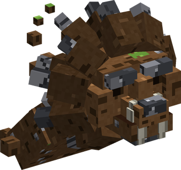
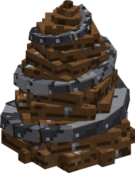
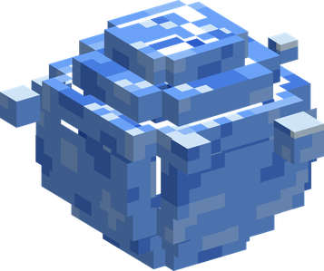

# Fuwa Fuwa no Mi

{ .mod-icon }

| | |
|---|---|
| **Type** | Paramecia |
| **Theme** | Float |
| **Box** | { .box-icon } Golden |
| **Chance per opening** | golden **3.06%**, iron **0.153%**, wooden **0.008%** ([how it works](index.md#box-odds)) |
| **Abilities** | 10: 9 active, 1 passive |
| **Effects applied** | { .effect-mini }[Buried](../effects.md#effect-buried) |

In 3D: drag to turn, scroll or pinch to zoom.

Found in the base mod's **golden Devil Fruit box**. Eat it and its abilities appear in the ability menu, grouped under the fruit.

!!! note "About the values"
    The values are those of the ability's tooltip in game, with the base mod's default settings. Damage is shown on the base mod's scale, as in the ability screen.

## Fuyu { #fuyu }

{ .ability-icon } *Passive*

The user makes themselves weightless allowing them to fly, the speed is higher while not in combat

## Item Kaiten { #item-kaiten }

{ .ability-icon } *Active*

The user takes up to 6 blocks from the ground that will float and spin around them. Each block stops one projectile, taking a melee hit drops all of them.

If used while crouching, drops all the blocks

| Stat | Value |
|---|---|
| Cooldown | 5 s |

## Item Hassha { #item-hassha }

{ .ability-icon } *Active*

Shoots one of the blocks spinning around the user where they are looking at. The block stays where it lands.

| Stat | Value |
|---|---|
| Damage type | Blunt, Indirect |
| Haki | Imbuing |
| Cooldown | 2 s |
| Damage | 8 |

## Shishi Odoshi { #shishi-odoshi }

{ .ability-icon } *Active*

{ .form-picture }

The user shapes the ground into 3 lion heads that charges forward, each one bites the first enemy it hits and sends it flying. Can be used while flying close to the ground

| Stat | Value |
|---|---|
| Damage type | Blunt, Indirect |
| Haki | Special |
| Cooldown | 10 s |
| Damage | 18 |
| Range | 20 blocks (line) |

## Shishi Odoshi: Chimaki { #chimaki }

{ .ability-icon } *Active*

{ .form-picture }

Applies { .effect-mini }[Buried](../effects.md#effect-buried)

The ground where the user is looking at buries up to 4 enemies into a spiral of earth, they can't move, attack or use abilities. On snow the enemies are also frozen.

Use the ability again to drop a boulder on each buried enemy

| Stat | Value |
|---|---|
| Damage type | Blunt, Indirect |
| Haki | Special |
| Cooldown | 20 s |
| Hold | 5 s |
| Damage | 10–30 |
| Range | 4 blocks (area) |

## Zanpa { #zanpa }

{ .ability-icon } *Active*

{ .form-picture }

Can only be used near water or during rain. Traps the enemy the user is looking at inside a floating sphere of water, where it drowns. Devil Fruit users lose their powers inside and drown 2 times faster.

| Stat | Value |
|---|---|
| Haki | Special |
| Cooldown | 25 s |
| Damage | 6 |

## Shishi Funjin { #shishi-funjin }

{ .ability-icon } *Active*

The user shoots 5 rock shards from their palms in a fan shape. Can be used while flying close to the ground

| Stat | Value |
|---|---|
| Damage type | Blunt, Projectile |
| Haki | Special |
| Cooldown | 8 s |
| Damage | 9 |

## Ryuki { #ryuki }

{ .ability-icon } *Active*

The user puts their palm on the ground making it erupt, damaging and pushing back all nearby enemies while the user is launched into the air.

| Stat | Value |
|---|---|
| Damage type | Blunt, Indirect |
| Haki | Special |
| Cooldown | 12 s |
| Damage | 18 |
| Range | 5 blocks (area) |

## Tatsumaki { #tatsumaki }

{ .ability-icon } *Active*

The user spins and rises into the air, taking all nearby enemies with them which are hit 5 times and then dropped. The floating blocks around the user increases the damage

| Stat | Value |
|---|---|
| Damage type | Blunt, Indirect |
| Haki | Special |
| Cooldown | 14 s |
| Hold | 2 s |
| Damage | 5 |
| Range | 3 blocks (area) |

## Fusen { #fusen }

{ .ability-icon } *Active*

The boat the user is sitting in becomes weightless and flies where they are looking, together with its passengers. The boat falls if the user leaves it or loses their powers.

| Stat | Value |
|---|---|
| Cooldown | 2 s |
