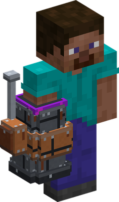
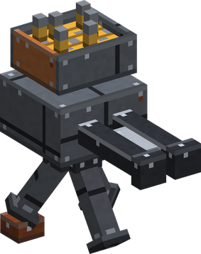
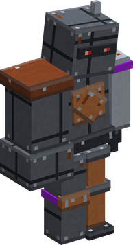
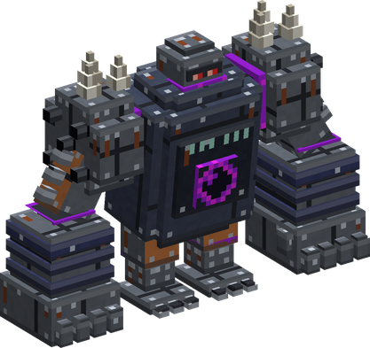
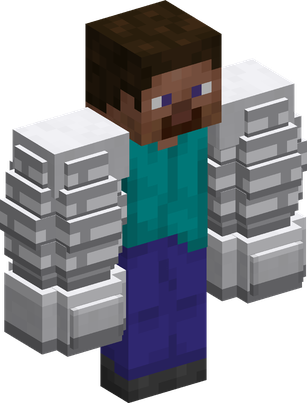

# Gasha Gasha no Mi

{ .mod-icon }

| | |
|---|---|
| **Type** | Paramecia |
| **Theme** | Assembly |
| **Box** | { .box-icon } Golden |
| **Chance per opening** | golden **3.96%**, iron **0.198%**, wooden **0.010%** ([how it works](index.md#box-odds)) |
| **Abilities** | 10: 10 active, 0 passive |
| **Transformations** | [Unión Armado](#union-armado), [Blindado](#blindado) |

In 3D: drag to turn, scroll or pinch to zoom.

Found in the base mod's **golden Devil Fruit box**. Eat it and its abilities appear in the ability menu, grouped under the fruit.

!!! note "About the values"
    The values are those of the ability's tooltip in game, with the base mod's default settings. Damage is shown on the base mod's scale, as in the ability screen.

## Desmontar { #desmontar }

{ .ability-icon } *Active*

Takes the crafted block or the dropped item the user aims at apart into the ingredients of its recipe. A worn item gives back less.

| Stat | Value |
|---|---|
| Cooldown | 2 s |

## Taller { #taller }

{ .ability-icon } *Active*

Opens a crafting grid anywhere, without a table.

Used while crouching, repairs the item held in the main hand with its material from the inventory, without anvil or experience.

| Stat | Value |
|---|---|
| Cooldown | 1 s |

## Muralla { #muralla }

{ .ability-icon } *Active*

Raises a wall eleven blocks wide and six high where the user aims, made in the image of the ground there, throwing away whoever stands where it rises. It stops bodies and projectiles, and falls to dust after ten seconds.

| Stat | Value |
|---|---|
| Cooldown | 12 s |

## Cañón Armado { #canon-armado }

{ .ability-icon } *Active*

{ .form-picture }

Turns the user's forearm into a cannon. While it is out, holding the use key with an empty hand fires the first ammunition of his inventory: TNT, gunpowder, bullets or cannon balls, arrows.

Used again, puts the cannon away.

| Stat | Value |
|---|---|
| Damage type | Blunt, Projectile |
| Cooldown | 2 s |

## Torreta { #torreta }

{ .ability-icon } *Active*

{ .form-picture }

Builds a turret where the user aims and loads it with up to 32 of his bullets. It shoots the nearest enemy once a second, for a minute or until it is empty or broken.

The bullets it did not shoot come back to the user. One turret at a time.

| Stat | Value |
|---|---|
| Cooldown | 30 s |

## Soldado { #soldado }

{ .ability-icon } *Active*

{ .form-picture }

Builds a soldier of scrap out of the ground in front of the user. It follows him and fights his enemies for a minute and a half, or until it is broken.

One soldier at a time.

| Stat | Value |
|---|---|
| Cooldown | 60 s |

## Unión Armado { #union-armado }

{ .ability-icon } *Active · Transformation*

{ .form-picture }

The user assembles a giant mech round himself: stronger fists with a longer reach, armored and hard to push back, but slower.

Its size is chosen beforehand: the colossus takes the look of the ground it rises from, lasts a shorter time, on a longer cooldown.

Unión Armado

| Stat | Value |
|---|---|
| Cooldown | 6–30 s |
| Hold | 60 s |
| Size | x3 |
| Fist Damage | +10 |
| Armor | +8 |
| Unión Armado | Coloso |
| Cooldown | 18–90 s |
| Hold | 30 s |
| Size | x8 |
| Fist Damage | +22 |
| Armor | +14 |

## Ultimate Faust { #ultimate-faust }

{ .ability-icon } *Active*

As the colossus, the user draws back its fist, then brings it down where he aims: every enemy round the impact is struck and thrown away.

Stronger with Armament Haki hardening on.

| Stat | Value |
|---|---|
| Damage type | Physical |
| Haki | Hardening |
| Cooldown | 40 s |
| Charge | 2 s |
| Range | 6 blocks (area) |
| Damage | 80 |

## Blindado { #blindado }

{ .ability-icon } *Active · Transformation*

{ .form-picture }

The user's arms swell with scrap and Armament Haki: stronger fists, armored and faster.

| Stat | Value |
|---|---|
| Requires Busoshoku Haki | Full Body Hardening to be active. |
| Cooldown | 60 s |
| Hold | 40 s |

**Stats while active**

| Stat | Value |
|---|---|
| Speed | x1.2 |
| Punch Damage | +12 |
| Armor | +8 |

## Det Sterkeste Strike { #det-sterkeste-strike }

{ .ability-icon } *Active*

A storm of eight punches in two seconds, striking every enemy in front of the user. The last one throws them away.

Requires Blindado to be active.

| Stat | Value |
|---|---|
| Damage type | Physical |
| Haki | Hardening |
| Cooldown | 20 s |
| Range | 4 blocks (line) |
| Damage | 10 |
