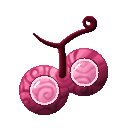

# Giro Giro no Mi

{ .mod-icon }

| | |
|---|---|
| **Type** | Paramecia |
| **Theme** | Glare |
| **Box** | { .box-icon } Wooden |
| **Chance per opening** | wooden **2.92%** ([how it works](index.md#box-odds)) |
| **Abilities** | 5: 4 active, 1 passive |
| **Effects applied** | { .effect-mini }[Giro Sight](../effects.md#effect-giro-sight) |

Found in the base mod's **wooden Devil Fruit box**. Eat it and its abilities appear in the ability menu, grouped under the fruit.

!!! note "About the values"
    The values are those of the ability's tooltip in game, with the base mod's default settings. Damage is shown on the base mod's scale, as in the ability screen.

## Giro Giro Vision { #giro-vision }

{ .ability-icon } *Active*

Through her finger-glasses the user sees every creature nearby through walls, with its health. Held long, it makes her hungry.

| Stat | Value |
|---|---|
| Cooldown | 2 s |
| Range | 40 blocks (area) |

## Peeping Mind { #peeping-mind }

{ .ability-icon } *Active*

Applies { .effect-mini }[Giro Sight](../effects.md#effect-giro-sight)

Forehead to forehead: reads an enemy's mind - its devil fruit, its abilities and cooldowns - and keeps it in sight through walls. On an ally, sends him her sight instead. A stronger mind can shock her.

| Stat | Value |
|---|---|
| Cooldown | 10 s |

## Senrigan { #senrigan }

{ .ability-icon } *Active*

The user sends her sight out far round her: every player and boss within 4,000 blocks is marked on her screen a while, with its direction and distance.

| Stat | Value |
|---|---|
| Cooldown | 60 s |
| Range | 4,000 blocks (area) |

## Hierro Lagrima: Mekujira { #mekujira }

{ .ability-icon } *Active*

A tear from each of the user's eyes swells into a whale that rushes at the enemy she looks at.

| Stat | Value |
|---|---|
| Element | Water |
| Cooldown | 10 s |
| Damage | 7 |

## Insight { #giro-insight }

{ .ability-icon } *Passive*

The user sees through everything: invisible creatures near her are not hidden from her.
