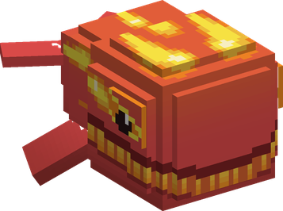

# Giro Giro no Mi

{ .mod-icon }

| | |
|---|---|
| **Type** | Paramecia |
| **Theme** | Glare |
| **Box** | { .box-icon } Wooden |
| **Chance per opening** | wooden **2.21%** ([how it works](index.md#box-odds)) |
| **Abilities** | 5: 4 active, 1 passive |
| **Effects applied** | { .effect-mini }[Giro Sight](../effects.md#effect-giro-sight) |

In 3D: drag to turn, scroll or pinch to zoom.

Found in the base mod's **wooden Devil Fruit box**. Eat it and its abilities appear in the ability menu, grouped under the fruit.

!!! note "About the values"
    The values are those of the ability's tooltip in game, with the base mod's default settings. Damage is shown on the base mod's scale, as in the ability screen.

## Giro Giro Vision { #giro-vision }

{ .ability-icon } *Active*

The user can see all nearby creatures through walls together with their health. Using it for too long makes the user hungry

| Stat | Value |
|---|---|
| Cooldown | 2 s |
| Range | 40 blocks (area) |

## Peeping Mind { #peeping-mind }

{ .ability-icon } *Active*

Applies { .effect-mini }[Giro Sight](../effects.md#effect-giro-sight)

The user reads the mind of an enemy, showing its devil fruit, abilities and cooldowns and keeping it visible through walls. If used on an ally, shares the user's vision with them instead. A stronger enemy can shock the user.

| Stat | Value |
|---|---|
| Cooldown | 10 s |

## Senrigan { #senrigan }

{ .ability-icon } *Active*

The user extends their vision very far, all players in 4000 blocks and the bosses nearby are marked on the screen for a while with their direction and distance

| Stat | Value |
|---|---|
| Cooldown | 60 s |
| Range | 4,000 blocks (area) |

## Hierro Lagrima: Mekujira { #mekujira }

{ .ability-icon } *Active*

{ .form-picture }

A tear from each of the user's eyes turns into a whale that charges at the enemy the user is looking at.

| Stat | Value |
|---|---|
| Element | Water |
| Haki | Special |
| Cooldown | 10 s |
| Damage | 7–14 |

## Insight { #giro-insight }

{ .ability-icon } *Passive*

The user can see through everything, nearby invisible creatures are visible for them
