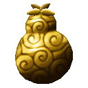
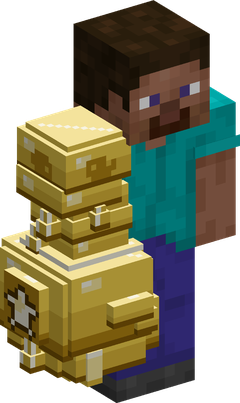
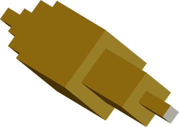
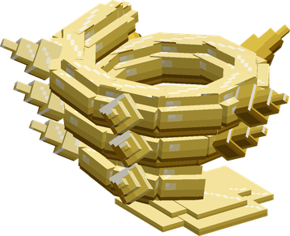

# Goru Goru no Mi

{ .mod-icon }

| | |
|---|---|
| **Type** | Paramecia |
| **Theme** | Gold |
| **Box** | { .box-icon } Golden |
| **Chance per opening** | golden **3.06%**, iron **0.153%**, wooden **0.008%** ([how it works](index.md#box-odds)) |
| **Abilities** | 14: 12 active, 2 passive |
| **Transformations** | [Golden Armour](#golden-armour), [Golden Tesoro](#golden-tesoro) |
| **Effects applied** | { .effect-mini }[Gold Dust](../effects.md#effect-gold-dust), { .effect-mini }[Golden Statue](../effects.md#effect-golden-statue) |

In 3D: drag to turn, scroll or pinch to zoom.

Found in the base mod's **golden Devil Fruit box**. Eat it and its abilities appear in the ability menu, grouped under the fruit.

!!! note "About the values"
    The values are those of the ability's tooltip in game, with the base mod's default settings. Damage is shown on the base mod's scale, as in the ability screen.

## Gold Hoard { #gold-hoard }

{ .ability-icon } *Passive*

Shows the gold the user can use, a gold nugget counts for 1, an ingot for 9 and a block for 81, and pulls the nearby gold items to them. The gold is shown in green when there are enough gold blocks around them to use the abilities for free

## Golden Senses { #golden-senses }

{ .ability-icon } *Passive*

The user sees everyone covered in gold dust through walls

## Gold Dust { #gold-dust }

{ .ability-icon } *Active*

Applies { .effect-mini }[Gold Dust](../effects.md#effect-gold-dust)

The user showers everyone around them with gold dust, marking them for 2 minutes. Water washes the gold dust off.

| Stat | Value |
|---|---|
| Cooldown | 20 s |
| Gold Spent | 9 |
| Range | 8 blocks (area) |

## Golden Statue { #golden-statue }

{ .ability-icon } *Active*

Applies { .effect-mini }[Golden Statue](../effects.md#effect-golden-statue)

The user turns the enemy covered in gold dust they are looking at into a golden statue, they can't move or attack. The statue lasts less on players and bosses, and breaks if it takes enough damage or touches water.

Use the ability again to release the enemy

| Stat | Value |
|---|---|
| Cooldown | 30 s |
| Gold Held | 72 |
| Hold | 4–10 s |
| Range | 16 blocks (line) |
| Statue Health | 30 |

## Gon Bomba { #gon-bomba }

{ .ability-icon } *Active*

{ .form-picture }

The user covers their arm with a golden gauntlet and punches the enemy in front, the gold then explodes damaging all nearby enemies

| Stat | Value |
|---|---|
| Damage type | Fist, Physical |
| Element | Explosion |
| Haki | Hardening |
| Cooldown | 10 s |
| Gold Held | 18 |
| Damage | 22 |
| Range | 3 blocks (area) |

## Gon Lancia { #gon-lancia }

{ .ability-icon } *Active*

{ .form-picture }

The user fires 9 golden spikes from their fingertips where they are looking, the gold of each spike is left where it lands

| Stat | Value |
|---|---|
| Damage type | Projectile |
| Haki | Imbuing |
| Cooldown | 10 s |
| Gold Thrown | 9 |
| Damage | 3 |

## Gon L'ira di Dio { #gon-lira-di-dio }

{ .ability-icon } *Active*

The user throws a huge golden tendril straight where they are looking, damaging and pushing away all the enemies on its way

| Stat | Value |
|---|---|
| Damage type | Blunt |
| Haki | Hardening |
| Cooldown | 14 s |
| Gold Held | 36 |
| Damage | 26 |
| Range | 16 blocks (line) |

## Gon Incantesimo { #gon-incantesimo }

{ .ability-icon } *Active*

{ .form-picture }

A golden tendril covered in spikes comes out of the ground and wraps around the enemy the user is looking at, they are stuck in place and damaged every second but can still attack.

Use the ability again to release the enemy

| Stat | Value |
|---|---|
| Damage type | Indirect |
| Haki | Special |
| Cooldown | 16 s |
| Gold Held | 36 |
| Hold | 6 s |
| Damage | 2–12 |
| Range | 14 blocks (line) |

## Gon Frenesia { #gon-frenesia }

{ .ability-icon } *Active*

The user forms a long golden blade on their arm and slashes all the enemies in front of them, pushing them back

| Stat | Value |
|---|---|
| Damage type | Slash |
| Haki | Imbuing |
| Cooldown | 8 s |
| Gold Held | 18 |
| Damage | 18 |
| Range | 4 blocks (cone) |

## Gon Tempesta { #gon-tempesta }

{ .ability-icon } *Active*

The user uppercuts the enemies in front of them with a golden gauntlet, launching them in the air, the gust it creates pushes back the enemies further away

| Stat | Value |
|---|---|
| Damage type | Fist, Physical |
| Haki | Hardening |
| Cooldown | 12 s |
| Gold Held | 18 |
| Damage | 16 |
| Range | 8 blocks (cone) |

## Golden Armour { #golden-armour }

{ .ability-icon } *Active · Transformation*

The user covers their whole body with gold, becoming much tougher and harder to push, but heavier and slower

| Stat | Value |
|---|---|
| Gold Held | 144 |

## Golden Tesoro { #golden-tesoro }

{ .ability-icon } *Active · Transformation*

The user creates a giant golden body around them, the hits damages the gold instead of the user and it repairs itself while standing among gold blocks. The golem breaks when there is no gold left. The size can be changed before using it, a bigger golem is slower and golems can't jump.

Golden Tesoro

Great Golden Tesoro

Huge Golden Tesoro

| Stat | Value |
|---|---|
| Size | x2.5 |
| Gold Held | 144 |
| Gold Body | 288 |
| Fist Damage | +20 |
| Movement Speed | -25 % |
| Golem Abilities' Damage | x1 |
| Size | x5 |
| Gold Held | 288 |
| Gold Body | 576 |
| Fist Damage | +35 |
| Movement Speed | -50 % |
| Golem Abilities' Damage | x1.5 |
| Size | x8 |
| Gold Held | 576 |
| Gold Body | 1,152 |
| Fist Damage | +50 |
| Movement Speed | -75 % |
| Golem Abilities' Damage | x2 |

## Gon Inferno { #gon-inferno }

{ .ability-icon } *Active*

Only as Golden Tesoro. The golem punches the enemy in front, the gold then explodes damaging all nearby enemies. A bigger golem hits harder and further.

| Stat | Value |
|---|---|
| Damage type | Fist, Physical |
| Element | Explosion |
| Haki | Hardening |
| Cooldown | 20 s |
| Damage | 26 |

## Gon Fuoco di Dio { #gon-fuoco-di-dio }

{ .ability-icon } *Active*

Only as Golden Tesoro. The golem fires a beam from its eyes where the user is looking, damaging all the enemies on its way and exploding at the end. A bigger golem hits harder.

| Stat | Value |
|---|---|
| Damage type | Indirect |
| Element | Explosion |
| Haki | Special |
| Cooldown | 20 s |
| Damage | 20 |
| Range | 32 blocks (line) |
