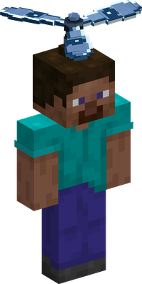
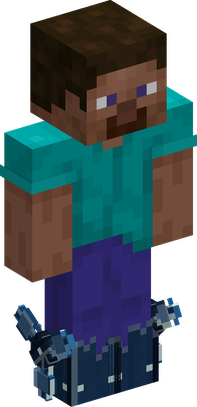
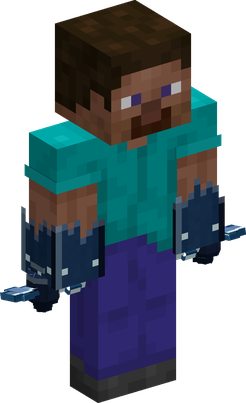

# Guru Guru no Mi

{ .mod-icon }

| | |
|---|---|
| **Type** | Paramecia |
| **Theme** | Spin |
| **Box** | { .box-icon } Wooden |
| **Chance per opening** | wooden **2.92%** ([how it works](index.md#box-odds)) |
| **Abilities** | 7: 5 active, 2 passive |
| **Effects applied** | { .effect-mini }[Launched](../effects.md#effect-launched) |

In 3D: drag to turn, scroll or pinch to zoom.

Found in the base mod's **wooden Devil Fruit box**. Eat it and its abilities appear in the ability menu, grouped under the fruit.

!!! note "About the values"
    The values are those of the ability's tooltip in game, with the base mod's default settings. Damage is shown on the base mod's scale, as in the ability screen.

## Puropera { #puropera }

{ .ability-icon } *Active*

{ .form-picture }

Transforms the top of the user's head into a propeller allowing them to fly while it spins. Taking a melee hit stops it

## Toppu: Matasaburo { #toppu-matasaburo }

{ .ability-icon } *Active*

The user spins creating a strong wind in front of them, enemies are blown away and clouds of gas and smoke are removed

| Stat | Value |
|---|---|
| Element | Wind |
| Cooldown | 10 s |
| Damage | 3 |
| Range | 10 blocks (cone) |

## Guru Guru Toshaho { #guru-guru-toshaho }

{ .ability-icon } *Active*

Applies { .effect-mini }[Launched](../effects.md#effect-launched)

Grabs the creature in front of the user, spins it with their arms and throws it where the user is looking at. An ally using Missile Girl is launched much faster.

| Stat | Value |
|---|---|
| Cooldown | 13 s |
| Damage | 8 |

## Suketo { #suketo }

{ .ability-icon } *Active*

{ .form-picture }

The user's legs spins like wheels allowing them to roll on the ground like on skates, pushing away everyone in their path

| Stat | Value |
|---|---|
| Cooldown | 10 s |
| Hold | 5 s |
| Damage | 4 |

**Stats while active**

| Stat | Value |
|---|---|
| Speed | x2.2 |

## Senpu { #senpu }

{ .ability-icon } *Active*

{ .form-picture }

The user's arms becomes rotors that spins around them, hitting all nearby enemies multiple times.

| Stat | Value |
|---|---|
| Damage type | Blunt |
| Cooldown | 12 s |
| Hold | 3 s |
| Damage | 5 |
| Range | 2.6 blocks (area) |

## Hiko { #hiko }

{ .ability-icon } *Passive*

While the propeller is spinning the user can fly, until they have no more stamina.

## Kaiten Ningen { #kaiten-ningen }

{ .ability-icon } *Passive*

Taking a melee hit while a part of the user is spinning stops all rotations, if the user was flying they will fall
