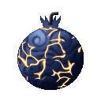
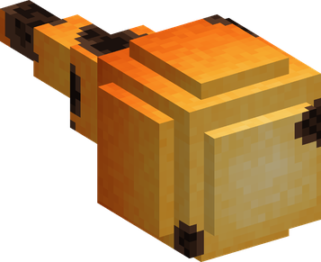
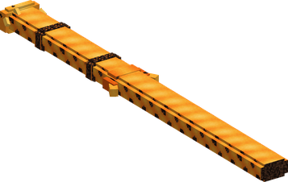

# Gutsu Gutsu no Mi

{ .mod-icon }

| | |
|---|---|
| **Type** | Paramecia |
| **Theme** | Furnace |
| **Box** | { .box-icon } Iron |
| **Chance per opening** | iron **1.71%**, wooden **0.085%** ([how it works](index.md#box-odds)) |
| **Abilities** | 9: 8 active, 1 passive |
| **Transformations** | [Metal Coat](#metal-coat), [Overfed](#overfed) |
| **Effects applied** | { .effect-mini }[Cased in Metal](../effects.md#effect-cased-in-metal) |

In 3D: drag to turn, scroll or pinch to zoom.

Found in the base mod's **iron Devil Fruit box**. Eat it and its abilities appear in the ability menu, grouped under the fruit.

!!! note "About the values"
    The values are those of the ability's tooltip in game, with the base mod's default settings. Damage is shown on the base mod's scale, as in the ability screen.

## Furnace { #furnace }

{ .ability-icon } *Passive*

The user's body is a furnace, the metal they eat is stored inside them, up to 64 ingots, and every ability of the fruit spends it. The best metal eaten decides what their metal is made of

The user is immune to fire and lava

## Smelt { #smelt }

{ .ability-icon } *Active*

The user eats up to 8 pieces of metal from their inventory, the one in their hand first. It can be ore, raw metal, ingots, nuggets or blocks of iron, gold or copper. It fills their furnace

| Stat | Value |
|---|---|
| Cooldown | 1 s |

## Forge { #forge }

{ .ability-icon } *Active*

The user pulls a glowing weapon out of their body, it can be a blade, a maul, a spear or a gun that fires molten metal. The weapon is chosen before it is forged

Forged weapons are made of the best metal in the furnace, set what they strike on fire, and melt after 90 seconds or when dropped

The weapon is a **Forged Blade**, a **Forged Maul**, a **Forged Spear** or a **Forged Gun**, in the metal the furnace holds (iron, gold or copper). What it strikes burns. It takes no wear and no enchantment, melts after 90 seconds, and at once if it is dropped. The gun fires 6 balls of molten metal, then it is spent.

| Stat | Value |
|---|---|
| Cooldown | 10 s |
| Metal Spent | 3 |

## Arm the Crew { #arm-the-crew }

{ .ability-icon } *Active*

The user forges a blade for each ally around them who has no forged weapon yet, as long as the furnace has metal for it. These blades melt as the user's own do

| Stat | Value |
|---|---|
| Cooldown | 30 s |
| Metal Spent | 2 |
| Range | 10 blocks (area) |

## Molten Shot { #molten-shot }

{ .ability-icon } *Active*

{ .form-picture }

The user spits a ball of molten metal that damages what it hits and sets it on fire

| Stat | Value |
|---|---|
| Damage type | Projectile |
| Haki | Special |
| Cooldown | 4 s |
| Damage | 9 |
| Metal Spent | 1 |

## Molten Stream { #molten-stream }

{ .ability-icon } *Active*

{ .form-picture }

The user pours a wide stream of molten metal where they are looking, enemies in it are burned and set on fire. It spends metal for as long as it flows

Use the ability again to stop it

| Stat | Value |
|---|---|
| Damage type | Indirect |
| Haki | Special |
| Cooldown | 15 s |
| Hold | 5 s |
| Damage | 2 |
| Range | 10 blocks (line) |
| Metal Spent | 10 |

## Metal Casing { #metal-casing }

{ .ability-icon } *Active*

Applies { .effect-mini }[Cased in Metal](../effects.md#effect-cased-in-metal)

The user pours molten metal over the enemy they are looking at, it sets around them and they can't move or attack. The casing lasts less on players and bosses and breaks if it takes enough damage

| Stat | Value |
|---|---|
| Cooldown | 25 s |
| Hold | 3–8 s |
| Metal Spent | 4 |
| Range | 12 blocks (line) |
| Casing Health | 25 |

## Metal Coat { #metal-coat }

{ .ability-icon } *Active · Transformation*

The user covers their whole body with the metal of their furnace, becoming much tougher and harder to push, but heavier and slower

| Stat | Value |
|---|---|
| Metal Spent | 6 |

## Overfed { #overfed }

{ .ability-icon } *Active · Transformation*

With at least 32 ingots in the furnace the user's body swells, they are bigger, much stronger and harder to push, and so hot that enemies standing close catch fire

The furnace burns its metal for as long as the form lasts, and the form ends when it is empty

| Stat | Value |
|---|---|
| Haki | Special |
| Damage | 2 |
| Range | 5.6 blocks (area) |
