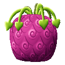
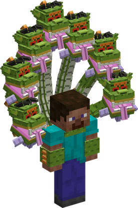
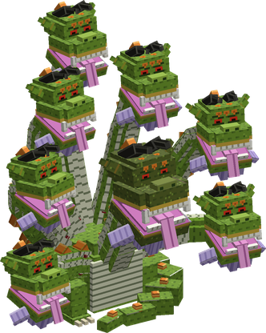

# Hebi Hebi no Mi, Model: Yamata no Orochi

{ .mod-icon }

| | |
|---|---|
| **Type** | Mythical Zoan |
| **Box** | { .box-icon } Golden |
| **Chance per opening** | golden **3.06%**, iron **0.153%**, wooden **0.008%** ([how it works](index.md#box-odds)) |
| **Abilities** | 10: 9 active, 1 passive |
| **Transformations** | [Orochi Heavy Point](#orochi-heavy-point), [Orochi Guard Point](#orochi-guard-point) |

In 3D: drag to turn, scroll or pinch to zoom.

Found in the base mod's **golden Devil Fruit box**. Eat it and its abilities appear in the ability menu, grouped under the fruit.

!!! note "About the values"
    The values are those of the ability's tooltip in game, with the base mod's default settings. Damage is shown on the base mod's scale, as in the ability screen.

## Orochi Heavy Point { #orochi-heavy-point }

{ .ability-icon } *Active · Transformation*

{ .form-picture }

Transforms the user into a serpent hybrid, with 7 serpent heads on long necks growing from their back around their own head.

## Orochi Guard Point { #orochi-guard-point }

{ .ability-icon } *Active · Transformation*

{ .form-picture }

Transforms the user into the Yamata no Orochi, a huge serpent with 8 heads on long necks. It is slow but very tough and reaches far.

## Eight Lives { #eight-lives }

{ .ability-icon } *Passive*

The user has 8 heads. A blow that would kill them cuts off a head instead and leaves them with a quarter of their health, even in human form. With only 1 head left the user dies normally

A lost head grows back after 4 minutes. The user's abilities are stronger with more heads

## Multi Bite { #multi-bite }

{ .ability-icon } *Active*

Each of the user's heads bites one of the enemies in front of them. With fewer heads, fewer enemies are bitten

| Stat | Value |
|---|---|
| Damage type | Physical |
| Haki | Hardening |
| Cooldown | 8 s |
| Damage | 12–14 |
| Range | 3.5–6 blocks (line) |

## Long Neck { #long-neck }

{ .ability-icon } *Active*

One of the user's heads shoots far ahead and bites the enemy they are looking at. With fewer heads, it reaches less far

| Stat | Value |
|---|---|
| Damage type | Physical |
| Haki | Hardening |
| Cooldown | 10 s |
| Damage | 20 |
| Range | 9.6–16 blocks (line) |

## Devour { #devour }

{ .ability-icon } *Active*

One of the user's heads bites a piece out of the enemy in front of them and swallows it, healing the user by half of the damage dealt

| Stat | Value |
|---|---|
| Damage type | Physical |
| Haki | Hardening |
| Cooldown | 12 s |
| Damage | 18 |
| Range | 3–5 blocks (line) |

## Eightfold Strike { #eightfold-strike }

{ .ability-icon } *Active*

All of the user's heads strike the enemy in front of them one after the other, the last hit sends it back. One hit for each head the user has left

| Stat | Value |
|---|---|
| Damage type | Physical |
| Haki | Hardening |
| Cooldown | 20 s |
| Damage | 5–40 |
| Range | 4–6 blocks (line) |

## Coiled Guard { #coiled-guard }

{ .ability-icon } *Active*

The user's necks close around them like a shield, reducing the damage they take. The more heads, the stronger the shield. While it holds the user is slowed and can't attack. Use the ability again to open it

| Stat | Value |
|---|---|
| Cooldown | 15 s |
| Hold | 5 s |
| Damage Blocked per Head | 8 % |

## Jaw Grab { #jaw-grab }

{ .ability-icon } *Active*

While in the full Orochi form, the main head grabs the enemy the user is looking at and lifts it in its jaws, it can't move and takes damage. Use the ability again to drop it

| Stat | Value |
|---|---|
| Damage type | Physical |
| Haki | Hardening |
| Cooldown | 16 s |
| Hold | 3 s |
| Damage | 4–24 |
| Range | 5.4–9 blocks (line) |

## Thrash { #thrash }

{ .ability-icon } *Active*

While in the full Orochi form, the user sweeps their necks in front of them, hitting all enemies there, sending them flying and breaking weak blocks. With fewer heads, the sweep reaches less far

| Stat | Value |
|---|---|
| Damage type | Physical |
| Haki | Hardening |
| Cooldown | 16 s |
| Damage | 24 |
| Range | 5–9 blocks (area) |
