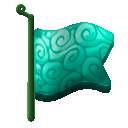

# Hira Hira no Mi

{ .mod-icon }

| | |
|---|---|
| **Type** | Paramecia |
| **Theme** | Ripple |
| **Box** | { .box-icon } Iron |
| **Chance per opening** | iron **2.45%**, wooden **0.122%** ([how it works](index.md#box-odds)) |
| **Abilities** | 7: 6 active, 1 passive |

Found in the base mod's **iron Devil Fruit box**. Eat it and its abilities appear in the ability menu, grouped under the fruit.

!!! note "About the values"
    The values are those of the ability's tooltip in game, with the base mod's default settings. Damage is shown on the base mod's scale, as in the ability screen.

## Vipera Glaive { #vipera-glaive }

{ .ability-icon } *Active*

Flattens the blade of the user's sword, which stretches and snakes out to cut the enemy in sight, then draws back.

| Stat | Value |
|---|---|
| Damage type | Slash |
| Haki | Imbuing |
| Cooldown | 8 s |
| Damage | 7 |
| Range | 14 blocks (line) |

## Corrida Glaive { #corrida-glaive }

{ .ability-icon } *Active · Punch*

Folds the user's sword into a bull-headed mace: the next blow of the sword lands heavily and throws the enemy back.

| Stat | Value |
|---|---|
| Damage type | Blunt |
| Haki | Hardening |

## Army Bandera { #army-bandera }

{ .ability-icon } *Active*

Makes the ground around the user ripple like a flag: every enemy standing on it loses its footing and staggers.

| Stat | Value |
|---|---|
| Cooldown | 15 s |
| Damage | 4 |
| Range | 9 blocks (area) |

## Death Enjambre { #death-enjambre }

{ .ability-icon } *Active*

Fires confetti high over where the user aims. Use again - Hira Release - to turn it back into spiked iron balls that rain down.

| Stat | Value |
|---|---|
| Damage type | Blunt, Projectile |
| Cooldown | 30 s |
| Hold | 5 s |
| Damage | 7 |
| Range | 5 blocks (area) |

## Steel Cape { #steel-cape }

{ .ability-icon } *Active*

Needs a worn cape. Stiffens it into a fluttering sheet of steel in front of the user: blows from the front are stopped and wear down the weapon that struck.

| Stat | Value |
|---|---|
| Cooldown | 3–9 s |
| Hold | 6 s |
| Frontal Damage Blocked | 100 % |

**Stats while active**

| Stat | Value |
|---|---|
| Speed | x0.7 |

## Lock { #lock }

{ .ability-icon } *Active*

Locks whatever the user holds into a denser, harder form: it hits harder and does not wear.

| Stat | Value |
|---|---|
| Cooldown | 20 s |
| Hold | 30 s |
| Held Item Damage | +5 |

## Flag Body { #flag-body }

{ .ability-icon } *Passive*

When falling, the user's body flattens into a flag and floats down safely. Sneak to fall normally.
