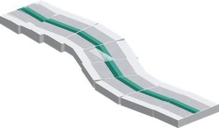
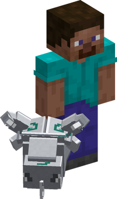
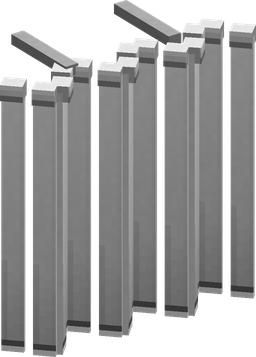

# Hira Hira no Mi

{ .mod-icon }

| | |
|---|---|
| **Type** | Paramecia |
| **Theme** | Ripple |
| **Box** | { .box-icon } Iron |
| **Chance per opening** | iron **1.71%**, wooden **0.085%** ([how it works](index.md#box-odds)) |
| **Abilities** | 7: 6 active, 1 passive |

In 3D: drag to turn, scroll or pinch to zoom.

Found in the base mod's **iron Devil Fruit box**. Eat it and its abilities appear in the ability menu, grouped under the fruit.

!!! note "About the values"
    The values are those of the ability's tooltip in game, with the base mod's default settings. Damage is shown on the base mod's scale, as in the ability screen.

## Vipera Glaive { #vipera-glaive }

{ .ability-icon } *Active*

{ .form-picture }

Flattens the blade of the user's sword making it stretch like a snake to cut the enemy the user is looking at, after which it comes back

| Stat | Value |
|---|---|
| Damage type | Slash |
| Haki | Imbuing |
| Cooldown | 8 s |
| Damage | 7 |
| Range | 14 blocks (line) |

## Corrida Glaive { #corrida-glaive }

{ .ability-icon } *Active · Punch*

{ .form-picture }

Folds the user's sword into a bull-headed mace, the next sword hit deals more damage and sends the enemy flying.

| Stat | Value |
|---|---|
| Damage type | Blunt |
| Haki | Hardening |

## Army Bandera { #army-bandera }

{ .ability-icon } *Active*

Makes the ground around the user wave like a flag, all enemies standing on it lose their balance

| Stat | Value |
|---|---|
| Haki | Special |
| Cooldown | 15 s |
| Damage | 4 |
| Range | 9 blocks (area) |

## Death Enjambre { #death-enjambre }

{ .ability-icon } *Active*

Shoots confetti above where the user is looking at. Use the ability again to turn them back into spiked iron balls that falls on the enemies.

| Stat | Value |
|---|---|
| Damage type | Blunt, Projectile |
| Haki | Imbuing |
| Cooldown | 30 s |
| Hold | 5 s |
| Damage | 7 |
| Range | 5 blocks (area) |

## Steel Cape { #steel-cape }

{ .ability-icon } *Active*

{ .form-picture }

The user needs to wear a cape. Turns the cape into a steel sheet in front of the user, which blocks the attacks from the front and damages the weapon that hit it

| Stat | Value |
|---|---|
| Cooldown | 3–9 s |
| Hold | 6 s |
| Frontal Damage Blocked | 100 % |

**Stats while active**

| Stat | Value |
|---|---|
| Speed | x0.7 |

## Lock { #lock }

{ .ability-icon } *Active*

Hardens the item the user is holding, making it deal more damage and not lose durability.

| Stat | Value |
|---|---|
| Cooldown | 20 s |
| Hold | 30 s |
| Held Item Damage | +5 |

## Flag Body { #flag-body }

{ .ability-icon } *Passive*

While falling the user's body flattens like a flag and floats down slowly. Crouch to fall normally
