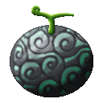
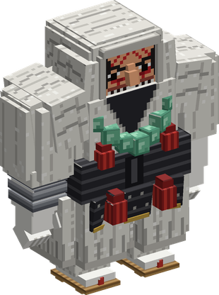

# Hito Hito no Mi, Model: Onyudo

{ .mod-icon }

| | |
|---|---|
| **Type** | Mythical Zoan |
| **Box** | { .box-icon } Golden |
| **Chance per opening** | golden **3.06%**, iron **0.153%**, wooden **0.008%** ([how it works](index.md#box-odds)) |
| **Abilities** | 8: 8 active, 0 passive |
| **Transformations** | [Onyudo Heavy Point](#onyudo-heavy-point), [Onyudo Guard Point](#onyudo-guard-point) |

In 3D: drag to turn, scroll or pinch to zoom.

Found in the base mod's **golden Devil Fruit box**. Eat it and its abilities appear in the ability menu, grouped under the fruit.

!!! note "About the values"
    The values are those of the ability's tooltip in game, with the base mod's default settings. Damage is shown on the base mod's scale, as in the ability screen.

## Onyudo Heavy Point { #onyudo-heavy-point }

{ .ability-icon } *Active · Transformation*

{ .form-picture }

Transforms the user into an onyudo hybrid, a tall and strong warrior monk with a long reach.

## Onyudo Guard Point { #onyudo-guard-point }

{ .ability-icon } *Active · Transformation*

{ .form-picture }

Transforms the user into an onyudo, a giant warrior monk as tall as 8 blocks, very strong, fast for its size and with a very long reach.

## Great Sweep { #great-sweep }

{ .ability-icon } *Active*

The user sweeps what they are holding in a wide arc in front of them, hitting all the enemies there and sending them away. A better weapon deals more damage

| Stat | Value |
|---|---|
| Damage type | Physical |
| Haki | Hardening |
| Cooldown | 10 s |
| Damage | 11–26 |
| Range | 4–7.5 blocks (area) |

## Long Thrust { #long-thrust }

{ .ability-icon } *Active*

The user thrusts what they are holding straight ahead with both hands, hitting all the enemies in a long line and pushing them back. A better weapon deals more damage

| Stat | Value |
|---|---|
| Damage type | Physical |
| Haki | Hardening |
| Cooldown | 11 s |
| Damage | 14–30 |
| Range | 5.5–10 blocks (line) |

## Monk's Guard { #monks-guard }

{ .ability-icon } *Active*

The user takes a guard stance that greatly reduces the damage coming from in front of them. While it holds the user is slowed and can't attack. Use the ability again to end it

| Stat | Value |
|---|---|
| Cooldown | 15 s |
| Hold | 5 s |
| Frontal Damage Blocked | 70 % |

## Giant's Stomp { #giants-stomp }

{ .ability-icon } *Active*

The user stomps the ground, all nearby enemies standing on it are damaged and knocked down for a moment

| Stat | Value |
|---|---|
| Damage type | Physical |
| Haki | Hardening |
| Cooldown | 14 s |
| Damage | 12–18 |
| Range | 3.5–7 blocks (area) |

## Dread Gaze { #dread-gaze }

{ .ability-icon } *Active*

The user stares down the nearby enemies that are looking at them, weakening and slowing them. Enemies that look away are not affected

| Stat | Value |
|---|---|
| Cooldown | 18 s |
| Range | 14 blocks (area) |
| Dread Lasts | 6 s |

## Earth Splitter { #earth-splitter }

{ .ability-icon } *Active*

While in the giant onyudo form, the user raises what they are holding above their head and brings it down, splitting the ground in a long line in front of them. Enemies on the line take heavy damage and are knocked down. A better weapon deals more damage

| Stat | Value |
|---|---|
| Damage type | Physical |
| Haki | Hardening |
| Cooldown | 40 s |
| Damage | 26–40 |
| Range | 16 blocks (line) |
