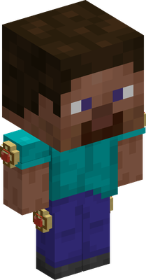
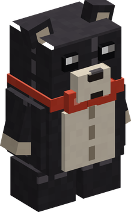
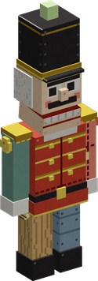

# Hobi Hobi no Mi

{ .mod-icon }

| | |
|---|---|
| **Type** | Paramecia |
| **Theme** | Toys |
| **Box** | { .box-icon } Iron |
| **Chance per opening** | iron **2.45%**, wooden **0.122%** ([how it works](index.md#box-odds)) |
| **Abilities** | 7: 6 active, 1 passive |
| **Effects applied** | { .effect-mini }[Toy](../effects.md#effect-toy) |

In 3D: drag to turn, scroll or pinch to zoom.

Found in the base mod's **iron Devil Fruit box**. Eat it and its abilities appear in the ability menu, grouped under the fruit.

!!! note "About the values"
    The values are those of the ability's tooltip in game, with the base mod's default settings. Damage is shown on the base mod's scale, as in the ability screen.

## Omocha { #omocha }

{ .ability-icon } *Active · Punch*

{ .form-picture }

Applies { .effect-mini }[Toy](../effects.md#effect-toy)

The next punch of the user turns the target into a toy, for as long as the curse lasts. A new toy does nothing until Keiyaku is used on it.

## Keiyaku { #keiyaku }

{ .ability-icon } *Active*

Makes a contract with a toy made by the user, a creature will follow and fight for the user and a player can't attack the user anymore

| Stat | Value |
|---|---|
| Cooldown | 1 s |
| Range | 10 blocks (line) |

## Little Black Bears { #little-black-bears }

{ .ability-icon } *Active*

{ .form-picture }

The user dashes around touching all nearby creatures, turning them into small black teddy bears.

| Stat | Value |
|---|---|
| Cooldown | 45 s |
| Range | 6 blocks (area) |

## Atamawari Ningyo { #atamawari-ningyo }

{ .ability-icon } *Active*

{ .form-picture }

Combines 8 of the user's contracted toys into a giant nutcracker that fights for the user for a while, after which it splits back into the toys

| Stat | Value |
|---|---|
| Cooldown | 120 s |
| Hold | 60 s |
| Range | 16 blocks (area) |

## Noroi { #noroi }

{ .ability-icon } *Passive*

The fruit keeps the user as a child, smaller and weaker. All the toys are turned back if the user dies, is knocked out, loses their powers or leaves.

## Zettai Meirei { #zettai-meirei }

{ .ability-icon } *Active*

Gives an absolute order to all the contracted toys near the user, for 10 seconds they hit harder, move faster and are more resistant

| Stat | Value |
|---|---|
| Cooldown | 30 s |
| Hold | 10 s |
| Range | 24 blocks (area) |
| Toys' Damage | x1.5 |

## Kaijo { #kaijo }

{ .ability-icon } *Active*

The user turns the toy they are looking at back to what it was, the other toys stay toys

| Stat | Value |
|---|---|
| Cooldown | 5 s |
| Range | 10 blocks (line) |
