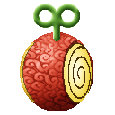

# Hobi Hobi no Mi

{ .mod-icon }

| | |
|---|---|
| **Type** | Paramecia |
| **Theme** | Toys |
| **Box** | { .box-icon } Iron |
| **Chance per opening** | iron **2.45%**, wooden **0.122%** ([how it works](index.md#box-odds)) |
| **Abilities** | 5: 4 active, 1 passive |
| **Effects applied** | { .effect-mini }[Toy](../effects.md#effect-toy) |

Found in the base mod's **iron Devil Fruit box**. Eat it and its abilities appear in the ability menu, grouped under the fruit.

!!! note "About the values"
    The values are those of the ability's tooltip in game, with the base mod's default settings. Damage is shown on the base mod's scale, as in the ability screen.

## Omocha { #omocha }

{ .ability-icon } *Active · Punch*

Applies { .effect-mini }[Toy](../effects.md#effect-toy)

The user's next bare-handed touch turns its target into a toy, for as long as her curse holds. A new toy is harmless until bound with Keiyaku.

## Keiyaku { #keiyaku }

{ .ability-icon } *Active*

Binds a toy the user made with a contract: a creature follows her and fights for her, a player can no longer attack her.

| Stat | Value |
|---|---|
| Cooldown | 1 s |
| Range | 10 blocks (line) |

## Little Black Bears { #little-black-bears }

{ .ability-icon } *Active*

The user darts round, touching every creature near her: they all turn into little black teddy bears.

| Stat | Value |
|---|---|
| Cooldown | 45 s |
| Range | 6 blocks (area) |

## Atamawari Ningyo { #atamawari-ningyo }

{ .ability-icon } *Active*

Builds eight of the user's bound toys into a giant nutcracker that fights for her a while, then comes apart into the same toys.

| Stat | Value |
|---|---|
| Cooldown | 120 s |
| Hold | 60 s |
| Range | 16 blocks (area) |

## Noroi { #noroi }

{ .ability-icon } *Passive*

The fruit keeps its user a child: smaller and weaker. Every toy she made turns back at once if she dies, is knocked out, loses her fruit's power (water, seastone...), loses the fruit or leaves.
