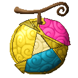
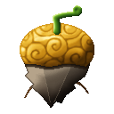
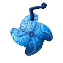
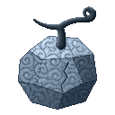
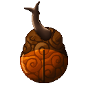

# Fruits

Missing Missing no Mi adds **21 Devil Fruits**. Pick one to see its abilities.

## Paramecia

| Fruit | Theme | Box | Abilities |
|---|---|---|---|
| { .fruit-icon } [**Ami Ami no Mi**](ami-ami-no-mi.md) | net | { .box-icon } Wooden | [Mucho Neto Net](ami-ami-no-mi.md#mucho-neto-net), [Neto Net Hoso Mo](ami-ami-no-mi.md#neto-net-hoso-mo), [Mucho Cho Shi Mo](ami-ami-no-mi.md#mucho-cho-shi-mo), [Mucho Tetsujo Mo](ami-ami-no-mi.md#mucho-tetsujo-mo), [Mucho Kaji Mo](ami-ami-no-mi.md#mucho-kaji-mo), [Millionet](ami-ami-no-mi.md#millionet), [No Shock Taimo](ami-ami-no-mi.md#no-shock-taimo) |
| { .fruit-icon } [**Ato Ato no Mi**](ato-ato-no-mi.md) | art | { .box-icon } Wooden | [Broken-Fu Art](ato-ato-no-mi.md#broken-fu-art), [Dying Art](ato-ato-no-mi.md#dying-art), [Fukugen](ato-ato-no-mi.md#fukugen), [Heaven's Do Art](ato-ato-no-mi.md#heavens-do-art), [Panorama Art](ato-ato-no-mi.md#panorama-art), [Still Life Art](ato-ato-no-mi.md#still-life-art), [Mosaic Art](ato-ato-no-mi.md#mosaic-art), [Readymade Art](ato-ato-no-mi.md#readymade-art) |
| { .fruit-icon } [**Buki Buki no Mi**](buki-buki-no-mi.md) | weapons | { .box-icon } Iron | [Espada Girl](buki-buki-no-mi.md#espada-girl), [Revolver Girl](buki-buki-no-mi.md#revolver-girl), [Revolver Leg](buki-buki-no-mi.md#revolver-leg), [Gatling Girl](buki-buki-no-mi.md#gatling-girl), [Sickle Girl](buki-buki-no-mi.md#sickle-girl), [Fire Girl](buki-buki-no-mi.md#fire-girl), [Missile Girl](buki-buki-no-mi.md#missile-girl), [Flying Disk Girl](buki-buki-no-mi.md#flying-disk-girl) |
| { .fruit-icon } [**Choki Choki no Mi**](choki-choki-no-mi.md) | scissors | { .box-icon } Wooden | [Hasami](choki-choki-no-mi.md#hasami), [O Kanabashi](choki-choki-no-mi.md#o-kanabashi), [Keep Out](choki-choki-no-mi.md#keep-out), [Kirikabe](choki-choki-no-mi.md#kirikabe), [Kamikiri](choki-choki-no-mi.md#kamikiri), [Dai Setsudan](choki-choki-no-mi.md#dai-setsudan), [Kirisaki](choki-choki-no-mi.md#kirisaki), [Kami Hashi](choki-choki-no-mi.md#kami-hashi) |
| { .fruit-icon } [**Fuwa Fuwa no Mi**](fuwa-fuwa-no-mi.md) | float | { .box-icon } Golden | [Fuyu](fuwa-fuwa-no-mi.md#fuyu), [Item Kaiten](fuwa-fuwa-no-mi.md#item-kaiten), [Item Hassha](fuwa-fuwa-no-mi.md#item-hassha), [Shishi Odoshi](fuwa-fuwa-no-mi.md#shishi-odoshi), [Shishi Odoshi: Chimaki](fuwa-fuwa-no-mi.md#chimaki), [Zanpa](fuwa-fuwa-no-mi.md#zanpa), [Shishi Funjin](fuwa-fuwa-no-mi.md#shishi-funjin), [Ryuki](fuwa-fuwa-no-mi.md#ryuki), [Tatsumaki](fuwa-fuwa-no-mi.md#tatsumaki), [Fusen](fuwa-fuwa-no-mi.md#fusen) |
| { .fruit-icon } [**Gasha Gasha no Mi**](gasha-gasha-no-mi.md) | assembly | { .box-icon } Golden | [Desmontar](gasha-gasha-no-mi.md#desmontar), [Taller](gasha-gasha-no-mi.md#taller), [Muralla](gasha-gasha-no-mi.md#muralla), [Cañón Armado](gasha-gasha-no-mi.md#canon-armado), [Torreta](gasha-gasha-no-mi.md#torreta), [Soldado](gasha-gasha-no-mi.md#soldado), [Unión Armado](gasha-gasha-no-mi.md#union-armado), [Ultimate Faust](gasha-gasha-no-mi.md#ultimate-faust), [Blindado](gasha-gasha-no-mi.md#blindado), [Det Sterkeste Strike](gasha-gasha-no-mi.md#det-sterkeste-strike) |
| { .fruit-icon } [**Giro Giro no Mi**](giro-giro-no-mi.md) | glare | { .box-icon } Wooden | [Giro Giro Vision](giro-giro-no-mi.md#giro-vision), [Peeping Mind](giro-giro-no-mi.md#peeping-mind), [Senrigan](giro-giro-no-mi.md#senrigan), [Hierro Lagrima: Mekujira](giro-giro-no-mi.md#mekujira), [Insight](giro-giro-no-mi.md#giro-insight) |
| { .fruit-icon } [**Guru Guru no Mi**](guru-guru-no-mi.md) | spin | { .box-icon } Wooden | [Puropera](guru-guru-no-mi.md#puropera), [Toppu: Matasaburo](guru-guru-no-mi.md#toppu-matasaburo), [Guru Guru Toshaho](guru-guru-no-mi.md#guru-guru-toshaho), [Suketo](guru-guru-no-mi.md#suketo), [Senpu](guru-guru-no-mi.md#senpu), [Hiko](guru-guru-no-mi.md#hiko), [Kaiten Ningen](guru-guru-no-mi.md#kaiten-ningen) |
| { .fruit-icon } [**Hira Hira no Mi**](hira-hira-no-mi.md) | ripple | { .box-icon } Iron | [Vipera Glaive](hira-hira-no-mi.md#vipera-glaive), [Corrida Glaive](hira-hira-no-mi.md#corrida-glaive), [Army Bandera](hira-hira-no-mi.md#army-bandera), [Death Enjambre](hira-hira-no-mi.md#death-enjambre), [Steel Cape](hira-hira-no-mi.md#steel-cape), [Lock](hira-hira-no-mi.md#lock), [Flag Body](hira-hira-no-mi.md#flag-body) |
| { .fruit-icon } [**Hobi Hobi no Mi**](hobi-hobi-no-mi.md) | toys | { .box-icon } Iron | [Omocha](hobi-hobi-no-mi.md#omocha), [Keiyaku](hobi-hobi-no-mi.md#keiyaku), [Little Black Bears](hobi-hobi-no-mi.md#little-black-bears), [Atamawari Ningyo](hobi-hobi-no-mi.md#atamawari-ningyo), [Noroi](hobi-hobi-no-mi.md#noroi), [Zettai Meirei](hobi-hobi-no-mi.md#zettai-meirei), [Kaijo](hobi-hobi-no-mi.md#kaijo) |
| { .fruit-icon } [**Ishi Ishi no Mi**](ishi-ishi-no-mi.md) | stone | { .box-icon } Golden | [Stone Mass](ishi-ishi-no-mi.md#ishi-stone), [Stone Assimilation](ishi-ishi-no-mi.md#ishi-travel), [Pulpostone](ishi-ishi-no-mi.md#pulpostone), [Charlestone](ishi-ishi-no-mi.md#charlestone), [Ishiusu](ishi-ishi-no-mi.md#ishiusu), [Bitestone](ishi-ishi-no-mi.md#bitestone), [Ishi Kobushi](ishi-ishi-no-mi.md#ishi-kobushi), [Stone Giant](ishi-ishi-no-mi.md#ishi-giant) |
| { .fruit-icon } [**Kama Kama no Mi**](kama-kama-no-mi.md) | sickle | { .box-icon } Wooden | [Kama Tsume](kama-kama-no-mi.md#kama-tsume), [Kama Kama no Kamaitachi](kama-kama-no-mi.md#kama-kama-no-kamaitachi), [Kama Kama no Tsumujikaze](kama-kama-no-mi.md#kama-kama-no-tsumujikaze), [Kama Kama no Kamaitachi Midareuchi](kama-kama-no-mi.md#kama-kama-no-kamaitachi-midareuchi), [Kama Kama no Renzan](kama-kama-no-mi.md#kama-kama-no-renzan), [Kama Kama no Tsuji Giri](kama-kama-no-mi.md#kama-kama-no-tsuji-giri), [Kama Kama no Kiri Harai](kama-kama-no-mi.md#kama-kama-no-kiri-harai), [Kama Kama no Enbu](kama-kama-no-mi.md#kama-kama-no-enbu) |
| { .fruit-icon } [**Nui Nui no Mi**](nui-nui-no-mi.md) | stitch | { .box-icon } Wooden | [Nuitsuke](nui-nui-no-mi.md#nuitsuke), [Nuiawase](nui-nui-no-mi.md#nuiawase), [Haute Couture: Patchwork](nui-nui-no-mi.md#haute-couture-patchwork), [Tsukuroi](nui-nui-no-mi.md#tsukuroi), [Hodoki](nui-nui-no-mi.md#hodoki), [Ude Nui](nui-nui-no-mi.md#ude-nui), [Nui Tobi](nui-nui-no-mi.md#nui-tobi) |
| { .fruit-icon } [**Pamu Pamu no Mi**](pamu-pamu-no-mi.md) | burst | { .box-icon } Iron | [Met Punc](pamu-pamu-no-mi.md#met-punc), [Bracchium](pamu-pamu-no-mi.md#bracchium), [Jirai Punc](pamu-pamu-no-mi.md#jirai-punc), [Punc Bala](pamu-pamu-no-mi.md#punc-bala), [Catapult Punc](pamu-pamu-no-mi.md#catapult-punc), [Punc Rock Fest](pamu-pamu-no-mi.md#punc-rock-fest), [Punc Hair](pamu-pamu-no-mi.md#punc-hair), [Fashion Punc](pamu-pamu-no-mi.md#fashion-punc), [Punc Rock Super Arena](pamu-pamu-no-mi.md#punc-rock-super-arena) |
| { .fruit-icon } [**Ton Ton no Mi**](ton-ton-no-mi.md) | weight | { .box-icon } Iron | [Float](ton-ton-no-mi.md#float), [Vise](ton-ton-no-mi.md#vise), [Heavy Body](ton-ton-no-mi.md#heavy-body), [Senton Knuckle](ton-ton-no-mi.md#senton-knuckle), [Hyakuton Stomp](ton-ton-no-mi.md#hyakuton-stomp), [Manton Tackle](ton-ton-no-mi.md#manton-tackle), [Senton Press](ton-ton-no-mi.md#senton-press) |

## Logia

| Fruit | Theme | Box | Abilities |
|---|---|---|---|
| { .fruit-icon } [**Mori Mori no Mi**](mori-mori-no-mi.md) | forest | { .box-icon } Golden | [Logia Invulnerability Mori](mori-mori-no-mi.md#logia-invulnerability-mori), [Kogosei](mori-mori-no-mi.md#kogosei), [Ryokuka](mori-mori-no-mi.md#ryokuka), [Jukon](mori-mori-no-mi.md#jukon), [Edayari](mori-mori-no-mi.md#edayari), [Kinniku Mori Mori](mori-mori-no-mi.md#kinniku-mori-mori), [Wakagi](mori-mori-no-mi.md#wakagi), [Bokarin](mori-mori-no-mi.md#bokarin), [Hanaguruma](mori-mori-no-mi.md#hanaguruma), [Hisho](mori-mori-no-mi.md#hisho) |
| { .fruit-icon } [**Numa Numa no Mi**](numa-numa-no-mi.md) | swamp | { .box-icon } Golden | [Logia Invulnerability Numa](numa-numa-no-mi.md#logia-invulnerability-numa), [Numa Numa no Gatling Gun](numa-numa-no-mi.md#numa-numa-no-gatling-gun), [Numachi](numa-numa-no-mi.md#numachi), [Numa Kyu](numa-numa-no-mi.md#numa-kyu), [Hikizuri Komi](numa-numa-no-mi.md#hikizuri-komi), [Numa Sensui](numa-numa-no-mi.md#numa-sensui), [Numa Kura](numa-numa-no-mi.md#numa-kura), [Doro Nami](numa-numa-no-mi.md#doro-nami), [Numa no Te](numa-numa-no-mi.md#numa-no-te), [Haki Dashi](numa-numa-no-mi.md#haki-dashi), [Sokonashi Numa](numa-numa-no-mi.md#sokonashi-numa) |

## Zoan

| Fruit | Box | Abilities |
|---|---|---|
| { .fruit-icon } [**Inu Inu no Mi, Model: Wolf**](inu-inu-no-mi-model-wolf.md) | { .box-icon } Iron | [Wolf Walk Point](inu-inu-no-mi-model-wolf.md#wolf-walk-point), [Wolf Heavy Point](inu-inu-no-mi-model-wolf.md#wolf-heavy-point), [Kamitsuki](inu-inu-no-mi-model-wolf.md#kamitsuki), [Shippu](inu-inu-no-mi-model-wolf.md#shippu), [Toboe](inu-inu-no-mi-model-wolf.md#toboe), [Kyukaku](inu-inu-no-mi-model-wolf.md#kyukaku), [Yako](inu-inu-no-mi-model-wolf.md#yako), [Jusshigan](inu-inu-no-mi-model-wolf.md#jusshigan), [Gekko Jusshigan](inu-inu-no-mi-model-wolf.md#gekko-jusshigan), [Rankyaku: Koro](inu-inu-no-mi-model-wolf.md#rankyaku-koro), [Tekkai Kenpo: Roga no Kamae](inu-inu-no-mi-model-wolf.md#tekkai-kenpo-roga-no-kamae) |
| { .fruit-icon } [**Mushi Mushi no Mi, Model: Kabutomushi**](mushi-mushi-no-mi-model-kabutomushi.md) | { .box-icon } Iron | [Kabutomushi Heavy Point](mushi-mushi-no-mi-model-kabutomushi.md#kabutomushi-heavy-point), [Kabutomushi Walk Point](mushi-mushi-no-mi-model-kabutomushi.md#kabutomushi-walk-point), [Kabutomushi Flight](mushi-mushi-no-mi-model-kabutomushi.md#kabutomushi-flight), [Kabutomushi Rideable](mushi-mushi-no-mi-model-kabutomushi.md#kabutomushi-rideable), [Beetle Upper](mushi-mushi-no-mi-model-kabutomushi.md#beetle-upper), [Horn Toss](mushi-mushi-no-mi-model-kabutomushi.md#horn-toss), [Horn Dive](mushi-mushi-no-mi-model-kabutomushi.md#horn-dive), [Four Arm Rush](mushi-mushi-no-mi-model-kabutomushi.md#four-arm-rush), [Shell Guard](mushi-mushi-no-mi-model-kabutomushi.md#shell-guard), [Beetle Ram](mushi-mushi-no-mi-model-kabutomushi.md#beetle-ram) |
| { .fruit-icon } [**Mushi Mushi no Mi, Model: Suzumebachi**](mushi-mushi-no-mi-model-suzumebachi.md) | { .box-icon } Iron | [Suzumebachi Heavy Point](mushi-mushi-no-mi-model-suzumebachi.md#suzumebachi-heavy-point), [Suzumebachi Walk Point](mushi-mushi-no-mi-model-suzumebachi.md#suzumebachi-walk-point), [Suzumebachi Flight](mushi-mushi-no-mi-model-suzumebachi.md#suzumebachi-flight), [Stinger](mushi-mushi-no-mi-model-suzumebachi.md#stinger), [Pink Hornets](mushi-mushi-no-mi-model-suzumebachi.md#pink-hornets), [Needle Dash](mushi-mushi-no-mi-model-suzumebachi.md#needle-dash), [Venom Spray](mushi-mushi-no-mi-model-suzumebachi.md#venom-spray), [Numbing Sting](mushi-mushi-no-mi-model-suzumebachi.md#numbing-sting), [Mandible Bite](mushi-mushi-no-mi-model-suzumebachi.md#mandible-bite) |
| { .fruit-icon } [**Tori Tori no Mi, Model: Falcon**](tori-tori-no-mi-model-falcon.md) | { .box-icon } Iron | [Falcon Assault Point](tori-tori-no-mi-model-falcon.md#falcon-assault-point), [Falcon Fly Point](tori-tori-no-mi-model-falcon.md#falcon-fly-point), [Falcon Flight](tori-tori-no-mi-model-falcon.md#falcon-flight), [Falcon Rideable](tori-tori-no-mi-model-falcon.md#falcon-rideable), [Tobizume](tori-tori-no-mi-model-falcon.md#tobizume), [Tsukami Otoshi](tori-tori-no-mi-model-falcon.md#tsukami-otoshi), [Hane Arashi](tori-tori-no-mi-model-falcon.md#hane-arashi), [Kyukoka](tori-tori-no-mi-model-falcon.md#kyukoka), [Kagizume](tori-tori-no-mi-model-falcon.md#kagizume), [Hayabusa no Me](tori-tori-no-mi-model-falcon.md#hayabusa-no-me), [Hane Tsubute](tori-tori-no-mi-model-falcon.md#hane-tsubute) |

## Box odds

A Devil Fruit box gives **one fruit at most**. When it opens:

- **5%** of the time, it also rolls the **next box up** (wooden → iron → golden), and a fruit from there comes first;
- **95%** of the time, it rolls **five fruits** from its own list, where **every fruit is equally likely**;
- it keeps the **first fruit still available**: with one fruit per world, a fruit someone already has is skipped.

With every fruit still available, no Luck and only Mine Mine no Mi and Missing Missing no Mi installed:

| Box | Fruits in the box | Each of its own fruits | A fruit from a higher box | No fruit |
|---|---|---|---|---|
| { .box-icon } Wooden | 31 (7 from this addon) | **2.92%** | iron 4.52%, golden 0.238% | 4.76% |
| { .box-icon } Iron | 37 (9 from this addon) | **2.45%** | golden 4.75% | 4.76% |
| { .box-icon } Golden | 24 (5 from this addon) | **3.96%** | — | 5.00% |

### What changes the odds

- **Luck**: each point of the Luck attribute adds 5% to the chance of rolling the next box up, and takes 5% off the chance of rolling fruits. The base mod's **New World**, once active, counts as one more point.
- **Fruits already found**: with one fruit per world, a fruit someone already has is skipped and the box looks further down its five rolls, so the remaining fruits come up more often.
- **Other addons** that add fruits to the boxes share the same odds: each new fruit makes every other one of its box a little rarer.

<small>Figures computed from Mine Mine no Mi 0.11.5's box logic and the boxes as the game loads them with Missing Missing no Mi, then checked against 200,000 simulated openings of each box.</small>

---

<small>The box icons are the Devil Fruit box textures of [Mine Mine no Mi](https://www.curseforge.com/minecraft/mc-mods/mine-mine-no-mi-mod), by Wynd and its other authors, shown to identify the boxes. The fruit sprites are Missing Missing no Mi's own.</small>
