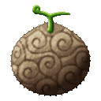
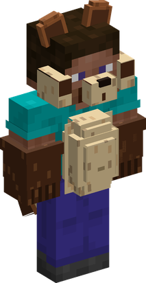
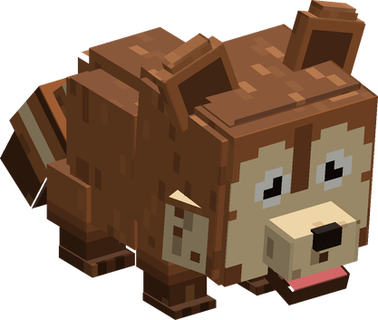

# Inu Inu no Mi, Model: Tanuki

{ .mod-icon }

| | |
|---|---|
| **Type** | Zoan |
| **Box** | { .box-icon } Wooden |
| **Chance per opening** | wooden **2.21%** ([how it works](index.md#box-odds)) |
| **Abilities** | 9: 9 active, 0 passive |
| **Transformations** | [Tanuki Heavy Point](#tanuki-heavy-point), [Tanuki Walk Point](#tanuki-walk-point) |

In 3D: drag to turn, scroll or pinch to zoom.

Found in the base mod's **wooden Devil Fruit box**. Eat it and its abilities appear in the ability menu, grouped under the fruit.

!!! note "About the values"
    The values are those of the ability's tooltip in game, with the base mod's default settings. Damage is shown on the base mod's scale, as in the ability screen.

## Tanuki Heavy Point { #tanuki-heavy-point }

{ .ability-icon } *Active · Transformation*

{ .form-picture }

Transforms the user into a tanuki hybrid, a round and sturdy brawler with a big belly.

## Tanuki Walk Point { #tanuki-walk-point }

{ .ability-icon } *Active · Transformation*

{ .form-picture }

Transforms the user into a tanuki, a small and quick animal that fits through a one block gap.

## Tanuki Bite { #tanuki-bite }

{ .ability-icon } *Active*

The user quickly bites the enemy in front of them

| Stat | Value |
|---|---|
| Damage type | Physical |
| Haki | Hardening |
| Cooldown | 5 s |
| Damage | 6–7 |
| Range | 1.8 blocks (line) |

## Tail Swipe { #tail-swipe }

{ .ability-icon } *Active*

The user spins and sweeps their tail around them, hitting all nearby enemies and pushing them away

| Stat | Value |
|---|---|
| Damage type | Physical |
| Haki | Hardening |
| Cooldown | 8 s |
| Damage | 6–8 |
| Range | 2–2.6 blocks (area) |

## Belly Drum { #belly-drum }

{ .ability-icon } *Active*

While in the hybrid form, the user drums on their belly, each beat hitting all the enemies around them. The last beat pushes them back

| Stat | Value |
|---|---|
| Damage type | Physical |
| Haki | Hardening |
| Cooldown | 12 s |
| Damage | 2.5–10 |
| Range | 4 blocks (area) |

## Belly Bash { #belly-bash }

{ .ability-icon } *Active*

While in the hybrid form, the user throws themselves forward belly first, hitting the first enemy in their way and sending it far back

| Stat | Value |
|---|---|
| Damage type | Physical |
| Haki | Hardening |
| Cooldown | 10 s |
| Damage | 12 |

## Scurry { #scurry }

{ .ability-icon } *Active*

While in the full tanuki form, the user dashes forward low to the ground, running between the enemies in their way, hitting and slowing them

| Stat | Value |
|---|---|
| Damage type | Physical |
| Haki | Hardening |
| Cooldown | 7 s |
| Damage | 4 |

## Play Dead { #play-dead }

{ .ability-icon } *Active*

While in the full tanuki form, the user drops on their side and plays dead. Creatures lose interest in them, but they cannot move or attack

| Stat | Value |
|---|---|
| Cooldown | 15 s |
| Hold | 10 s |

## Burrow { #burrow }

{ .ability-icon } *Active*

While in the full tanuki form and on the ground, the user digs in where they stand. For a moment nothing can hit them, but they cannot move or use other abilities

| Stat | Value |
|---|---|
| Cooldown | 16 s |
| Hold | 3 s |
