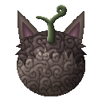
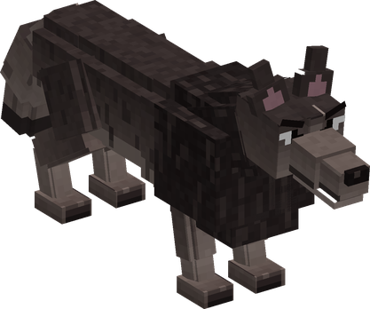
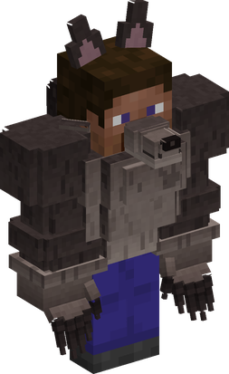
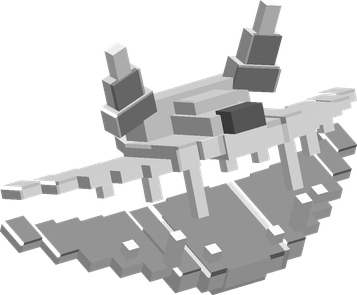

# Inu Inu no Mi, Model: Wolf

{ .mod-icon }

| | |
|---|---|
| **Type** | Zoan |
| **Box** | { .box-icon } Iron |
| **Chance per opening** | iron **2.45%**, wooden **0.122%** ([how it works](index.md#box-odds)) |
| **Abilities** | 11: 10 active, 1 passive |
| **Transformations** | [Wolf Walk Point](#wolf-walk-point), [Wolf Heavy Point](#wolf-heavy-point) |

In 3D: drag to turn, scroll or pinch to zoom.

Found in the base mod's **iron Devil Fruit box**. Eat it and its abilities appear in the ability menu, grouped under the fruit.

!!! note "About the values"
    The values are those of the ability's tooltip in game, with the base mod's default settings. Damage is shown on the base mod's scale, as in the ability screen.

## Wolf Walk Point { #wolf-walk-point }

{ .ability-icon } *Active · Transformation*

{ .form-picture }

Transforms the user into a wolf, which focuses on speed and long jumps.

## Wolf Heavy Point { #wolf-heavy-point }

{ .ability-icon } *Active · Transformation*

{ .form-picture }

Transforms the user into a wolf-man hybrid with claws, which focuses on strength.

## Kamitsuki { #kamitsuki }

{ .ability-icon } *Active*

The user jumps at the target and bites it, making it bleed. Deals more damage in the wolf form

| Stat | Value |
|---|---|
| Damage type | Slash, Physical |
| Haki | Hardening |
| Cooldown | 6 s |
| Damage | 5 |

## Shippu { #shippu }

{ .ability-icon } *Active*

While in the wolf form, the user runs at full speed knocking down all enemies in their path.

| Stat | Value |
|---|---|
| Damage type | Blunt, Physical |
| Cooldown | 8 s |
| Damage | 5 |

## Toboe { #toboe }

{ .ability-icon } *Active*

The user howls, weakening and slowing all nearby enemies. During the night the user also gets strength and speed

| Stat | Value |
|---|---|
| Cooldown | 20 s |
| Range | 12 blocks (area) |

## Kyukaku { #kyukaku }

{ .ability-icon } *Active*

The user smells all nearby creatures, making them glow for 10 seconds even through walls.

| Stat | Value |
|---|---|
| Cooldown | 20 s |
| Range | 32 blocks (area) |

## Yako { #yako }

{ .ability-icon } *Passive*

While in a wolf form the user can see in the dark. During the night they are also faster, stronger and regenerates health

## Jusshigan { #jusshigan }

{ .ability-icon } *Active*

While in the hybrid form, the user stabs the enemy in front of them with all their 10 clawed fingers, one after another

| Stat | Value |
|---|---|
| Damage type | Slash, Physical |
| Haki | Hardening |
| Cooldown | 8 s |
| Damage | 9 |

## Gekko Jusshigan { #gekko-jusshigan }

{ .ability-icon } *Active*

While in the hybrid form, the user jumps at the target and stabs it with all 10 claws. Deals more damage during the night.

| Stat | Value |
|---|---|
| Damage type | Slash, Physical |
| Haki | Hardening |
| Cooldown | 15 s |
| Damage | 10 |

## Rankyaku: Koro { #rankyaku-koro }

{ .ability-icon } *Active*

{ .form-picture }

While in the hybrid form, the user kicks the air launching an air blade in the shape of a wolf

| Stat | Value |
|---|---|
| Damage type | Slash, Projectile |
| Element | Wind |
| Haki | Imbuing |
| Cooldown | 7 s |
| Damage | 7 |

## Tekkai Kenpo: Roga no Kamae { #tekkai-kenpo-roga-no-kamae }

{ .ability-icon } *Active*

While in the hybrid form, the user hardens their body like iron, taking less damage and no knockback but moving slower. The punches becomes Okami Hajiki, which sends the target flying.

| Stat | Value |
|---|---|
| Hold | 15 s |
