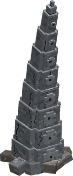
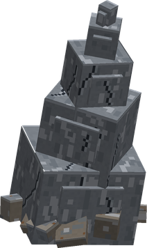
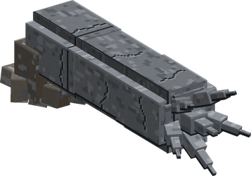
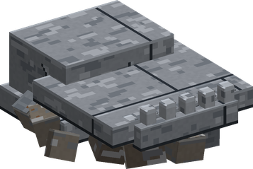
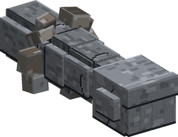
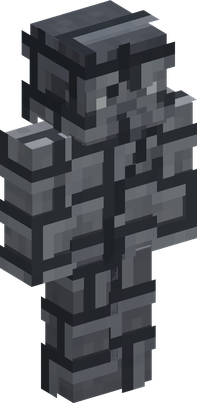

# Ishi Ishi no Mi

{ .mod-icon }

| | |
|---|---|
| **Type** | Paramecia |
| **Theme** | Stone |
| **Box** | { .box-icon } Golden |
| **Chance per opening** | golden **3.06%**, iron **0.153%**, wooden **0.008%** ([how it works](index.md#box-odds)) |
| **Abilities** | 8: 6 active, 2 passive |
| **Transformations** | [Stone Giant](#ishi-giant) |

In 3D: drag to turn, scroll or pinch to zoom.

Found in the base mod's **golden Devil Fruit box**. Eat it and its abilities appear in the ability menu, grouped under the fruit.

!!! note "About the values"
    The values are those of the ability's tooltip in game, with the base mod's default settings. Damage is shown on the base mod's scale, as in the ability screen.

## Stone Mass { #ishi-stone }

{ .ability-icon } *Passive*

Shows the stone the user can use, the stone blocks they carry are shown in green when there is enough stone around them to use the abilities for free

## Stone Assimilation { #ishi-travel }

{ .ability-icon } *Passive*

The user merges with stone, crouch on a stone block to enter it and then move freely through the stone.

## Pulpostone { #pulpostone }

{ .ability-icon } *Active*

{ .form-picture }

Creates stone tentacles around the location the user is looking at, that smashes down holding in place the enemies they hit

| Stat | Value |
|---|---|
| Damage type | Blunt |
| Haki | Special |
| Cooldown | 10 s |
| Damage | 12 |

## Charlestone { #charlestone }

{ .ability-icon } *Active*

{ .form-picture }

Creates multiple waves of stone spikes from the ground around the user, launching into the air all the enemies caught.

| Stat | Value |
|---|---|
| Damage type | Blunt |
| Haki | Special |
| Cooldown | 25 s |
| Damage | 14 |

## Ishiusu { #ishiusu }

{ .ability-icon } *Active*

{ .form-picture }

Creates two spiked stone pillars on each side of the enemy the user is looking at, which crushes it between them

| Stat | Value |
|---|---|
| Damage type | Blunt |
| Haki | Special |
| Cooldown | 15 s |
| Damage | 26 |

## Bitestone { #bitestone }

{ .ability-icon } *Active*

{ .form-picture }

Creates a giant stone head in front of the enemy the user is looking at, which bites it.

| Stat | Value |
|---|---|
| Damage type | Blunt |
| Haki | Special |
| Cooldown | 12 s |
| Damage | 15 |

## Ishi Kobushi { #ishi-kobushi }

{ .ability-icon } *Active*

{ .form-picture }

A stone fist comes out of the closest stone wall or floor near the enemy the user is looking at and punches it

| Stat | Value |
|---|---|
| Damage type | Blunt |
| Haki | Hardening |
| Cooldown | 3 s |
| Damage | 6 |

## Stone Giant { #ishi-giant }

{ .ability-icon } *Active · Transformation*

{ .form-picture }

The user creates a giant stone body around them, the hits breaks the stone instead of damaging the user and it regenerates while standing on stone. The giant breaks when there is no stone left. The size can be changed before using it, a bigger giant is slower and giants can't jump.

Stone Giant

Great Stone Giant

Huge Stone Giant

Stone Colossus

| Stat | Value |
|---|---|
| Size | x2.5 |
| Stone to Raise | 64 blocks |
| Stone Body | 128 blocks |
| Fist Damage | +20 |
| Movement Speed | -25 % |
| Other Abilities' Damage | x1.5 |
| Size | x5 |
| Stone to Raise | 128 blocks |
| Stone Body | 256 blocks |
| Fist Damage | +35 |
| Movement Speed | -50 % |
| Other Abilities' Damage | x2 |
| Size | x8 |
| Stone to Raise | 256 blocks |
| Stone Body | 512 blocks |
| Fist Damage | +50 |
| Movement Speed | -75 % |
| Other Abilities' Damage | x3 |
| Size | x12 |
| Stone to Raise | 512 blocks |
| Stone Body | 1,024 blocks |
| Fist Damage | +70 |
| Movement Speed | -100 % |
| Other Abilities' Damage | x4 |
