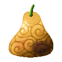

# Juku Juku no Mi

{ .mod-icon }

| | |
|---|---|
| **Type** | Paramecia |
| **Theme** | Ripening |
| **Box** | { .box-icon } Wooden |
| **Chance per opening** | wooden **2.21%** ([how it works](index.md#box-odds)) |
| **Abilities** | 6: 6 active, 0 passive |
| **Effects applied** | { .effect-mini }[Aged](../effects.md#effect-aged) |

Found in the base mod's **wooden Devil Fruit box**. Eat it and its abilities appear in the ability menu, grouped under the fruit.

!!! note "About the values"
    The values are those of the ability's tooltip in game, with the base mod's default settings. Damage is shown on the base mod's scale, as in the ability screen.

## Decaying Touch { #decaying-touch }

{ .ability-icon } *Active*

The block the user touches rots, and the rot spreads to the blocks around it. A rotten block crumbles for good, the harder it is the longer it takes.

| Stat | Value |
|---|---|
| Cooldown | 6 s |
| Range | 5 blocks (line) |

## Sinkhole { #sinkhole }

{ .ability-icon } *Active*

The ground the user looks at rots into a pit that goes on deepening for a while. Sneaking, or with no ground in sight, the pit opens under the user's own feet.

| Stat | Value |
|---|---|
| Cooldown | 15 s |
| Range | 8 blocks (line) |

## Kare-San-Sui { #kare-san-sui }

{ .ability-icon } *Active*

The ceiling above the enemy the user looks at rots through and falls on whoever is under it. The fallen blocks break where they land.

The harder the ceiling, the longer it takes to rot and the more it hurts

| Stat | Value |
|---|---|
| Cooldown | 20 s |
| Range | 16 blocks (line) |

## Aging Touch { #aging-touch }

{ .ability-icon } *Active*

Applies { .effect-mini }[Aged](../effects.md#effect-aged)

The enemy the user touches grows old, they are slower and weaker. A creature stays old until it dies, a player for a while.

A young animal grows up instead

| Stat | Value |
|---|---|
| Cooldown | 15 s |
| Range | 4.5 blocks (line) |
| Old Age on Players | 90 s |

## Rot Gear { #rot-gear }

{ .ability-icon } *Active*

The weapon and the armor of the enemy the user touches rot, each loses a third of its durability and breaks if it had less left.

| Stat | Value |
|---|---|
| Cooldown | 15 s |
| Range | 4.5 blocks (line) |

## Ripen { #ripen }

{ .ability-icon } *Active*

The crops, the saplings and the young animals around the user reach full growth at once.

| Stat | Value |
|---|---|
| Cooldown | 30 s |
| Range | 6 blocks (area) |
