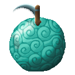
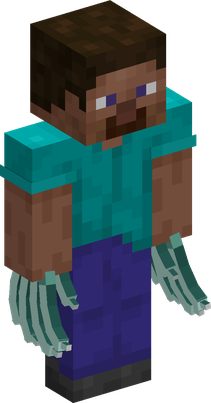

# Kama Kama no Mi

{ .mod-icon }

| | |
|---|---|
| **Type** | Paramecia |
| **Theme** | Sickle |
| **Box** | { .box-icon } Wooden |
| **Chance per opening** | wooden **2.92%** ([how it works](index.md#box-odds)) |
| **Abilities** | 4: 4 active, 0 passive |
| **Transformations** | [Kama Tsume](#kama-tsume) |

In 3D: drag to turn, scroll or pinch to zoom.

Found in the base mod's **wooden Devil Fruit box**. Eat it and its abilities appear in the ability menu, grouped under the fruit.

!!! note "About the values"
    The values are those of the ability's tooltip in game, with the base mod's default settings. Damage is shown on the base mod's scale, as in the ability screen.

## Kama Tsume { #kama-tsume }

{ .ability-icon } *Active · Transformation*

{ .form-picture }

The user draws out their nails into long sickles: bare-handed blows deal more damage while they are out.

| Stat | Value |
|---|---|
| Damage type | Slash, Fist, Physical |
| Element | Wind |

## Kama Kama no Kamaitachi { #kama-kama-no-kamaitachi }

{ .ability-icon } *Active*

A swipe of the nails throws a small, fast blade of air.

| Stat | Value |
|---|---|
| Damage type | Slash, Projectile |
| Element | Wind |
| Haki | Imbuing |
| Cooldown | 3 s |
| Projectile damage | 6 |

## Kama Kama no Tsumujikaze { #kama-kama-no-tsumujikaze }

{ .ability-icon } *Active*

Throws a heavy blade of air that stays on the first body it meets and cuts it three times.

While crouching, throws two blades crossed in an X, which cut harder.

| Stat | Value |
|---|---|
| Damage type | Slash, Projectile |
| Element | Wind |
| Haki | Imbuing |
| Cooldown | 10–15 s |
| Damage | 9–15 |

## Kama Kama no Kamaitachi Midareuchi { #kama-kama-no-kamaitachi-midareuchi }

{ .ability-icon } *Active*

Slashes the air again and again, throwing a fan of blades, then raises a whirlwind of razor air where the user aimed.

| Stat | Value |
|---|---|
| Damage type | Slash, Projectile |
| Element | Wind |
| Haki | Imbuing |
| Cooldown | 30 s |
| Range | 3 blocks (area) |
| Damage | 4 |
