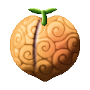
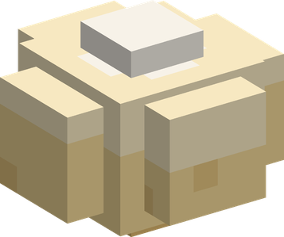

# Kibi Kibi no Mi

{ .mod-icon }

| | |
|---|---|
| **Type** | Paramecia |
| **Theme** | Millet dango |
| **Box** | { .box-icon } Wooden |
| **Chance per opening** | wooden **2.21%** ([how it works](index.md#box-odds)) |
| **Abilities** | 2: 2 active, 0 passive |
| **Effects applied** | { .effect-mini }[Devoted](../effects.md#effect-devoted) |

In 3D: drag to turn, scroll or pinch to zoom.

Found in the base mod's **wooden Devil Fruit box**. Eat it and its abilities appear in the ability menu, grouped under the fruit.

!!! note "About the values"
    The values are those of the ability's tooltip in game, with the base mod's default settings. Damage is shown on the base mod's scale, as in the ability screen.

## Kibi Dango { #kibi-dango }

{ .ability-icon } *Active*

{ .form-picture }

The user pulls a dango from their cheek. It costs hunger, more when several are made in a row.

An animal given a dango serves the user, it follows them, fights for them and obeys Command

A second dango makes a servant stronger and tougher for a minute, and heals it

Sneaking and clicking a servant twice with an empty hand sends it away

A player who ate a Zoan fruit and is given a dango can no longer harm the user

| Stat | Value |
|---|---|
| Cooldown | 2 s |

## Kibi Dan-boshi { #kibi-dan-boshi }

{ .ability-icon } *Active*

Applies { .effect-mini }[Devoted](../effects.md#effect-devoted)

The user throws a dango, the first animal it strikes eats it and serves them, a servant it strikes is strengthened. A dango that misses falls on the ground.

Each throw costs the hunger of a dango

| Stat | Value |
|---|---|
| Cooldown | 3 s |
