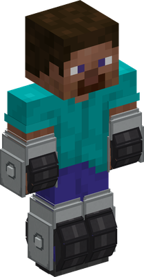

# Koro Koro no Mi

{ .mod-icon }

| | |
|---|---|
| **Type** | Paramecia |
| **Theme** | Wheels |
| **Box** | { .box-icon } Wooden |
| **Chance per opening** | wooden **2.21%** ([how it works](index.md#box-odds)) |
| **Abilities** | 6: 6 active, 0 passive |
| **Transformations** | [Wheels](#wheels) |
| **Effects applied** | { .effect-mini }[Rolling Low](../effects.md#effect-rolling-low) |

In 3D: drag to turn, scroll or pinch to zoom.

Found in the base mod's **wooden Devil Fruit box**. Eat it and its abilities appear in the ability menu, grouped under the fruit.

!!! note "About the values"
    The values are those of the ability's tooltip in game, with the base mod's default settings. Damage is shown on the base mod's scale, as in the ability screen.

## Wheels { #wheels }

{ .ability-icon } *Active · Transformation*

{ .form-picture }

Applies { .effect-mini }[Rolling Low](../effects.md#effect-rolling-low)

The user's hands and feet become wheels, they roll much faster than they walk and far faster on rails, without a minecart. Lit powered rails push them, unlit ones hold them back

The other abilities of the fruit can only be used on the wheels

| Stat | Value |
|---|---|
| Speed | +80 % |
| Speed on Rails | +200 % |
| Speed on Lit Powered Rails | +300 % |

## Ram { #ram }

{ .ability-icon } *Active*

On their wheels, the user charges where they are looking, the first enemy they hit is thrown back and takes more damage the faster the user was rolling

| Stat | Value |
|---|---|
| Damage type | Blunt, Physical |
| Haki | Hardening |
| Cooldown | 7 s |
| Damage | 8–16 |

## Skid { #skid }

{ .ability-icon } *Active*

On their wheels, the user skids into a sliding half-turn that mows down the enemies around them and throws them back

| Stat | Value |
|---|---|
| Damage type | Blunt, Physical |
| Haki | Hardening |
| Cooldown | 8 s |
| Damage | 9 |
| Range | 3.2 blocks (area) |

## Rail Jump { #rail-jump }

{ .ability-icon } *Active*

On their wheels, the user takes off at full speed and comes down on the enemy they are looking at

| Stat | Value |
|---|---|
| Damage type | Blunt, Physical |
| Haki | Hardening |
| Cooldown | 11 s |
| Damage | 12 |
| Range | 14 blocks (line) |

## Bakudan Ame { #bakudan-ame }

{ .ability-icon } *Active*

On their wheels, the user throws up to 3 explosives from their inventory where they are looking, gunpowder makes small bursts and TNT large ones. The bursts don't break blocks and don't hurt allies

| Stat | Value |
|---|---|
| Cooldown | 6 s |
| Damage | 10–20 |

## Spin { #spin }

{ .ability-icon } *Active*

On their wheels, the user makes the tool they hold spin with the wheel of their hand, they dig much faster for a while

| Stat | Value |
|---|---|
| Cooldown | 30 s |
| Hold | 15 s |
| Mining Speed | +60 % |
| Attack Speed | +30 % |
