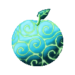
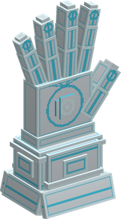
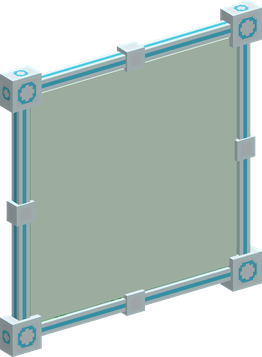
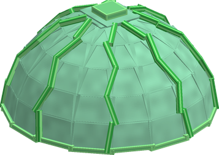

# Kote Kote no Mi

{ .mod-icon }

| | |
|---|---|
| **Type** | Paramecia |
| **Theme** | Gauntlet |
| **Box** | { .box-icon } Iron |
| **Chance per opening** | iron **1.71%**, wooden **0.085%** ([how it works](index.md#box-odds)) |
| **Abilities** | 9: 9 active, 0 passive |

In 3D: drag to turn, scroll or pinch to zoom.

Found in the base mod's **iron Devil Fruit box**. Eat it and its abilities appear in the ability menu, grouped under the fruit.

!!! note "About the values"
    The values are those of the ability's tooltip in game, with the base mod's default settings. Damage is shown on the base mod's scale, as in the ability screen.

## Gauntlet Punch { #gauntlet-punch }

{ .ability-icon } *Active*

{ .form-picture }

The user sends a giant gauntlet that punches where they are looking, damaging and pushing back the enemies it hits

| Stat | Value |
|---|---|
| Damage type | Fist, Indirect, Physical |
| Haki | Hardening |
| Cooldown | 6 s |
| Damage | 14 |
| Range | 16 blocks (line) |

## Gauntlet Grab { #gauntlet-grab }

{ .ability-icon } *Active*

The user sends a gauntlet that rips out the block they are looking at and holds it. Only plain blocks no harder than cobblestone can be taken

If used again, throws the block where the user is looking. The block stays where it lands

| Stat | Value |
|---|---|
| Damage type | Blunt, Projectile |
| Haki | Special |
| Cooldown | 8 s |
| Hold | 20 s |
| Damage | 12 |
| Range | 12 blocks (line) |

## Lightning Barrier { #lightning-barrier }

{ .ability-icon } *Active*

{ .form-picture }

The user raises a pane of solid lightning in front of them that sends back every projectile that reaches it

| Stat | Value |
|---|---|
| Cooldown | 14 s |
| Hold | 8 s |

## Tensei Hoshi { #tensei-hoshi }

{ .ability-icon } *Active*

The user sets panes of lightning around the enemy they are looking at, the user's own projectiles that miss it bounce off the panes and fly back at it

Use the ability again to remove the panes

| Stat | Value |
|---|---|
| Cooldown | 16 s |
| Hold | 8 s |
| Range | 20 blocks (line) |

## Grande { #grande }

{ .ability-icon } *Active*

{ .form-picture }

Two giant gauntlets raise a dome of lightning over the user, projectiles from outside are sent back, enemies inside are thrown out and shocked, and the user and their allies inside take less damage

Use the ability again to lower the dome

| Stat | Value |
|---|---|
| Element | Lightning |
| Haki | Special |
| Cooldown | 30 s |
| Hold | 8 s |
| Damage | 4 |
| Range | 5 blocks (area) |

## Gauntlet Vise { #gauntlet-vise }

{ .ability-icon } *Active*

Two gauntlets close on the enemy the user is looking at and crush it, then hold it in place for a moment

| Stat | Value |
|---|---|
| Damage type | Blunt, Indirect |
| Haki | Special |
| Cooldown | 16 s |
| Hold | 2 s |
| Damage | 18 |
| Range | 12 blocks (line) |

## Gauntlet Lift { #gauntlet-lift }

{ .ability-icon } *Active*

The user's gauntlets throw them high in the air where they are looking. The fall that follows doesn't hurt

| Stat | Value |
|---|---|
| Cooldown | 8 s |

## Solmente { #solmente }

{ .ability-icon } *Active*

Two gauntlets close on the small animal the user is looking at and make it the user's ally for a while, it follows them, defends them and obeys the Command ability

| Stat | Value |
|---|---|
| Cooldown | 40 s |
| Hold | 60 s |
| Range | 10 blocks (line) |

## A Jien Te { #a-jien-te }

{ .ability-icon } *Active*

Two gauntlets seize the boat or minecart the user is looking at and steer it where the user is looking

Use the ability again to let go

| Stat | Value |
|---|---|
| Cooldown | 20 s |
| Hold | 10 s |
| Range | 24 blocks (line) |
