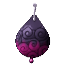
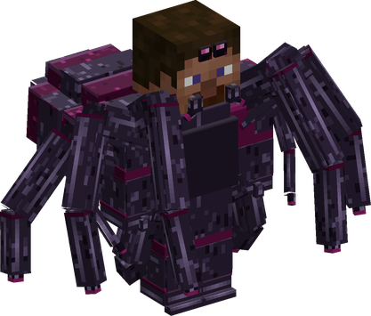
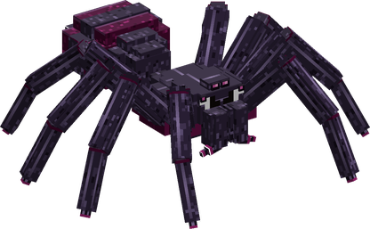

# Kumo Kumo no Mi, Model: Rosamygale Grauvogeli

{ .mod-icon }

| | |
|---|---|
| **Type** | Ancient Zoan |
| **Box** | { .box-icon } Iron |
| **Chance per opening** | iron **1.71%**, wooden **0.085%** ([how it works](index.md#box-odds)) |
| **Abilities** | 11: 10 active, 1 passive |
| **Transformations** | [Rosamygale Heavy Point](#rosamygale-heavy-point), [Rosamygale Walk Point](#rosamygale-walk-point) |

In 3D: drag to turn, scroll or pinch to zoom.

Found in the base mod's **iron Devil Fruit box**. Eat it and its abilities appear in the ability menu, grouped under the fruit.

!!! note "About the values"
    The values are those of the ability's tooltip in game, with the base mod's default settings. Damage is shown on the base mod's scale, as in the ability screen.

## Rosamygale Heavy Point { #rosamygale-heavy-point }

{ .ability-icon } *Active · Transformation*

{ .form-picture }

Transforms the user into a spider hybrid, which stands on 2 of its 8 legs and weaves sticky webs. Its punches poison.

## Rosamygale Walk Point { #rosamygale-walk-point }

{ .ability-icon } *Active · Transformation*

{ .form-picture }

Transforms the user into a giant spider, which is fast, low to the ground and has a poisonous bite.

## Wall Walker { #wall-walker }

{ .ability-icon } *Passive*

While in a spider form the user climbs the walls they walk against, and holds on to them while crouching

Requires Rosamygale Heavy Point or Rosamygale Walk Point to be active.

## Hard Gum { #hard-gum }

{ .ability-icon } *Active*

The user throws a mass of sticky web where they are looking, it holds everything that walks into it. The web disappears after a while, burns easily and shatters in the cold

| Stat | Value |
|---|---|
| Cooldown | 12 s |
| Range | 12 blocks (line) |

## Marianette { #marianette }

{ .ability-icon } *Active*

While in the spider hybrid form, the user shoots threads from their fingers at the enemy they are looking at, binding its limbs so it can't move. Use the ability again to let it go

| Stat | Value |
|---|---|
| Cooldown | 14 s |
| Hold | 4 s |
| Range | 14 blocks (line) |

## Oshizumaria { #oshizumaria }

{ .ability-icon } *Active*

While in the spider hybrid form, the user pulls apart the arms of the enemy bound by Marianette, it is weakened and takes more damage from everyone for a while

| Stat | Value |
|---|---|
| Cooldown | 15 s |
| Damage Taken After | x1.3 |

## Ikidomaria { #ikidomaria }

{ .ability-icon } *Active*

While in the spider hybrid form, the user weaves a wall of net in front of them that stops enemies and projectiles. The wall disappears after a while, burns easily and shatters in the cold

| Stat | Value |
|---|---|
| Cooldown | 15 s |

## Web Trap { #web-trap }

{ .ability-icon } *Active*

The user lays a hidden web on the ground where they stand, the first one to step on it is held in place and wrapped in sticky web. The trap disappears after a while

| Stat | Value |
|---|---|
| Cooldown | 8 s |

## Cocoon { #cocoon }

{ .ability-icon } *Active*

The user winds a nearby enemy that is already caught in a web, a trap or Marianette in a cocoon of silk, it can't move and is poisoned for a while

| Stat | Value |
|---|---|
| Cooldown | 16 s |
| Range | 6 blocks (area) |

## Venom Bite { #venom-bite }

{ .ability-icon } *Active*

While in the full spider form, the user bites the enemy in front of them with their fangs and injects a strong poison

| Stat | Value |
|---|---|
| Damage type | Physical |
| Haki | Hardening |
| Cooldown | 10 s |
| Damage | 18 |
| Range | 2.5 blocks (line) |

## Thread Pull { #thread-pull }

{ .ability-icon } *Active*

The user throws a thread at the block they are looking at, the thread then pulls them to it. Use the ability again to let go

| Stat | Value |
|---|---|
| Cooldown | 7 s |
| Range | 20 blocks (line) |
