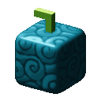

# Kyubu Kyubu no Mi

{ .mod-icon }

| | |
|---|---|
| **Type** | Paramecia |
| **Theme** | Cube |
| **Box** | { .box-icon } Wooden |
| **Chance per opening** | wooden **2.21%** ([how it works](index.md#box-odds)) |
| **Abilities** | 7: 7 active, 0 passive |
| **Effects applied** | { .effect-mini }[Cubed](../effects.md#effect-cubed) |

Found in the base mod's **wooden Devil Fruit box**. Eat it and its abilities appear in the ability menu, grouped under the fruit.

!!! note "About the values"
    The values are those of the ability's tooltip in game, with the base mod's default settings. Damage is shown on the base mod's scale, as in the ability screen.

## Cubreak { #cubreak }

{ .ability-icon } *Active*

The user breaks the block they are looking at and those around it into cubes that float above them, up to 6 cubes. Only plain blocks no harder than cobblestone can be broken

The cubes are needed by Cubooster and Cube Wall

If used while crouching, drops all the cubes

| Stat | Value |
|---|---|
| Cooldown | 4 s |

## Cubooster { #cubooster }

{ .ability-icon } *Active*

Needs cubes taken with Cubreak. The user hurls their floating cubes one after another at the enemy they are looking at

| Stat | Value |
|---|---|
| Damage type | Projectile |
| Haki | Imbuing |
| Cooldown | 8 s |
| Damage | 3.5 |

## Cube Wall { #cube-wall }

{ .ability-icon } *Active*

Needs cubes taken with Cubreak. The user assembles their floating cubes into a wall of blocks in front of them

| Stat | Value |
|---|---|
| Cooldown | 6 s |

## Air Cube { #air-cube }

{ .ability-icon } *Active*

The user compresses the air into a cube in their hand, no block is needed

If used again, throws the cube where the user is looking and it bursts like a bomb

| Stat | Value |
|---|---|
| Damage type | Projectile |
| Haki | Imbuing |
| Cooldown | 12 s |
| Hold | 10 s |
| Damage | 12 |

## Living Cube { #living-cube }

{ .ability-icon } *Active*

Applies { .effect-mini }[Cubed](../effects.md#effect-cubed)

The user turns the enemy they are looking at from up close into a cube, it can barely move and can no longer fight. The cube breaks after taking enough damage

An enemy turned into a cube can be lifted with Totem Cube

| Stat | Value |
|---|---|
| Cooldown | 20 s |
| Hold | 4–10 s |
| Range | 5 blocks (line) |
| Cube Health | 20 |

## Totem Cube { #totem-cube }

{ .ability-icon } *Active*

Needs an enemy turned into a cube with Living Cube. The user lifts it on top of a stack of cubes, then knocks the bottom cube away and the enemy falls

| Stat | Value |
|---|---|
| Damage type | Blunt |
| Haki | Imbuing |
| Cooldown | 18 s |
| Damage | 20 |
| Range | 12 blocks (line) |

## Cube Ride { #cube-ride }

{ .ability-icon } *Active*

The user sits on a floating cube that carries them where they are looking for a short time, no block is needed

| Stat | Value |
|---|---|
| Cooldown | 15 s |
| Hold | 5 s |
