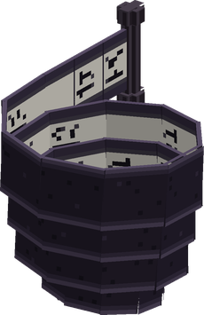

# Maki Maki no Mi

{ .mod-icon }

| | |
|---|---|
| **Type** | Paramecia |
| **Theme** | Scroll |
| **Box** | { .box-icon } Wooden |
| **Chance per opening** | wooden **2.21%** ([how it works](index.md#box-odds)) |
| **Abilities** | 7: 7 active, 0 passive |
| **Effects applied** | { .effect-mini }[Wound in Paper](../effects.md#effect-wound) |

In 3D: drag to turn, scroll or pinch to zoom.

Found in the base mod's **wooden Devil Fruit box**. Eat it and its abilities appear in the ability menu, grouped under the fruit.

!!! note "About the values"
    The values are those of the ability's tooltip in game, with the base mod's default settings. Damage is shown on the base mod's scale, as in the ability screen.

## Maki Maki no Jutsu { #maki-maki-no-jutsu }

{ .ability-icon } *Active*

{ .form-picture }

The user unrolls a large scroll in front of them, every projectile that reaches its paper is caught and stored in the scroll, up to 12.

Hokan gives the stored attacks back

| Stat | Value |
|---|---|
| Cooldown | 10 s |
| Hold | 6 s |

## Hokan { #hokan }

{ .ability-icon } *Active*

The user unrolls the scroll and lets out the attacks it holds one after the other, at the point they are looking at.

The attacks are those caught with Maki Maki no Jutsu

Let out while Scroll Wrap holds an enemy, they all strike it

| Stat | Value |
|---|---|
| Cooldown | 8 s |

## Scroll Wrap { #scroll-wrap }

{ .ability-icon } *Active*

{ .form-picture }

Applies { .effect-mini }[Wound in Paper](../effects.md#effect-wound)

The user winds a long scroll around the enemy they are looking at, it can't move and is squeezed 4 times.

Hokan lets its attacks out against a wrapped enemy

| Stat | Value |
|---|---|
| Damage type | Indirect |
| Haki | Special |
| Cooldown | 15 s |
| Damage | 2.5 |
| Range | 12 blocks (line) |

## Katon { #katon }

{ .ability-icon } *Active*

The user's scroll swallows the fire nearby, which goes out, then lets it out 3 times as a jet of flame that burns the enemies in front of them.

Lava nearby fills the scroll too

| Stat | Value |
|---|---|
| Damage type | Indirect |
| Element | Fire |
| Haki | Special |
| Cooldown | 10 s |
| Damage | 4–12 |
| Range | 9 blocks (line) |

## Deluge { #deluge }

{ .ability-icon } *Active*

The user's scroll takes in water nearby, or the rain, then lets it out 3 times as a wave that throws the enemies back, soaks them and puts out every fire it passes.

The wave leaves no water behind

| Stat | Value |
|---|---|
| Damage type | Indirect |
| Element | Water |
| Haki | Special |
| Cooldown | 12 s |
| Damage | 5 |
| Range | 10 blocks (line) |

## Storage Scroll { #storage-scroll }

{ .ability-icon } *Active*

The user unrolls a scroll that keeps things, 27 slots of their own that can be opened anywhere.

What it keeps stays in it when the user dies

| Stat | Value |
|---|---|
| Cooldown | 1 s |

## Bunshin no Jutsu { #bunshin-no-jutsu }

{ .ability-icon } *Active*

The user lays 4 scrolls on the ground around them and a copy of them comes out of each. The copies run about and vanish at the first blow, the monsters that were after the user go for them.

| Stat | Value |
|---|---|
| Cooldown | 30 s |
| Hold | 15 s |
